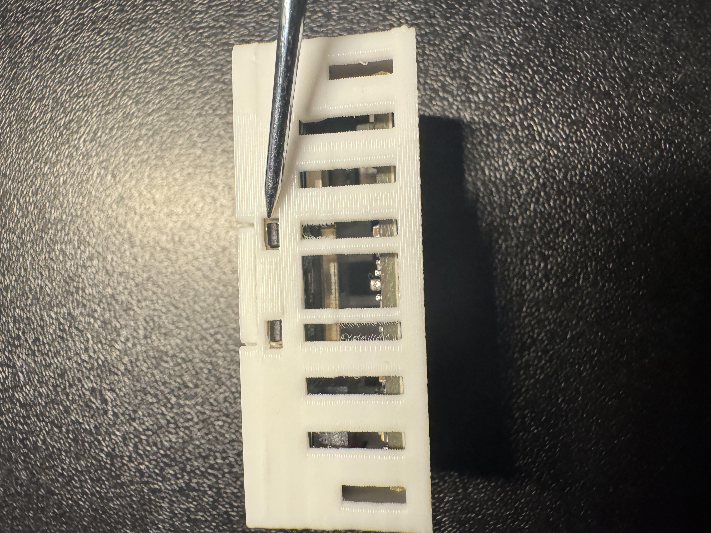
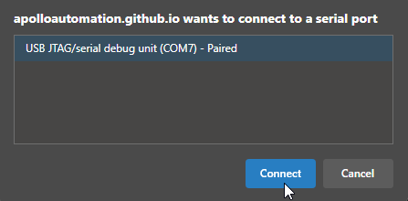
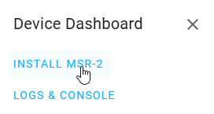

# Factory Re-Flash MSR-2

!!! info "If your device becomes unresponsive and you've exhausted the other troubleshooting methods you can reflash the factory firmware by following the steps below."

    This factory re-flash needs to be done in Chrome, Edge, or another Chromium based browser.

If your device has already been connected to Home Assistant please <a href="https://wiki.apolloautomation.com/products/general/troubleshooting/removing-device-from-home-assistant" target="_blank" rel="noreferrer nofollow noopener">remove it from the ESPHome integration</a> and the ESPHome Device Builder before continuing.

1\. Position the MSR-2 as shown in the image below and locate the small opening to press the boot button (the right button).

2\. Push and hold the boot button. While still holding the button down, plug in a USB-C cable into the USB-C port of your MSR-2 then let go of the button.

3\. Navigate to our installer page and click connect under <a href="https://apolloautomation.github.io/MSR-2/" target="_blank" rel="noreferrer nofollow noopener">Apollo MSR-2 Installer</a>.

3\. Click the big "Connect" button.

3\. Select the open com port then click Connect.

4\. Click "Install MSR-2".

5\. Click "INSTALL".

6\. Once you see "Installation complete!" you are finished. Click Next then close out of the browser window.

!!! warning "Power cycle your device before doing anything else!"

    Your device is still in boot mode and needs to be power cycled aka power removed to make it boot in a normal mode!

7\. Please <a href="https://wiki.apolloautomation.com/products/general/setup/getting-started-msr2" target="_blank" rel="noreferrer nofollow noopener">proceed to the getting started guide</a> and setup your sensor as a new device!