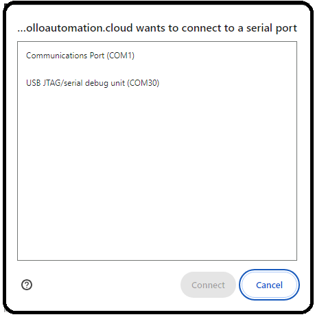
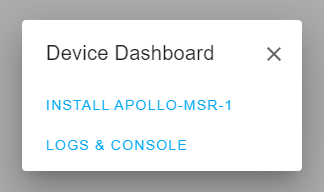
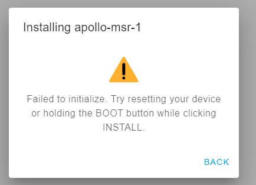

# Manually Uploading Code Through ESPHome

If your device becomes unresponsive and you've exhausted the other troubleshooting methods you can upload a fresh set of firmware by following the below guide. The utility does need to be run from Chrome or Edge.

If your device has already been connected to Home Assistant previously please refer to Removing Device From Home Assistant first before proceeding

1. Plug your MSR-2 into your computer with a quality USBC cable that supports data transfer
2. Navigate to our installer page and click connect [\*\* Install Page \*\*](https://apolloautomation.github.io/MSR-2/)
3. Select your Apollo device, it will show with a similar name to the one below, and click connect. If you aren't sure which device it is, you can unplug the MSR-2 and see which disappears.

If no device shows, click cancel and then install the recommended driver that shows on the popup. If you have installed the driver, tried different cables, and it still won't work refer [here](https://apolloautomation.github.io/docs/products/msr2/troubleshooting/msr2-boot-mode/)for putting the MSR-2 in bootloader mode and then retry step 3.

4. Choose to install the new firmware

6. Wait for the installer to finish

7. After finishing, check for the Apollo hotspot and connect. This might not show if you previously had the MSR-2 connected to your wifi
8. Log into Home Assistant and go to the ESPHome addon check to see if you can adopt the device.

If you encounter the below error, please complete the [Putting MSR-2 In Boot Mode Document](https://apolloautomation.github.io/docs/products/msr2/troubleshooting/msr2-boot-mode/) and go back to step 3.

