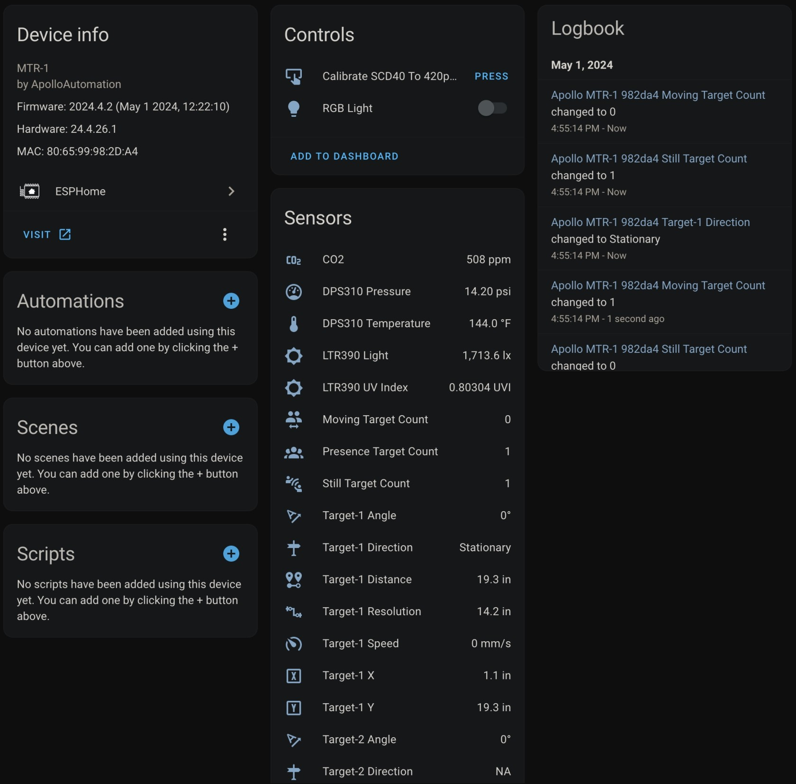
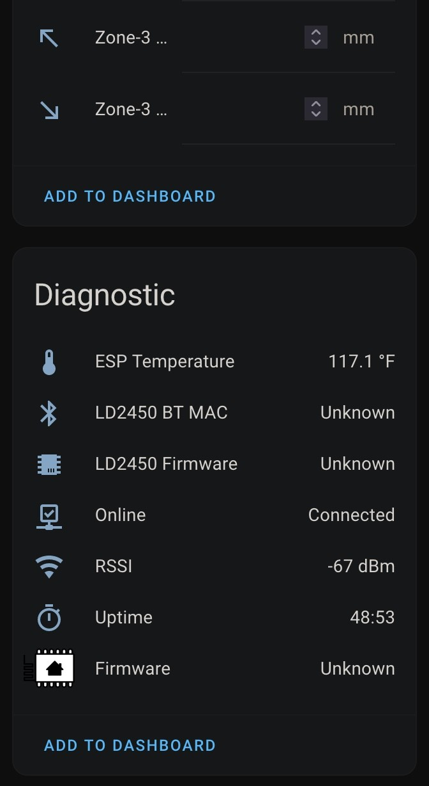

# Sensor Definitions






## Component

The `ld2450` component enables the use of the [HLK-LD2450](https://www.hlktech.net/index.php?id=1157) human presence and motion detection radar module with ESPHome.

[HLK-LD2450 Official Datasheet and user manuals](https://drive.google.com/drive/folders/1aItrdziwnEqI-ovDWf24Lj6ioALaljFA?usp=sharing)

Motion target tracking involves real-time tracking of the position of a moving target within a specific area, enabling measurements of distance, angle, and speed. The LD2450 is a sensor module for tracking motion targets within the Hi-link 24G millimeter-wave radar series. It features simplified 24 GHz radar sensor hardware and intelligent algorithm firmware. It is mainly used in general indoor scenarios such as homes, offices, and hotels for tracking the location of moving human targets.

[HLKRadarTool Android App](https://play.google.com/store/apps/details?id=com.hlk.hlkradartool)

[HLKRadarTool iOS App](https://apps.apple.com/us/app/hlkradartool/id1638651152)

**Note:** Ensure that the LD2450 firmware version is `V2.02.23090617` or later for proper integration functionality. You can use the [HLKRadarTool mobile app](https://chat.openai.com/c/80edd6fc-fd39-4287-b045-ed6d4fd74f1c#ld2450-mobile-apps) to update the firmware.


The [UART](https://chat.openai.com/c/80edd6fc-fd39-4287-b045-ed6d4fd74f1c#uart) needs to be set up in your configuration for this sensor to work. `parity` and `stop_bits` **must be** `NONE` and `1`, respectively. Using hardware UART pins is highly recommended, as they support the out-of-the-box 256000 baud rate of the LD2450 sensor.

```
# uart configuration
uart:
  id: uart_ld2450
  tx_pin: 17
  rx_pin: 21
  baud_rate: 256000
  parity: NONE
  stop_bits: 1

```

```
# ld2450 configuration
ld2450:
  id: ld2450_radar
  uart_id: uart_ld2450
  throttle: 1000ms

```

### Configuration variables:

- **id** (*Optional*, [config-id](https://chat.openai.com/c/80edd6fc-fd39-4287-b045-ed6d4fd74f1c#config-id)): Manually specify the ID for the `ld2450` component if you need multiple components.
- **uart\_id** (*Optional*, [config-id](https://chat.openai.com/c/80edd6fc-fd39-4287-b045-ed6d4fd74f1c#config-id)): Manually specify the ID of the [UART Component](https://chat.openai.com/c/80edd6fc-fd39-4287-b045-ed6d4fd74f1c#uart) if you want to use multiple UART buses.
- **throttle** (*Optional*, int): Time in milliseconds to control the rate of data updates. Defaults to `1000ms`.

### Binary Sensor

The `ld2450` binary sensor offers presence states for the targets.

```
binary_sensor:
  - platform: ld2450
    ld2450_id: ld2450_radar
    has_target:
      name: Presence
    has_moving_target:
      name: Moving Target
    has_still_target:
      name: Still Target
```

#### Configuration variables:

- **ld2450\_id** (*Optional*, [config-id](https://chat.openai.com/c/80edd6fc-fd39-4287-b045-ed6d4fd74f1c#config-id)): Manually specify the ID for the `ld2450` component if you are using multiple components.
- **has\_target** (*Optional*): True if either target is still or in motion. All options from [Binary Sensor](https://chat.openai.com/c/80edd6fc-fd39-4287-b045-ed6d4fd74f1c#config-binary_sensor).
- **has\_moving\_target** (*Optional*): True if a moving target is detected. All options from [Binary Sensor](https://chat.openai.com/c/80edd6fc-fd39-4287-b045-ed6d4fd74f1c#config-binary_sensor).
- **has\_still\_target** (*Optional*): True if a still target is detected. All options from [Binary Sensor](https://chat.openai.com/c/80edd6fc-fd39-4287-b045-ed6d4fd74f1c#config-binary_sensor).

### Sensor

The `ld2450` sensor provides information about the states and attributes of detected targets.

```
sensor:
  - platform: ld2450
    ld2450_id: ld2450_radar
    target_count:
      name: Presence Target Count
    still_target_count:
      name: Still Target Count
    moving_target_count:
      name: Moving Target Count
    target_1:
      x:
        name: Target-1 X
      y:
        name: Target-1 Y
      speed:
        name: Target-1 Speed
      angle:
        name: Target-1 Angle
      distance:
        name: Target-1 Distance
      resolution:
        name: Target-1 Resolution
    target_2:
      x:
        name: Target-2 X
      y:
        name: Target-2 Y
      speed:
        name: Target-2 Speed
      angle:
        name: Target-2 Angle
      distance:
        name: Target-2 Distance
      resolution:
        name: Target-2 Resolution
    target_3:
      x:
        name: Target-3 X
      y:
        name: Target-3 Y
      speed:
        name: Target-3 Speed
      angle:
        name: Target-3 Angle
      distance:
        name: Target-3 Distance
      resolution:
        name: Target-3 Resolution
    zone_1:
      target_count:
        name: Zone-1 All Target Count
      still_target_count:
        name: Zone-1 Still Target Count
      moving_target_count:
        name: Zone-1 Moving Target Count
    zone_2:
      target_count:
        name: Zone-2 All Target Count
      still_target_count:
        name: Zone-2 Still Target Count
      moving_target_count:
        name: Zone-2 Moving Target Count
    zone_3:
      target_count:
        name: Zone-3 All Target Count
      still_target_count:
        name: Zone-3 Still Target Count
      moving_target_count:
        name: Zone-3 Moving Target Count
```

#### Configuration variables:

- **ld2450\_id** (*Optional*, [config-id](https://chat.openai.com/c/80edd6fc-fd39-4287-b045-ed6d4fd74f1c#config-id)): Manually specify the ID for the `ld2450` component if you are using multiple components.
- **target\_count** (*Optional*, int): Total targets detected, stationary or moving. All options from [Sensor](https://chat.openai.com/c/80edd6fc-fd39-4287-b045-ed6d4fd74f1c#config-sensor).
- **still\_target\_count** (*Optional*, int): Count of stationary targets. All options from [Sensor](https://chat.openai.com/c/80edd6fc-fd39-4287-b045-ed6d4fd74f1c#config-sensor).
- **moving\_target\_count** (*Optional*, int): Count of moving targets. All options from [Sensor](https://chat.openai.com/c/80edd6fc-fd39-4287-b045-ed6d4fd74f1c#config-sensor).
- **target\_N** (*Optional*): Details about the targets (N = 1 to 3). A maximum of 3 targets can be detected: `target_1`, `target_2`, `target_3`. 
    - **x** (*Optional*, int): Distance in millimeters (mm) of the target from the `ld2450` sensor along the X-axis. All options from [Sensor](https://chat.openai.com/c/80edd6fc-fd39-4287-b045-ed6d4fd74f1c#config-sensor).
    - **y** (*Optional*, int): Distance in millimeters (mm) of the target from the `ld2450` sensor in the Y direction. All options from [Sensor](https://chat.openai.com/c/80edd6fc-fd39-4287-b045-ed6d4fd74f1c#config-sensor).
    - **speed** (*Optional*, int): Speed of the moving target in `mm/s`. All options from [Sensor](https://chat.openai.com/c/80edd6fc-fd39-4287-b045-ed6d4fd74f1c#config-sensor).
    - **angle** (*Optional*, int): Angle of target in degrees (°) relative to the `ld2450` sensor. All options from [Sensor](https://chat.openai.com/c/80edd6fc-fd39-4287-b045-ed6d4fd74f1c#config-sensor).
    - **distance** (*Optional*, int): Distance in millimeters (mm) of the target from the `ld2450` sensor. All options from [Sensor](https://chat.openai.com/c/80edd6fc-fd39-4287-b045-ed6d4fd74f1c#config-sensor).
    - **resolution** (*Optional*, int): The `ld2450` target detection range resolution in millimeters (mm). All options from [Sensor](https://chat.openai.com/c/80edd6fc-fd39-4287-b045-ed6d4fd74f1c#config-sensor).
- **zone\_N** (*Optional*): Target count details in the defined [zones](https://chat.openai.com/c/80edd6fc-fd39-4287-b045-ed6d4fd74f1c#ld2450-number) (N = 1 to 3). A maximum of 3 zones: `zone_1`, `zone_2`, `zone_3`. 
    - **target\_count** (*Optional*, int): Total targets detected in the zone, stationary or moving. All options from [Sensor](https://chat.openai.com/c/80edd6fc-fd39-4287-b045-ed6d4fd74f1c#config-sensor).
    - **still\_target\_count** (*Optional*, int): Count of stationary targets in the zone. All options from [Sensor](https://chat.openai.com/c/80edd6fc-fd39-4287-b045-ed6d4fd74f1c#config-sensor).
    - **moving\_target\_count** (*Optional*, int): Count of moving targets in the zone. All options from [Sensor](https://chat.openai.com/c/80edd6fc-fd39-4287-b045-ed6d4fd74f1c#config-sensor).

### Switch

The `ld2450` switch allows you to control your `ld2450` Bluetooth and Multi/Single Target Tracking.

```
switch:
  - platform: ld2450
    ld2450_id: ld2450_radar
    bluetooth:
      name: "Bluetooth"
    multi_target:
      name: "Multi Target Tracking"
```

#### Configuration variables:

- **ld2450\_id** (*Optional*, [config-id](https://chat.openai.com/c/80edd6fc-fd39-4287-b045-ed6d4fd74f1c#config-id)): Manually specify the ID for the `ld2450` component if you are using multiple components.
- **bluetooth** (*Optional*): Turn on/off the Bluetooth adapter. Defaults to `true`. All options from [Switch](https://chat.openai.com/c/80edd6fc-fd39-4287-b045-ed6d4fd74f1c#config-switch).
- **multi\_target** (*Optional*): Turn on/off the Multi Target Tracking option. All options from [Switch](https://chat.openai.com/c/80edd6fc-fd39-4287-b045-ed6d4fd74f1c#config-switch).

### Number

The `ld2450` number allows you to control the presence timeout and zone area configuration of your `ld2450`.

```
number:
  - platform: ld2450
    ld2450_id: ld2450_radar
    presence_timeout:
      name: "Timeout"
    zone_1:
      x1:
        name: Zone-1 X1
      y1:
        name: Zone-1 Y1
      x2:
        name: Zone-1 X2
      y2:
        name: Zone-1 Y2
    zone_2:
      x1:
        name: Zone-2 X1
      y1:
        name: Zone-2 Y1
      x2:
        name: Zone-2 X2
      y2:
        name: Zone-2 Y2
    zone_3:
      x1:
        name: Zone-3 X1
      y1:
        name: Zone-3 Y1
      x2:
        name: Zone-3 X2
      y2:
        name: Zone-3 Y2
```

#### Configuration variables:

- **ld2450\_id** (*Optional*, [config-id](https://chat.openai.com/c/80edd6fc-fd39-4287-b045-ed6d4fd74f1c#config-id)): Manually specify the ID for the `ld2450` component if you are using multiple components.
- **presence\_timeout** (*Required*, int): The duration, in seconds, for which the [presence states](https://chat.openai.com/c/80edd6fc-fd39-4287-b045-ed6d4fd74f1c#ld2450-binary-sensors) will persist after detection is cleared. Default is `5` seconds. All options from [Number](https://chat.openai.com/c/80edd6fc-fd39-4287-b045-ed6d4fd74f1c#config-number).
- **zone\_N** (*Optional*): Configuration of the zone (N = 1 to 3), defined as a rectangular area. A maximum of 3 Zones can be configured: `zone_1`, `zone_2`, `zone_3`. The zone coordinates consist of x1 y1 (Near-Left) to x2 y2 (Far-Right) relative to the `ld2450` sensor. 
    - **x1** (*Optional*, int): Start X coordinate in millimeters (mm) of the zone from the `ld2450` sensor along the X-axis. All options from [Number](https://chat.openai.com/c/80edd6fc-fd39-4287-b045-ed6d4fd74f1c#config-number).
    - **y1** (*Optional*, int): Start Y coordinate in millimeters (mm) of the zone from the `ld2450` sensor along the Y-axis. All options from [Number](https://chat.openai.com/c/80edd6fc-fd39-4287-b045-ed6d4fd74f1c#config-number).
    - **x2** (*Optional*, int): End X coordinate in millimeters (mm) of the zone from the `ld2450` sensor along the X-axis. All options from [Number](https://chat.openai.com/c/80edd6fc-fd39-4287-b045-ed6d4fd74f1c#config-number).
    - **y2** (*Optional*, int): End Y coordinate in millimeters (mm) of the zone from the `ld2450` sensor along the Y-axis. All options from [Number](https://chat.openai.com/c/80edd6fc-fd39-4287-b045-ed6d4fd74f1c#config-number).

### Button

The `ld2450` button allows you to perform `restart` and `factory reset` actions on your `ld2450`.

```
button:
  - platform: ld2450
    ld2450_id: ld2450_radar
    factory_reset:
      name: "LD2450 Factory Reset"
    restart:
      name: "LD2450 Restart"
```

#### Configuration variables:

- **ld2450\_id** (*Optional*, [config-id](https://chat.openai.com/c/80edd6fc-fd39-4287-b045-ed6d4fd74f1c#config-id)): Manually specify the ID for the `ld2450` component if you are using multiple components.
- **factory\_reset** (*Optional*): Resets the `ld2450` to its default values. All options from [Button](https://chat.openai.com/c/80edd6fc-fd39-4287-b045-ed6d4fd74f1c#config-button).
- **restart** (*Optional*): Restarts the `ld2450` device. All options from [Button](https://chat.openai.com/c/80edd6fc-fd39-4287-b045-ed6d4fd74f1c#config-button).

### Text Sensor

The `ld2450` text sensor allows you to get information about your `ld2450`.

```
text_sensor:
  - platform: ld2450
    ld2450_id: ld2450_radar
    version:
      name: "LD2450 Firmware"
    mac_address:
      name: "LD2450 BT MAC"
    target_1:
      direction:
        name: "Target-1 Direction"
    target_2:
      direction:
        name: "Target-2 Direction"
    target_3:
      direction:
        name: "Target-3 Direction"
```

#### Configuration variables:

- **ld2450\_id** (*Optional*, [config-id](https://chat.openai.com/c/80edd6fc-fd39-4287-b045-ed6d4fd74f1c#config-id)): Manually specify the ID for the `ld2450` component if you are using multiple components.
- **version** (*Optional*): The `ld2450` firmware version. All options from [Text Sensor](https://chat.openai.com/c/80edd6fc-fd39-4287-b045-ed6d4fd74f1c#config-text_sensor).
- **mac\_address** (*Optional*): The `ld2450` Bluetooth MAC address. All options from [Text Sensor](https://chat.openai.com/c/80edd6fc-fd39-4287-b045-ed6d4fd74f1c#config-text_sensor).
- **target\_N** (*Optional*): Targets (N = 1 to 3). A maximum of 3 targets can be detected: `target_1`, `target_2`, `target_3`. 
    - **direction** (*Optional*): Direction of the target relative to the `ld2450` sensor. Possible values are: `Stationary`, `Moving away`, `Coming closer`, `NA`. All options from [Sensor](https://chat.openai.com/c/80edd6fc-fd39-4287-b045-ed6d4fd74f1c#config-sensor).

### Select

The `ld2450` select allows you to control `baud rate` and `zone type` of your `ld2450`.

```
select:
  - platform: ld2450
    ld2450_id: ld2450_radar
    baud_rate:
      name: "Baud rate"
    zone_type:
      name: "Zone Type"
```

#### Configuration variables:

- **ld2450\_id** (*Optional*, [config-id](https://chat.openai.com/c/80edd6fc-fd39-4287-b045-ed6d4fd74f1c#config-id)): Manually specify the ID for the `ld2450` component if you are using multiple components.
- **baud\_rate** (*Optional*): Control the UART serial port baud rate. Defaults to `256000`. Once changed, all sensors will stop working until a fresh install with an updated [UART Component](https://chat.openai.com/c/80edd6fc-fd39-4287-b045-ed6d4fd74f1c#uart) configuration. All options from [Select](https://chat.openai.com/c/80edd6fc-fd39-4287-b045-ed6d4fd74f1c#config-select).
- **zone\_type** (*Optional*): Control the Zone detection modes. It can be set to `Disabled`, `Detection`, or `Filter`. Selecting the `Disabled` option will disable zone area detection. `Detection` mode is used to detect only targets in the specified area, while `Filter` mode can be used to exclude an area from detection. All options from [Select](https://chat.openai.com/c/80edd6fc-fd39-4287-b045-ed6d4fd74f1c#config-select).

##### **(Copied and adapted from [hareeshmu](https://github.com/esphome/esphome-docs/pull/3327/files))**