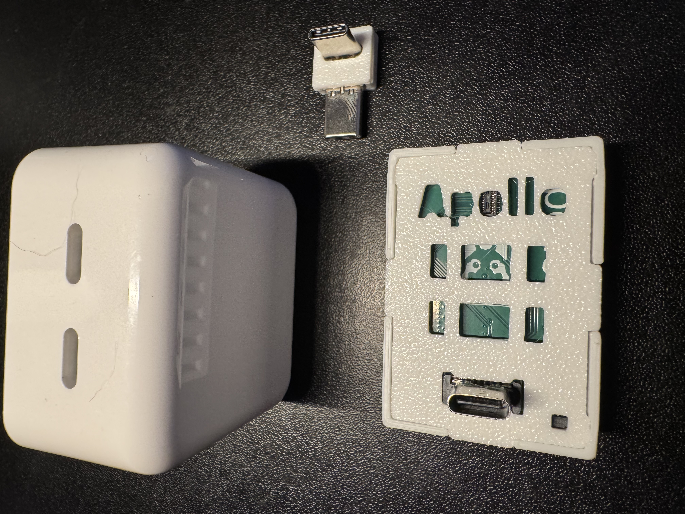
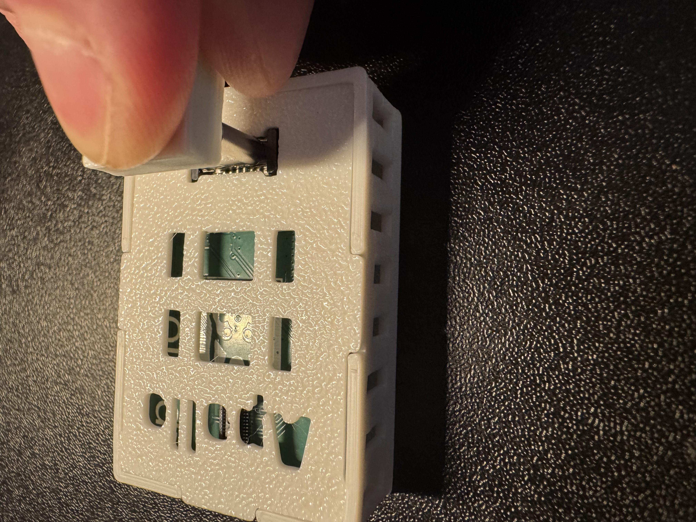
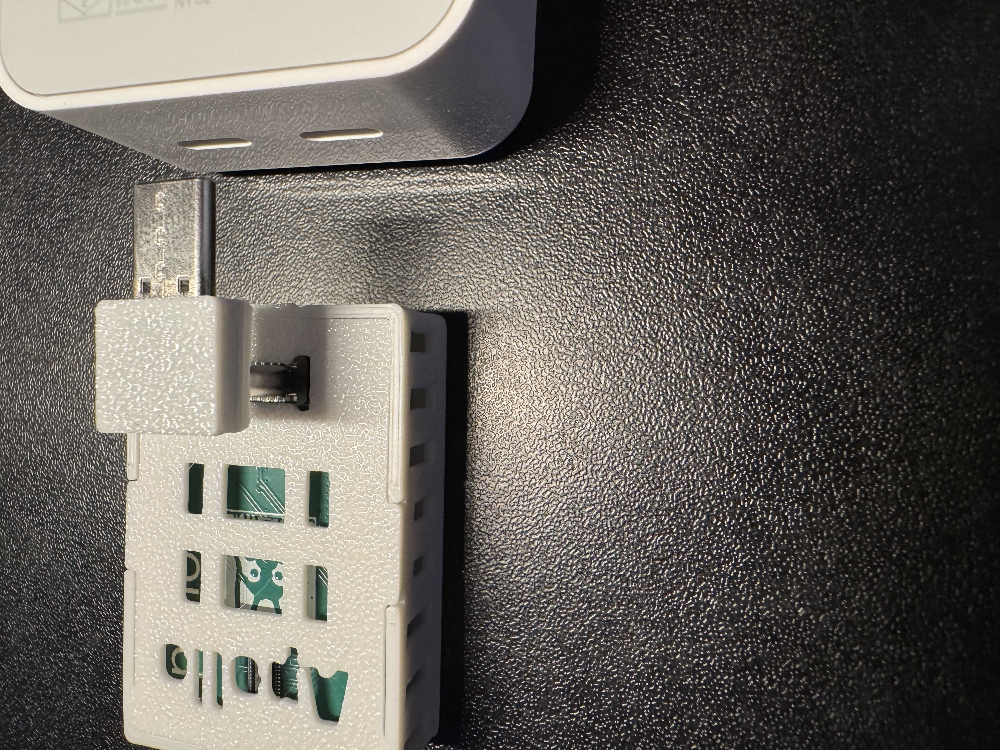
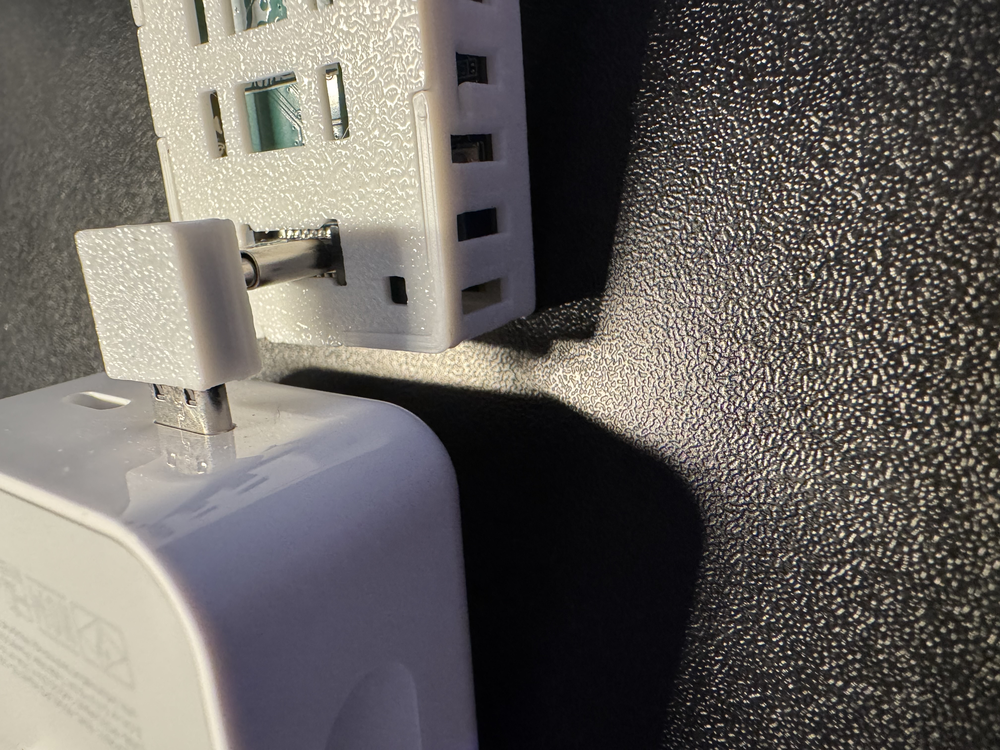
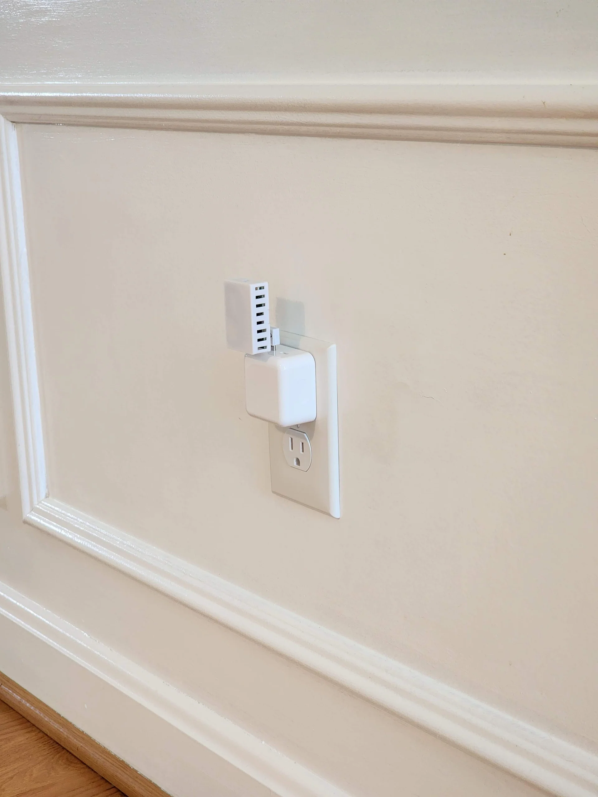

# Adding 90 degree USB-C to MTR-1

1\. Gather the MTR-1, 90 degree addon, and optional top facing USB-C Plug.

2\. Insert the shorter end of the 90 degree addon into the MTR-1.

3\. Align the other end of the 90 degree addon to the optional top facing USB-C Plug.

4\. Gently push the connector into one of the top usb-c ports.

5\. Plug into an outlet and enjoy your sensor!

!!! success "You're ready to begin using your device!"

    Make sure to head to our <a href="https://wiki.apolloautomation.com/products/general/setup/getting-started-mtr1/" target="_blank" rel="noreferrer nofollow noopener">getting started guide</a> to get your MTR-1 up and running!