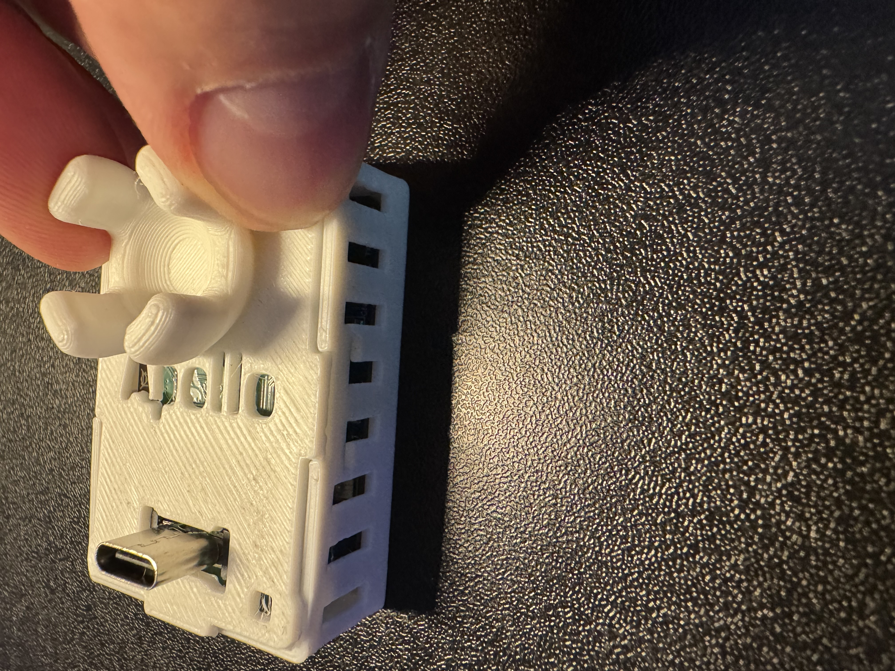
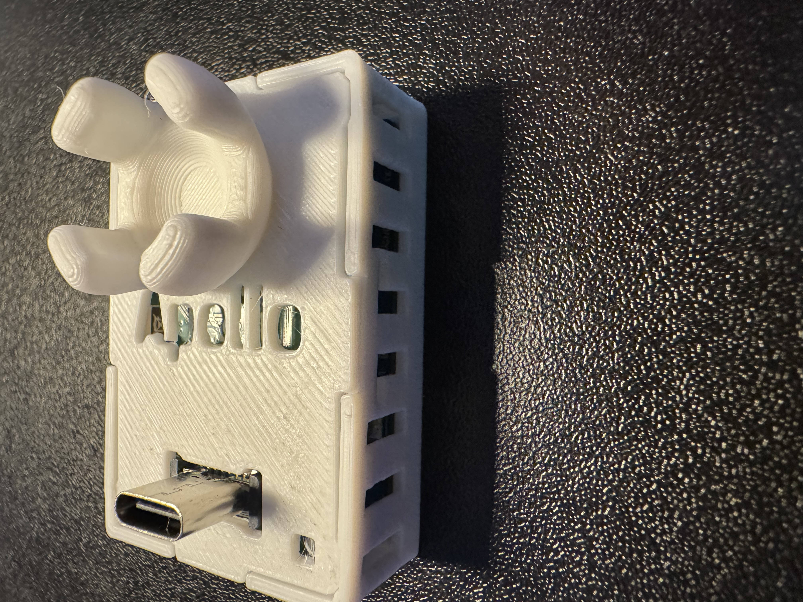
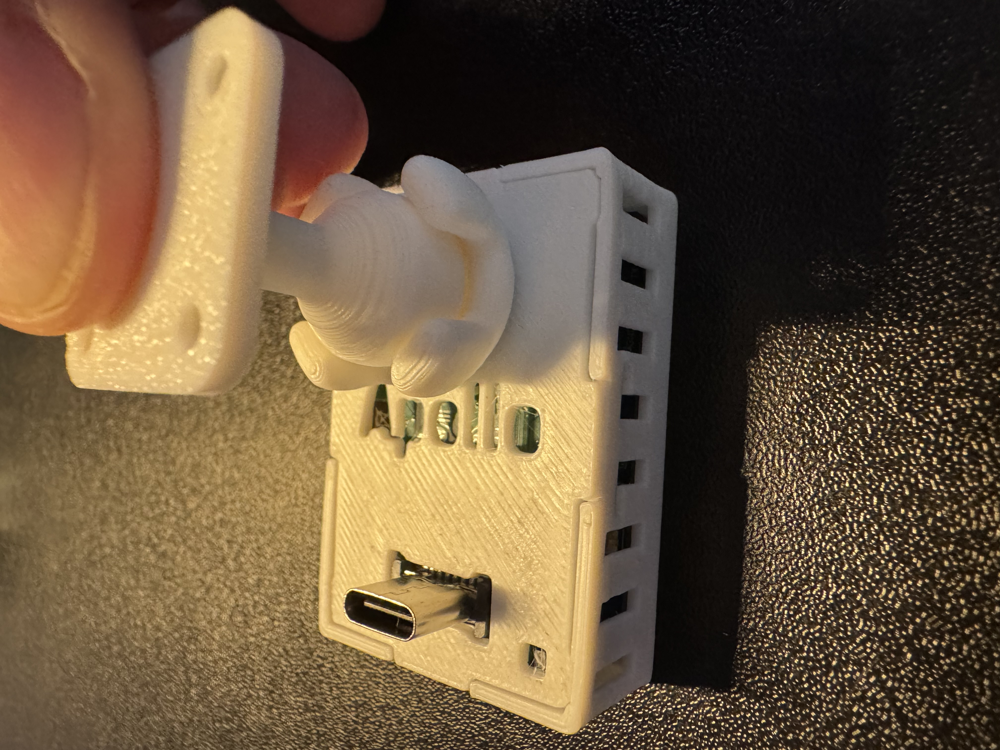

# Adding Articulating Stand To MTR-1

1\. Unplug your MTR-1 from power and remove the stand if attached.

2\. Remove the backplate of the MTR-1.

3\. Align the new backplate that came with the articulating stand addon and gently push down on two corners near the articulating ball mount then the other two corners until it seats flat.

4\. Align the ball inside the articulating mount and then push down until it's fully seated.

