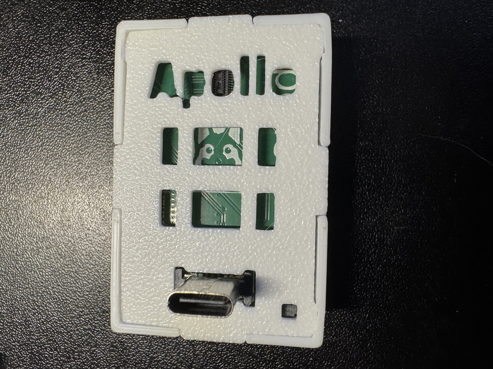
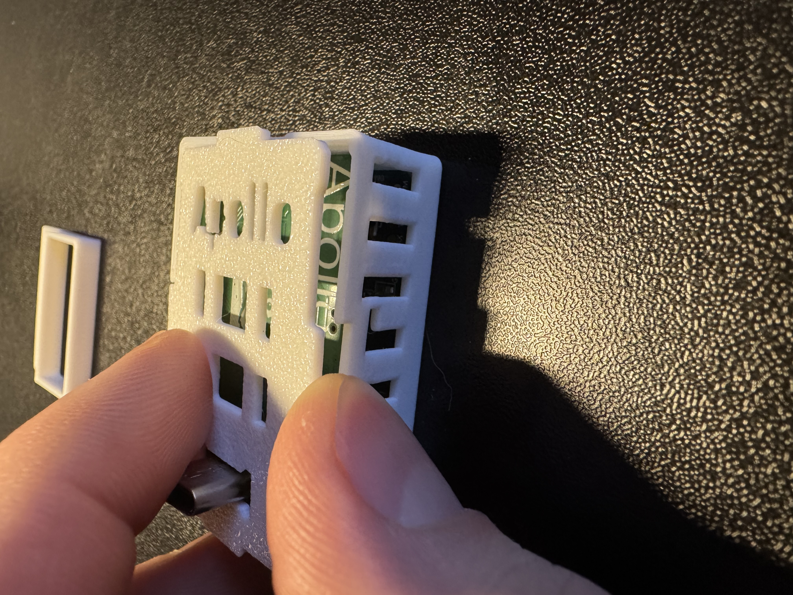
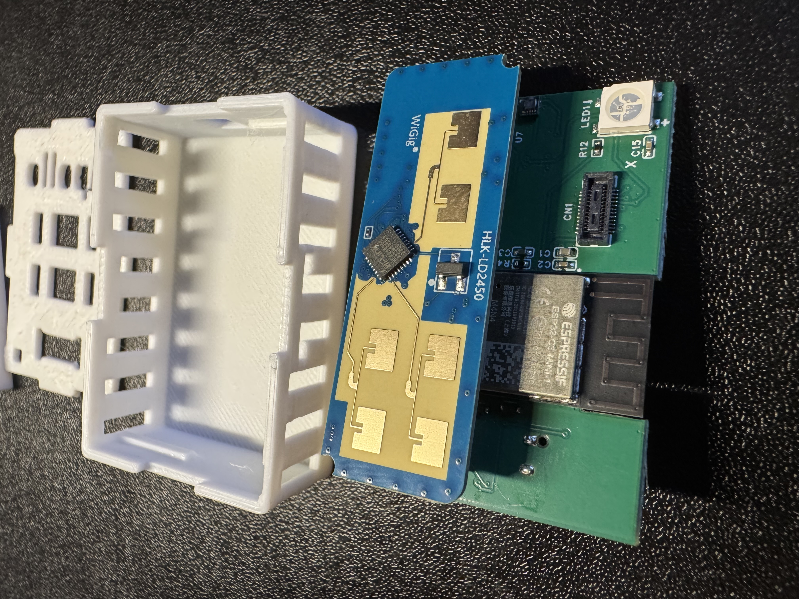
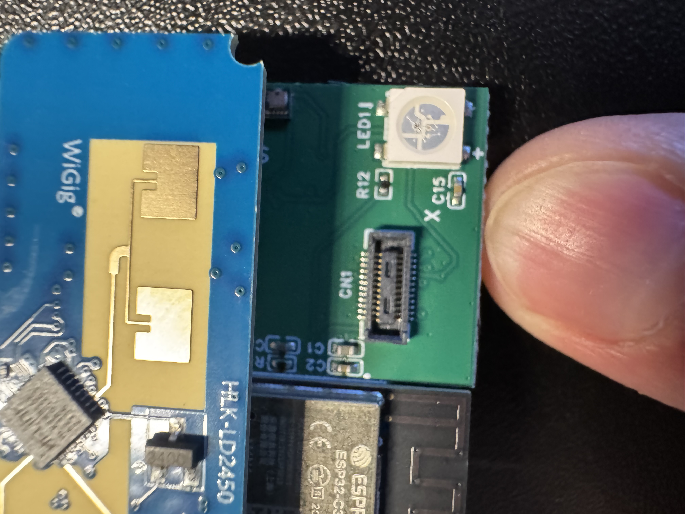
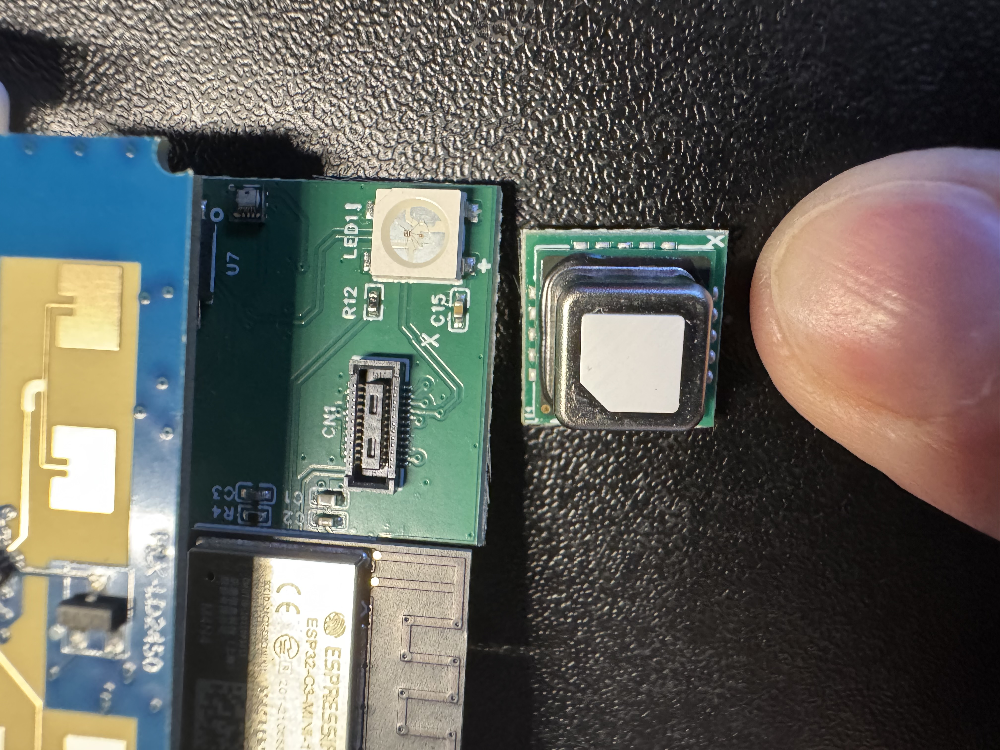
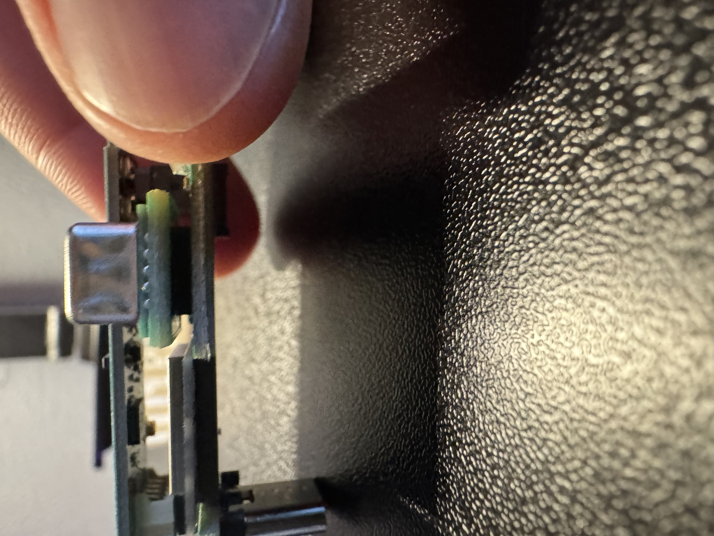
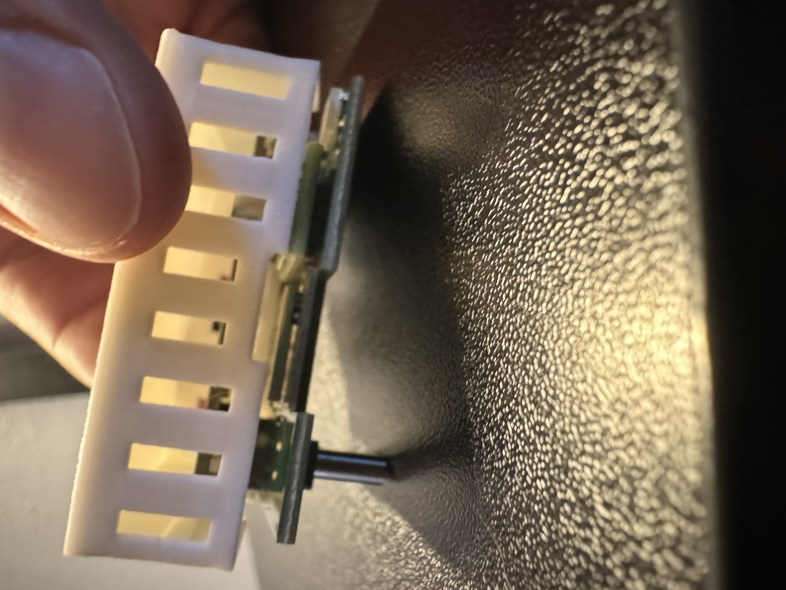
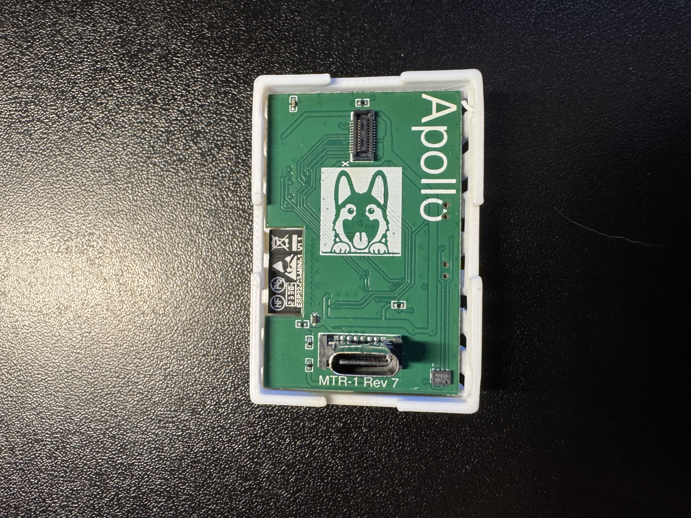
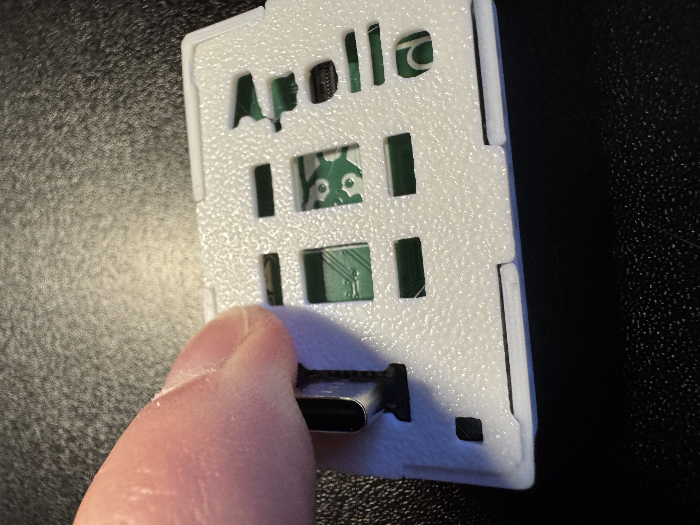

# Adding CO2 To MTR-1

1\. Unplug your MTR-1 from power and remove the stand if attached.

2\. Flip the MTR-1 upside down and gently tap the case on the table and your MTR-1 should slide out of the case.

3\. With the case removed, identify the bottom right corner of where the small black mezzanine connector lives. You will see an "X" indicating which corner needs to be lined up with the SCD40 CO2 sensor. There is an X on the SCD40 sensor's PCB as well, you can see it in the image below. There is also a "gold dot" in the top left of the SCD40 when oriented properly.

4\. Gently push the SCD40 CO2 module onto the black mezzanine connector.

5\. Slide the case back over the MTR-1, making sure that the case has the hole for the LUX Sensor facing the right direction (to the right).

6\. Flip the MTR-1 back over to prepare to put the back case on.

7\. Gently press the backplate of the MTR-1 case onto the MTR-1 until it lightly snaps into place. Please do not force it, if necessary please repeat steps above until it seats in the case without any force required.

8\. Put the stand back on if applicable.

9\. Please refer to our [CO2 calibration guide](https://wiki.apolloautomation.com/products/general/calibrating-and-updating/co2-calibration/ "CO2 Calibration") to calibrate the CO2 module after installation. This is required for all CO2 addons purchased from us separately from a product (such as buying it to addon to an existing Apollo device).