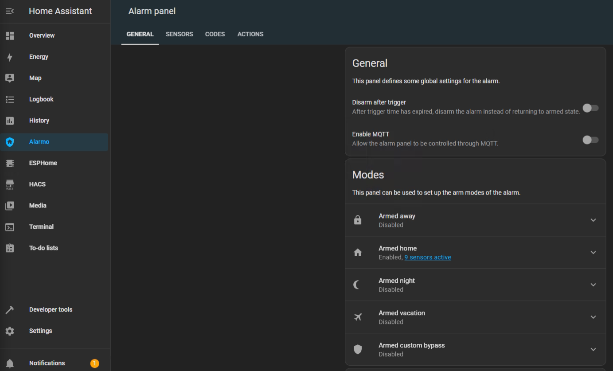
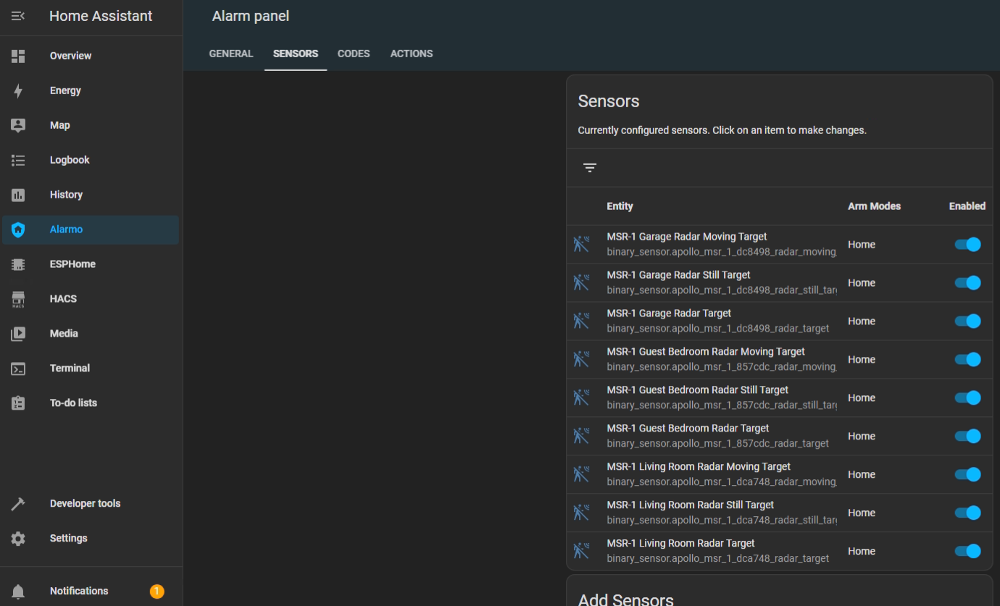
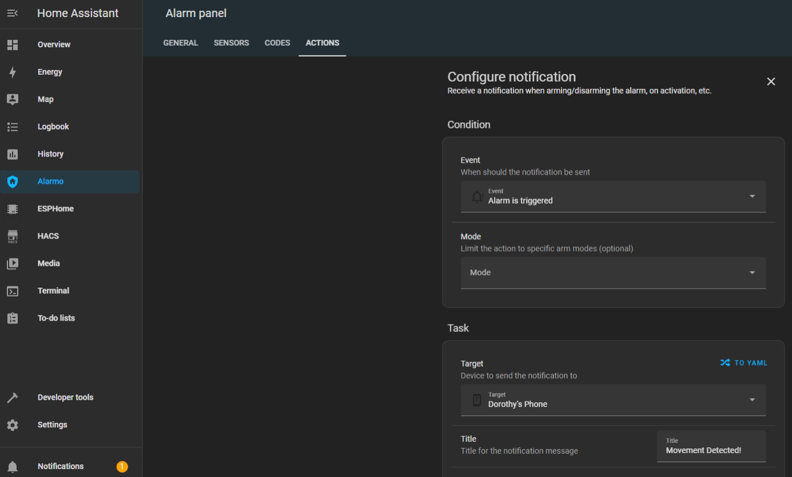
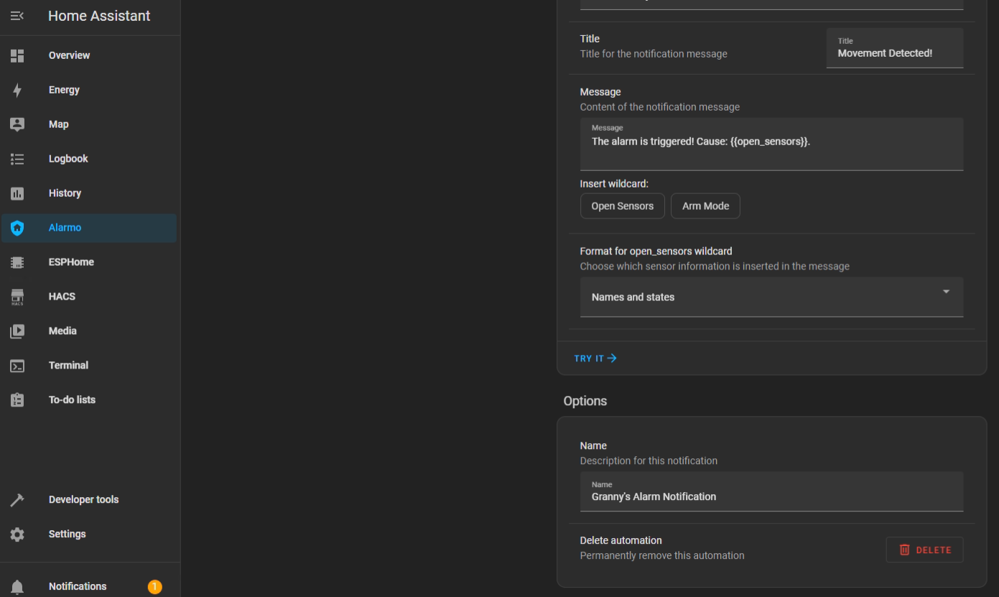
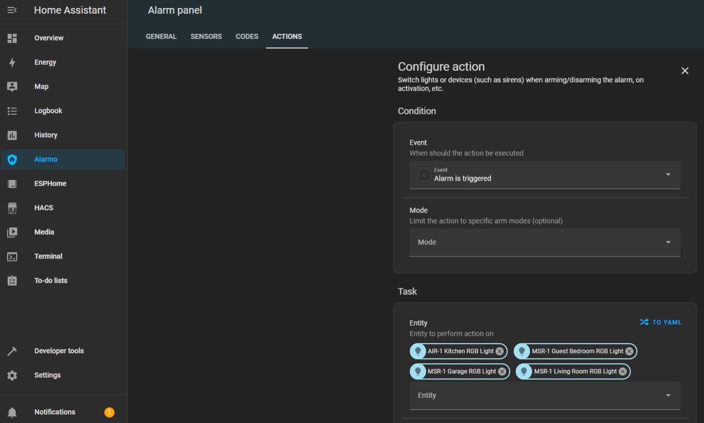
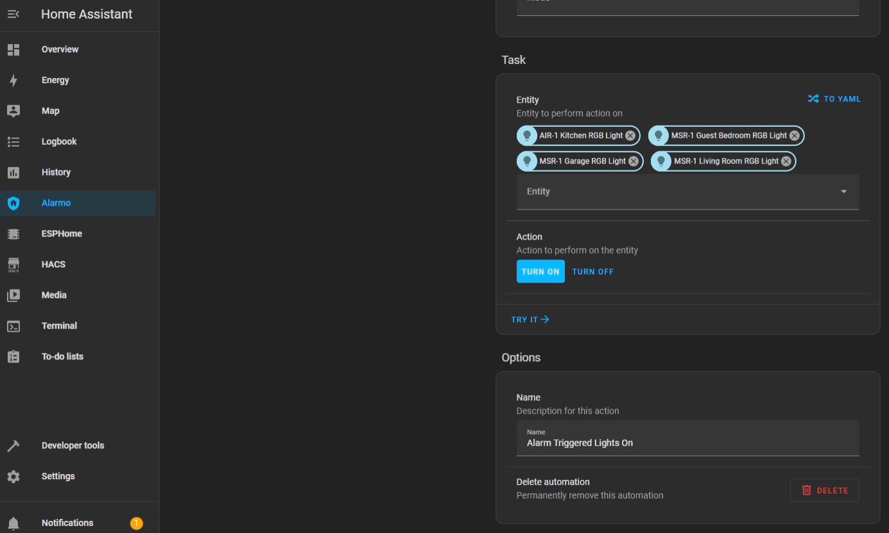

# MTR-1 + Alarmo Home Security Install

My grandmother wanted a security system that would alert her when there was movement in her home after she had gone to bed. So, I set up three of our Apollo Automation mmWave sensors. These devices, plus the Alarmo add-on, quickly and easily allowed me to install a fully local, private, cloud-free, and no monthly subscription security system. She can arm/disarm it with one button on her Home Assistant dashboard, and it makes her feel much safer. This guide assumes you already have a motion/presence sensor installed on HA.

1\. Install [HACS](https://hacs.xyz/docs/setup/download/)  
2\. Install [Alarmo](https://github.com/nielsfaber/alarmo?tab=readme-ov-file#installation) and the [Alarmo Card](https://github.com/nielsfaber/alarmo-card) (Pretty Arm and Disarm card for your HA dashboard)  
  
  
  
  
  
3\. Find Alarmo on the left, select the Sensors tab, and toggle on the sensor entities that you would like to use for your alarm system.  
  
  
  
4\. Now select the Actions tab and under Condition > Event > Select "Alarm is triggered". You can also select the device you would like to receive a notification on under Task > Target > Select Device (Phone, tablet, etc.)  
  
  
  
5\. You can change the Title, Message, and Name of the alarm notification.  
  
  
  
6\. After saving that action we can add another one that will turn on our sensor lights and/or make the onboard piezo buzzers play an alarm sound. Uner Entity select your sensors RGB light.  
  
  
  
7\. Under Action select Turn On and now your sensors RGB lights will turn on when the alarm is triggered.  
  
  
  
8\. And that's it, seriously... Now you can enjoy a free and local security system.  
  
We hope this was helpful and please let us know if there are any questions!