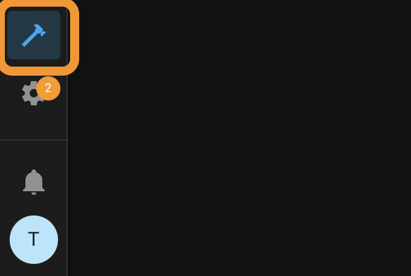
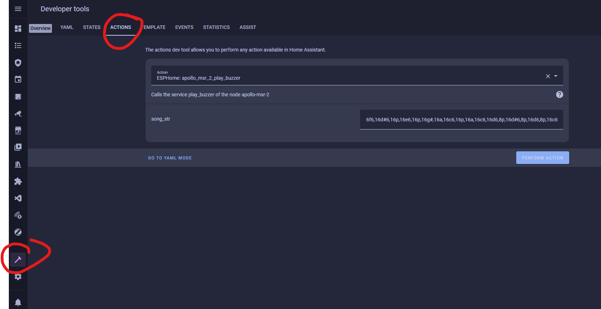

# Using MTR-1 Buzzer

This guide will walk you through using the buzzer on your MTR-1. You can also use the "action" in an automation in Home Assistant.

1. Open Home Assistant and navigate to developer tools in the bottom left



2\. Click on services

3\. Choose your MTR-1's buzzer (You can type in buzzer to find it easier)

4\. Put a rtttl tone into the the string box

- - Mario: ```
        smb:d=4,o=5,b=100:16e6,16e6,32p,8e6,16c6,8e6,8g6,8p,8g,8p,8c6,16p,8g,16p,8e,16p,8a,8b,16a#,8a,16g.,16e6,16g6,8a6,16f6,8g6,8e6,16c6,16d6,8b,16p,8c6,16p,8g,16p,8e,16p,8a,8b,16a#,8a,16g.,16e6,16g6,8a6,16f6,8g6,8e6,16c6,16d6,8b,8p,16g6,16f#6,16f6,16d#6,16p,16e6,16p,16g#,16a,16c6,16p,16a,16c6,16d6,8p,16g6,16f#6,16f6,16d#6,16p,16e6,16p,16c7,16p,16c7,16c7,p,16g6,16f#6,16f6,16d#6,16p,16e6,16p,16g#,16a,16c6,16p,16a,16c6,16d6,8p,16d#6,8p,16d6,8p,16c6
        ```
    - Cantina: ```
        Cantina:d=4,o=5,b=250:8a,8p,8d6,8p,8a,8p,8d6,8p,8a,8d6,8p,8a,8p,8g#,a,8a,8g#,8a,g,8f#,8g,8f#,f.,8d.,16p,p.,8a,8p,8d6,8p,8a,8p,8d6,8p,8a,8d6,8p,8a,8p,8g#,8a,8p,8g,8p,g.,8f#,8g,8p,8c6,a#,a,g
        ```
    - Star Wars Imperial Death March: ```
        StarWars/Imp:d=4,o=5,b=112:8d.,16p,8d.,16p,8d.,16p,8a#4,16p,16f,8d.,16p,8a#4,16p,16f,d.,8p,8a.,16p,8a.,16p,8a.,16p,8a#,16p,16f,8c#.,16p,8a#4,16p,16f,d.,8p,8d.6,16p,8d,16p,16d,8d6,8p,8c#6,16p,16c6,16b,16a#,8b,8p,16d#,16p,8g#,8p,8g,16p,16f#,16f,16e,8f,8p,16a#4,16p,2c#
        ```
    - Huge list: [https://picaxe.com/rtttl-ringtones-for-tune-command/](https://picaxe.com/rtttl-ringtones-for-tune-command/)
    - This is a good site to test rttl tones: [https://adamonsoon.github.io/rtttl-play/](https://adamonsoon.github.io/rtttl-play/)

5\. Click on the ACTIONS button in bottom right

