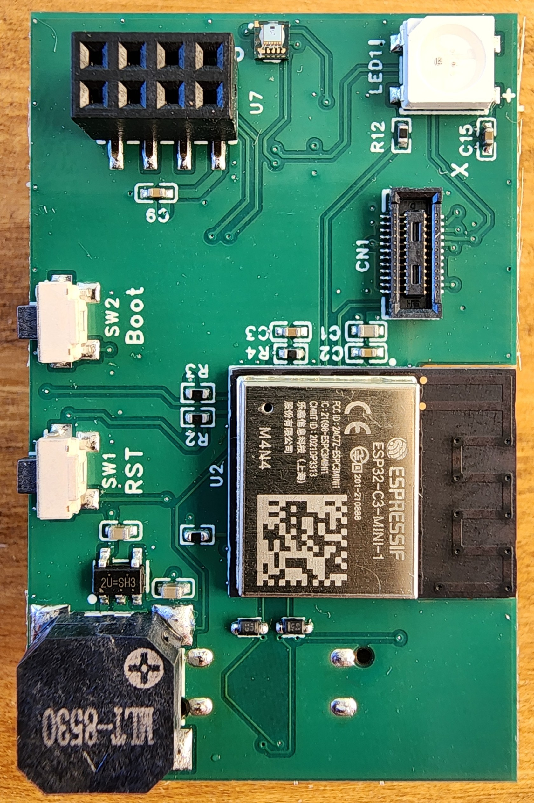
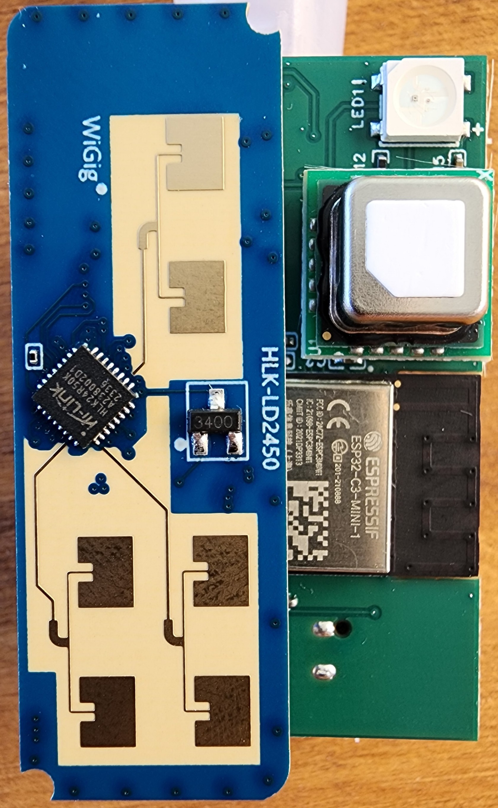
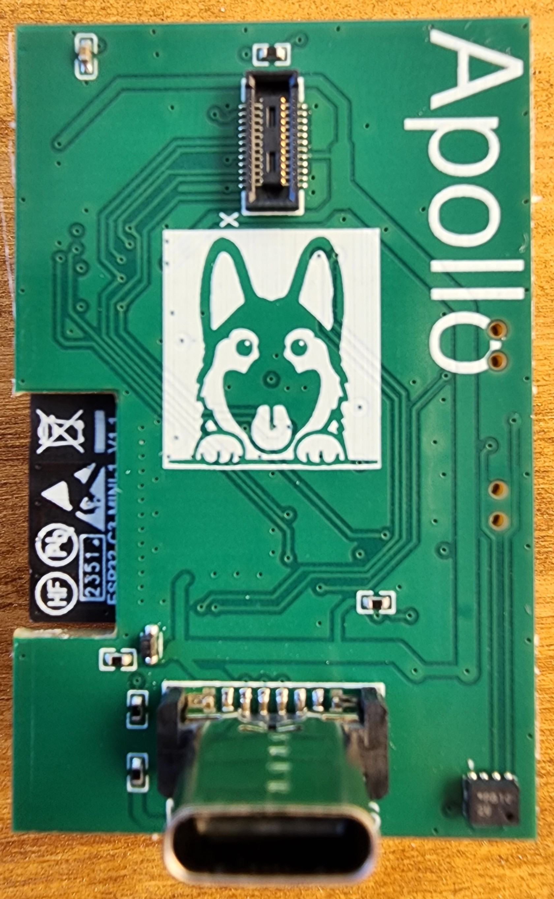
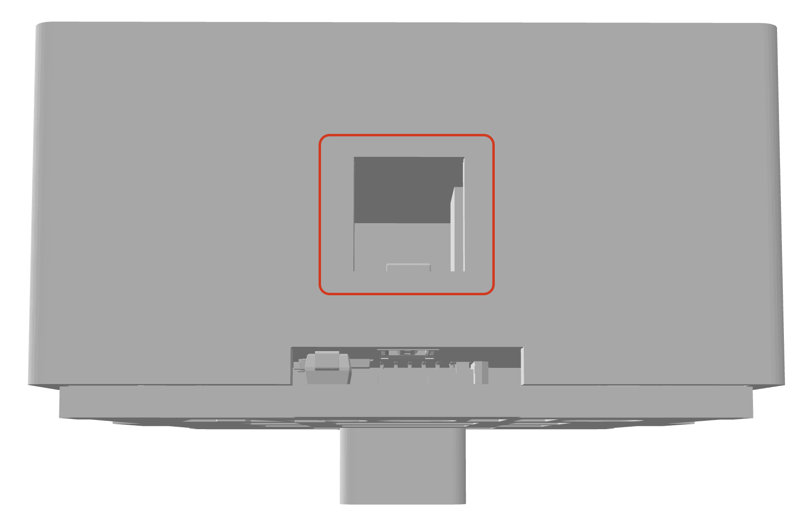
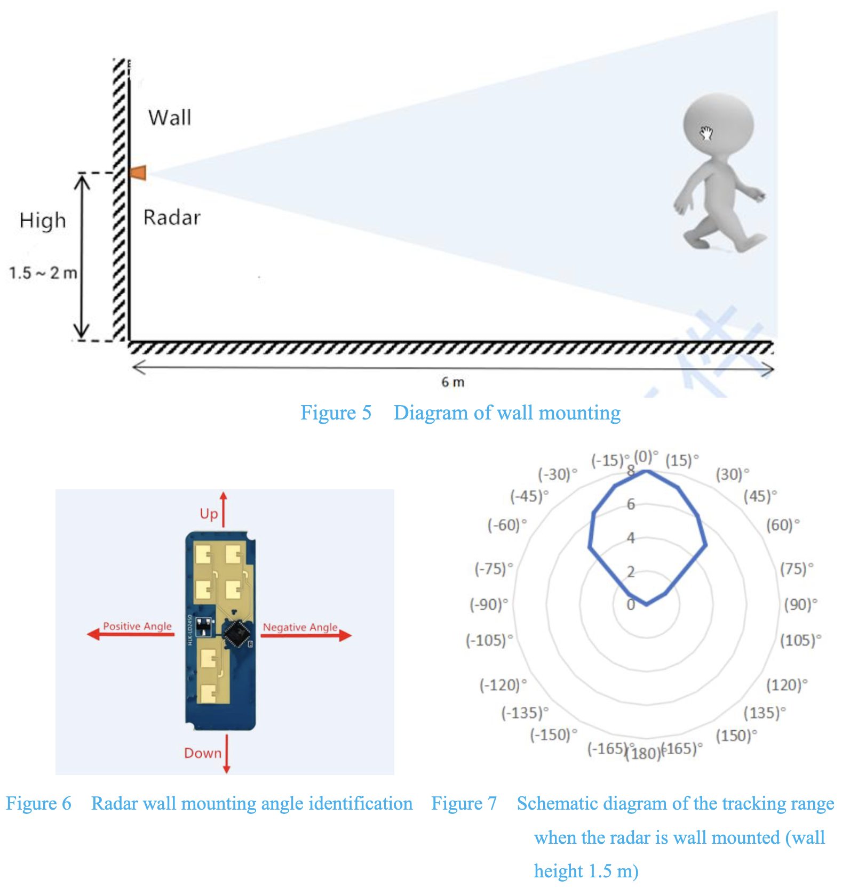
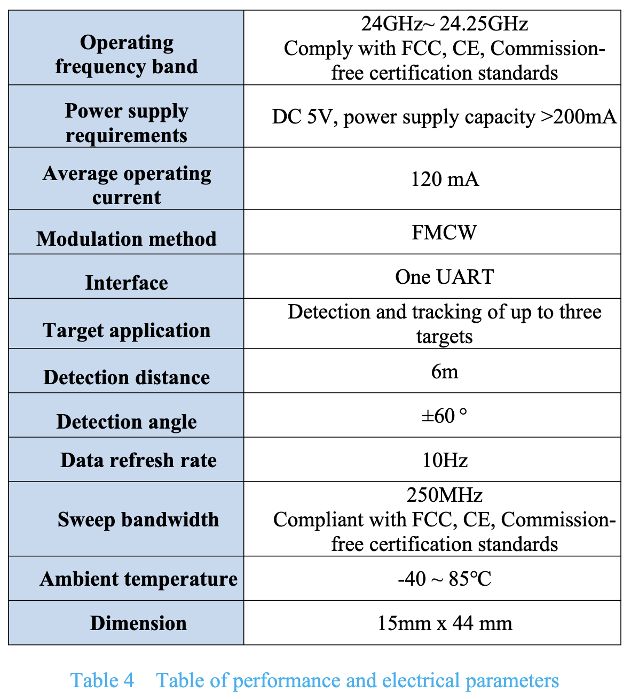
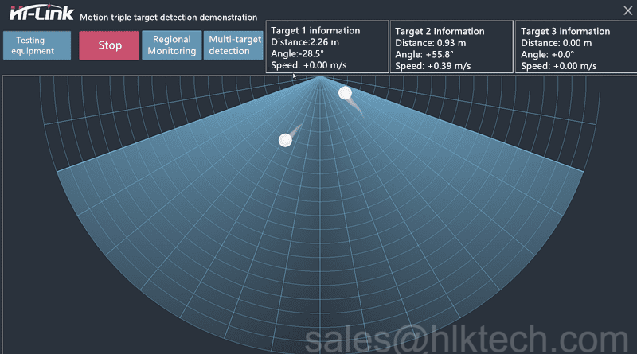

# General Tips

##### **MTR-1 PCB with Sensors**



##### **Light Sensor (LTR-390UV)**



When mounting the MTR-1 be sure to position the device so that the large hole at the top is not covered. This allows more light to enter and will ensure better accuracy

The onboard RGB LED will trigger the light sensor. Be cognizant of this when making automations based on light/LUX.

##### **Mounting**



##### **LD2450 Performance and Electrical Parameters**

##### [**LD2450 Datasheet**](https://www.tinytronics.nl/index.php?route=product/product/get_file&amp;file=6000/HLK-LD2450-Instruction-Manual.pdf)



##### **Expanding Horizontal Distance as Target Moves Further Away**

The detection is 60 degrees from center on each side. So it is a cone when you are close to it but at 4 feet away to the side you might not be visible. If you are further from the wall it can detect further in a horizontal distance.



##### **Increased ESP Temperature**

If you are experiencing higher than normal ESP temperatures ~140+ degrees F then changing the wifi power save mode option might help decrease the temperature. Here is the link to the ESPHome WiFi Component [Power Save Mode](https://esphome.io/components/wifi.html#power-save-mode).

**Power Save Mode** The Wi-Fi interface of all ESP32 devices offer three power save modes to reduce the amount of power spent on Wi-Fi. While some options can reduce the power usage of the ESP, they generally also decrease the reliability of the Wi-Fi connection, with frequent disconnections from the router in the highest power saving mode. Switch to "none" to get the best Wi-Fi performance!

```yaml
wifi:
  # ...
  power_save_mode: none
```