# Zone Configuration Using Home Assistant

***Disclaimer: Currently having issues saving the zones after restarting the device when using this method. It is recommended to use the*** [***HLKRadarTool App Zone Configuration Guide***](https://wiki.apolloautomation.com/products/mtr1/setup/zones-hlk/)***.***

!!! tip "Tip"

    ***Users are currently having issues saving the zones after restarting the device when using this method. It is recommended to use the*** [***HLKRadarTool App Zone Configuration Guide***](https://wiki.apolloautomation.com/products/mtr1/setup/zones-hlk/)***.***

1\.Install [HACS](https://hacs.xyz/docs/use/)

2\. Install [Plotly](https://github.com/dbuezas/lovelace-plotly-graph-card "Click here to install Plotly!") and [Decluttering Card](https://github.com/custom-cards/decluttering-card "Click here to install Decluttering Card!") inside HACS.

!!! danger "You can break things at this point!"

    Now you are able to break things if you do not follow along exactly as shown in the tutorial.

3\. Click edit dashboard in the top right then click the 3 dots menu then choose "Raw configuration editor".

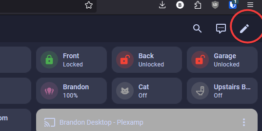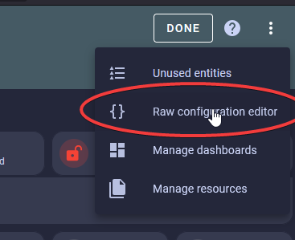

4\. Make sure to scroll to the very bottom and start a new line all the way to the left as shown in the image below. Make sure to save and exit in the top right when finished.

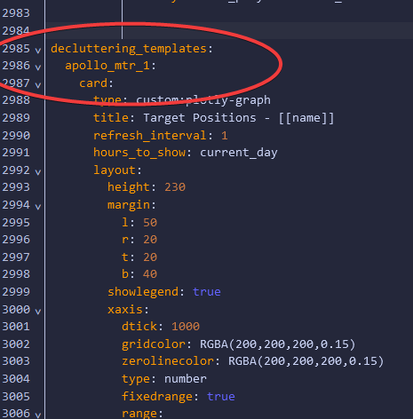

5\. Copy the code below and paste it on the new line from step 4.

```yaml
decluttering_templates:
  apollo_mtr_1:
    card:
      type: custom:plotly-graph
      title: Target Positions - [[name]]
      refresh_interval: 1
      hours_to_show: current_day
      layout:
        height: 230
        margin:
          l: 50
          r: 20
          t: 20
          b: 40
        showlegend: true
        xaxis:
          dtick: 1000
          gridcolor: RGBA(200,200,200,0.15)
          zerolinecolor: RGBA(200,200,200,0.15)
          type: number
          fixedrange: true
          range:
            - 4000
            - -4000
        yaxis:
          dtick: 1000
          gridcolor: RGBA(200,200,200,0.15)
          zerolinecolor: RGBA(200,200,200,0.15)
          scaleanchor: x
          scaleratio: 1
          fixedrange: true
          range:
            - 7500
            - 0
      entities:
        - entity: ''
          name: Target1
          marker:
            size: 12
          line:
            shape: spline
            width: 5
          x:
            - $ex hass.states["sensor.[[name]]_target_1_x"].state
          'y':
            - $ex hass.states["sensor.[[name]]_target_1_y"].state
        - entity: ''
          name: Target2
          marker:
            size: 12
          line:
            shape: spline
            width: 5
          x:
            - $ex hass.states["sensor.[[name]]_target_2_x"].state
          'y':
            - $ex hass.states["sensor.[[name]]_target_2_y"].state
        - entity: ''
          name: Target3
          marker:
            size: 12
          line:
            shape: spline
            width: 5
          x:
            - $ex hass.states["sensor.[[name]]_target_3_x"].state
          'y':
            - $ex hass.states["sensor.[[name]]_target_3_y"].state
        - entity: ''
          name: Zone1
          mode: lines
          fill: toself
          fillcolor: RGBA(20,200,0,0.06)
          line:
            color: RGBA(20,200,0,0.2)
            shape: line
            width: 2
          x:
            - $ex hass.states["number.[[name]]_zone_1_x1"].state
            - $ex hass.states["number.[[name]]_zone_1_x1"].state
            - $ex hass.states["number.[[name]]_zone_1_x2"].state
            - $ex hass.states["number.[[name]]_zone_1_x2"].state
            - $ex hass.states["number.[[name]]_zone_1_x1"].state
          'y':
            - $ex hass.states["number.[[name]]_zone_1_y1"].state
            - $ex hass.states["number.[[name]]_zone_1_y2"].state
            - $ex hass.states["number.[[name]]_zone_1_y2"].state
            - $ex hass.states["number.[[name]]_zone_1_y1"].state
            - $ex hass.states["number.[[name]]_zone_1_y1"].state
        - entity: ''
          name: Zone2
          mode: lines
          fill: toself
          fillcolor: RGBA(200,0,255,0.06)
          line:
            color: RGBA(200,0,255,0.2)
            shape: line
            width: 2
          x:
            - $ex hass.states["number.[[name]]_zone_2_x1"].state
            - $ex hass.states["number.[[name]]_zone_2_x1"].state
            - $ex hass.states["number.[[name]]_zone_2_x2"].state
            - $ex hass.states["number.[[name]]_zone_2_x2"].state
            - $ex hass.states["number.[[name]]_zone_2_x1"].state
          'y':
            - $ex hass.states["number.[[name]]_zone_2_y1"].state
            - $ex hass.states["number.[[name]]_zone_2_y2"].state
            - $ex hass.states["number.[[name]]_zone_2_y2"].state
            - $ex hass.states["number.[[name]]_zone_2_y1"].state
            - $ex hass.states["number.[[name]]_zone_2_y1"].state
        - entity: ''
          name: Zone3
          mode: lines
          fill: toself
          fillcolor: RGBA(200,120,55,0.06)
          line:
            color: RGBA(200,120,55,0.2)
            shape: line
            width: 2
          x:
            - $ex hass.states["number.[[name]]_zone_3_x1"].state
            - $ex hass.states["number.[[name]]_zone_3_x1"].state
            - $ex hass.states["number.[[name]]_zone_3_x2"].state
            - $ex hass.states["number.[[name]]_zone_3_x2"].state
            - $ex hass.states["number.[[name]]_zone_3_x1"].state
          'y':
            - $ex hass.states["number.[[name]]_zone_3_y1"].state
            - $ex hass.states["number.[[name]]_zone_3_y2"].state
            - $ex hass.states["number.[[name]]_zone_3_y2"].state
            - $ex hass.states["number.[[name]]_zone_3_y1"].state
            - $ex hass.states["number.[[name]]_zone_3_y1"].state
        - entity: ''
          name: Coverage
          mode: lines
          fill: tonexty
          fillcolor: rgba(168, 216, 234, 0.15)
          line:
            shape: line
            width: 1
            dash: dot
          x:
            - 0
            - $ex 7500 * Math.sin((2 * Math.PI)/360 * 60)
            - 4500
            - 4000
            - 3000
            - 2000
            - 1000
            - 0
            - -1000
            - -2000
            - -3000
            - -4000
            - -4500
            - $ex -7500 * Math.sin((2 * Math.PI)/360 * 60)
            - 0
          'y':
            - 0
            - $ex 7500 * Math.cos((2 * Math.PI)/360 * 60)
            - $ex Math.sqrt( 7500**2 - 4500**2 )
            - $ex Math.sqrt( 7500**2 - 4000**2 )
            - $ex Math.sqrt( 7500**2 - 3000**2 )
            - $ex Math.sqrt( 7500**2 - 2000**2 )
            - $ex Math.sqrt( 7500**2 - 1000**2 )
            - 7500
            - $ex Math.sqrt( 7500**2 - 1000**2 )
            - $ex Math.sqrt( 7500**2 - 2000**2 )
            - $ex Math.sqrt( 7500**2 - 3000**2 )
            - $ex Math.sqrt( 7500**2 - 4000**2 )
            - $ex Math.sqrt( 7500**2 - 4500**2 )
            - $ex 7500 * Math.cos((2 * Math.PI)/360 * 60)
            - 0
      raw_plotly_config: true
```

6\. Copy the code below to use in the next step. Please change the "name" in the code below to the name of your MTR-1 sensor. If you are unsure what name to use here, please head to the [ESPHome Integrations page](http://homeassistant.local:8123/config/integrations/integration/esphome "Click me to go to the ESPHome integrations page") and navigate to your device then find the full device name. Unless you renamed it, your device will likely be called "apollo\_mtr\_1\_" with 6 random numbers/letters after the final underscore as shown in the example image below.

```yaml
template: apollo_mtr_1
type: custom:decluttering-card
variables:
  - name: apollo_mtr_1_c64a28
```

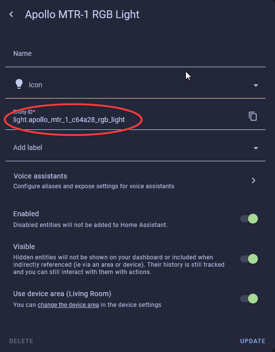

7\. Click edit dashboard in the top right then choose ADD CARD in the bottom right. Type in "Manual" then select Manual.

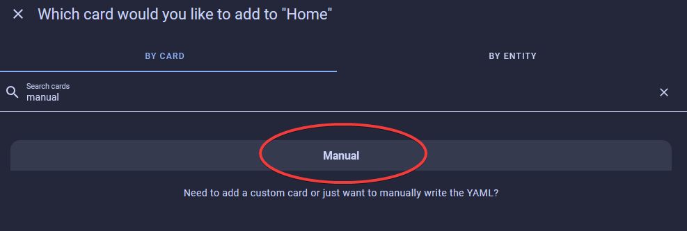

8\. Paste in the code you copied from step 6 and you should now see this:

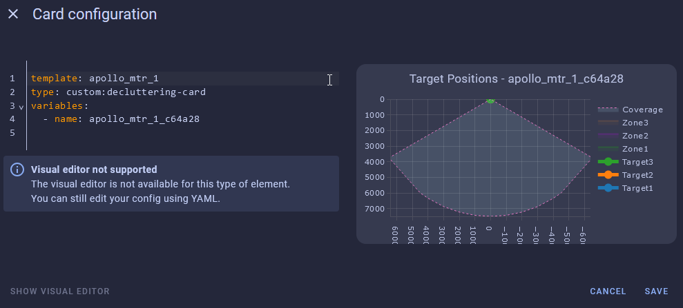

9\. Head to the [ESPHome Integrations page](http://homeassistant.local:8123/config/integrations/integration/esphome "Click me to go to the ESPHome integrations page")

10\. Click device as shown in the image below

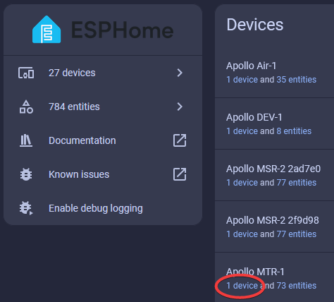

8\. Scroll down until you get to the Configuration section and you see the empty boxes for zones 1-3 for both X and Y coordinates.

!!! tip "Suggested settings"

    * Multi Target Tracking toggled on helps it detect up to three targets better.
    * Zone Type allows you to select Disabled, Detection, or Filter.
    * Disabled: Disable zone area detection.
    * Detection: Only detects targets in the specified zone.
    * Filter: Excludes a zone from detection.

9\. Now we can input our Zone 1-3 X and Y values to make our zones. Using the visual card from above, we can walk, sit, or stand in the area where we want to create a detection or non-detection zone. Input values for X are -7000 mm to 7000 mm, and the Y values are 0 mm to 7000 mm.<br> 

10\. If you use the imperial system (Freedom Units) then you will need to do this step. Metric users can skip this. For the targets to show up correctly we first need to update the Target 1-3 X and Y measurements from inches (in) to millimeters (mm). Find Target 1-3 X and Y under the Sensors section and select them. You will want to update all 3 targets X and Y values.<br> 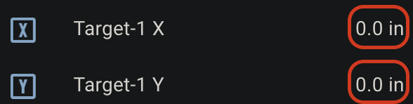

11\. Select the Settings cog in the top right.<br> 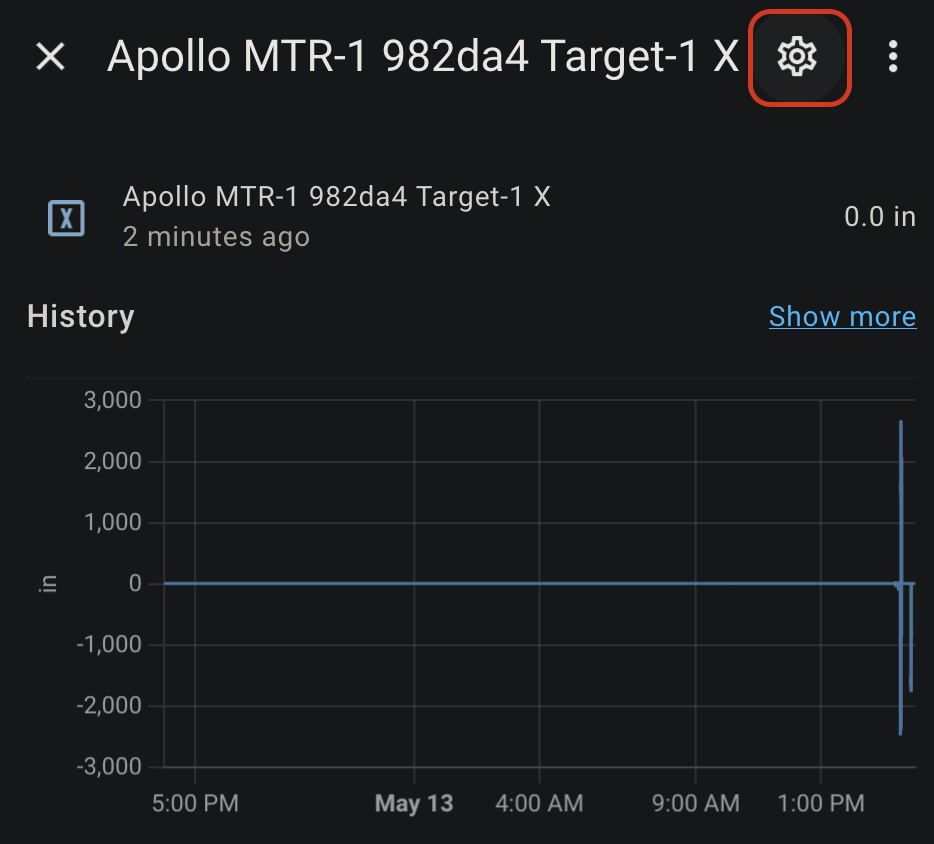

12\. Change the unit of measurement to mm and select Update.<br> 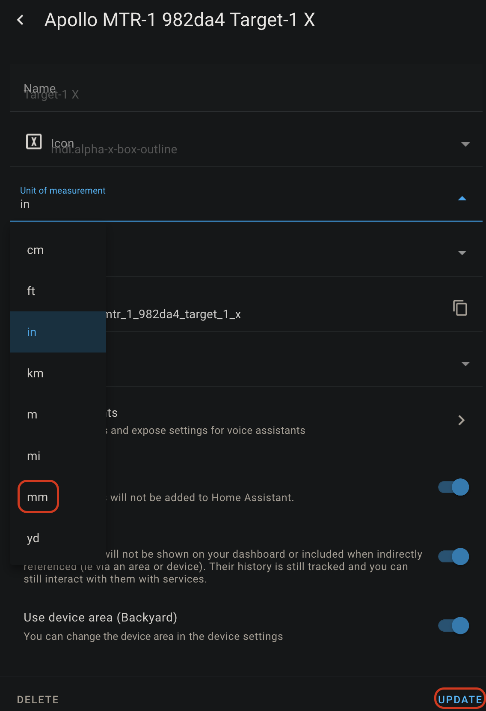

13\. Now you should see targets on the card.<br> 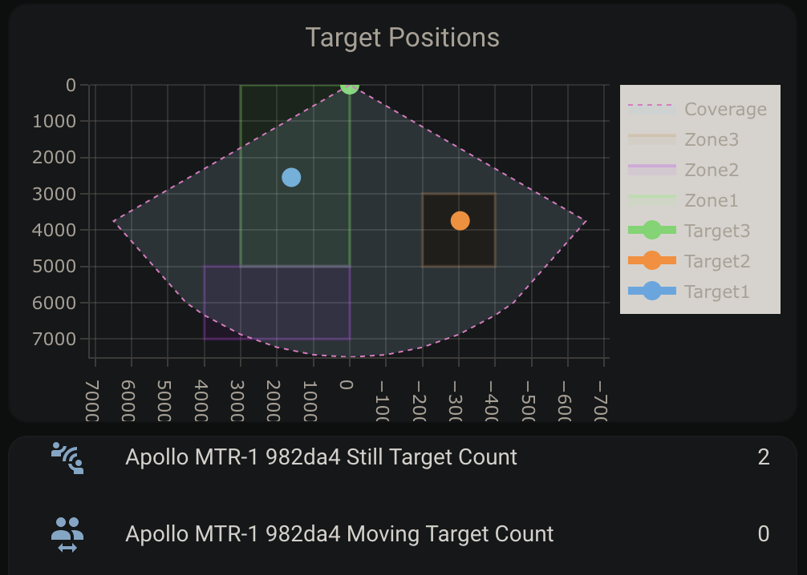

14\. Now we can make zones around the targets where you want to Detect presence or filter them out

!!! ! tip "Tip for zone configuration resetting"

    If your zone configurations are not saved when restarting the device then try turning on the LD2450 Bluetooth for a few seconds and then turning it off again. You can also try to toggle on Multi Target Radar. This should wake up the mmWave module and retrieve your saved zones