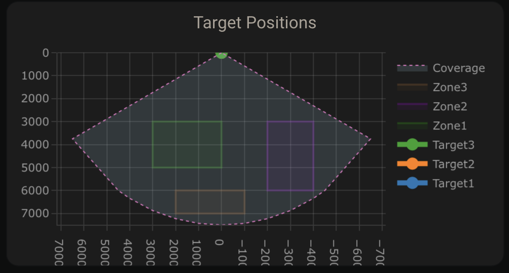
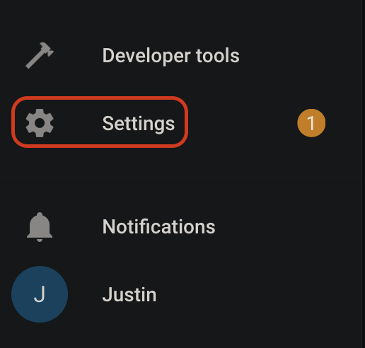
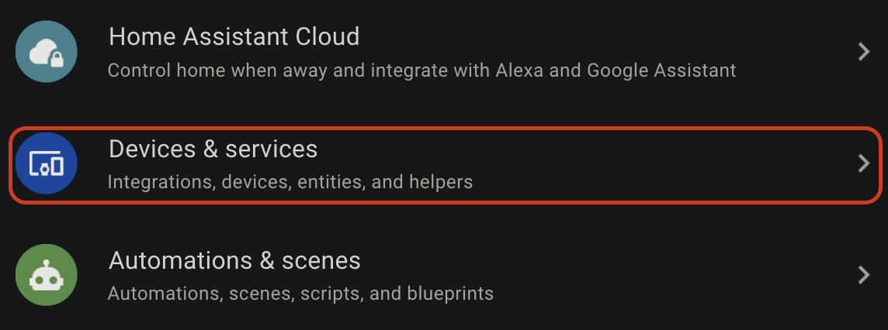
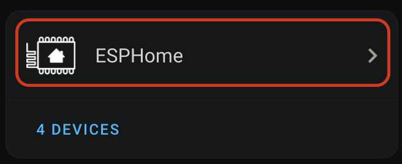
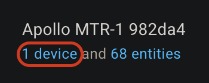
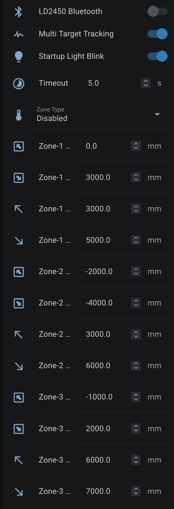

# Zone Configuration Using Home Assistant

***Disclaimer: Currently having issues saving the zones after restarting the device when using this method. It is recommended to use the*** [***HLKRadarTool App Zone Configuration Guide***](https://wiki.apolloautomation.com/books/mtr-1-ImK/page/zone-configuration-using-hlkradartool-app)***.***

!!! warning "Warning"

    ***Users are currently having issues saving the zones after restarting the device when using this method. It is recommended to use the*** [***HLKRadarTool App Zone Configuration Guide***](https://wiki.apolloautomation.com/products/mtr1/setup/zones-hlk/)***.***

You will need to have HACS and Plotly installed to make it easier to visualize the zones. If you already have HACS then you can skip Step 1. Same for Step 2 if you have Plotly.

1\.Install [HACS](https://hacs.xyz/docs/use/)

2\. Install [Plotly](https://github.com/dbuezas/lovelace-plotly-graph-card)

3\. Copy the code below and add a Home Assistant card to visualize your zones. You will need to change all of the sensor\_apollo\_mtr\_1 entity IDs to match your MTR-1 device. This can be done quickly by using a code editor or ChatGPT.<br> 

```
type: custom:plotly-graph
title: Target Positions
refresh_interval: 1
hours_to_show: current_day
layout:
  height: 230
  margin:
    l: 50
    r: 20
    t: 20
    b: 40
  showlegend: true
  xaxis:
    dtick: 1000
    gridcolor: RGBA(200,200,200,0.15)
    zerolinecolor: RGBA(200,200,200,0.15)
    type: number
    fixedrange: true
    range:
      - 4000
      - -4000
  yaxis:
    dtick: 1000
    gridcolor: RGBA(200,200,200,0.15)
    zerolinecolor: RGBA(200,200,200,0.15)
    scaleanchor: x
    scaleratio: 1
    fixedrange: true
    range:
      - 7500
      - 0
entities:
  - entity: ''
    name: Target1
    marker:
      size: 12
    line:
      shape: spline
      width: 5
    x:
      - $ex hass.states["sensor.apollo_mtr_1_982da4_target_1_x"].state
    'y':
      - $ex hass.states["sensor.apollo_mtr_1_982da4_target_1_y"].state
  - entity: ''
    name: Target2
    marker:
      size: 12
    line:
      shape: spline
      width: 5
    x:
      - $ex hass.states["sensor.apollo_mtr_1_982da4_target_2_x"].state
    'y':
      - $ex hass.states["sensor.apollo_mtr_1_982da4_target_2_y"].state
  - entity: ''
    name: Target3
    marker:
      size: 12
    line:
      shape: spline
      width: 5
    x:
      - $ex hass.states["sensor.apollo_mtr_1_982da4_target_3_x"].state
    'y':
      - $ex hass.states["sensor.apollo_mtr_1_982da4_target_3_y"].state
  - entity: ''
    name: Zone1
    mode: lines
    fill: toself
    fillcolor: RGBA(20,200,0,0.06)
    line:
      color: RGBA(20,200,0,0.2)
      shape: line
      width: 2
    x:
      - $ex hass.states["number.apollo_mtr_1_982da4_zone_1_x1"].state
      - $ex hass.states["number.apollo_mtr_1_982da4_zone_1_x1"].state
      - $ex hass.states["number.apollo_mtr_1_982da4_zone_1_x2"].state
      - $ex hass.states["number.apollo_mtr_1_982da4_zone_1_x2"].state
      - $ex hass.states["number.apollo_mtr_1_982da4_zone_1_x1"].state
    'y':
      - $ex hass.states["number.apollo_mtr_1_982da4_zone_1_y1"].state
      - $ex hass.states["number.apollo_mtr_1_982da4_zone_1_y2"].state
      - $ex hass.states["number.apollo_mtr_1_982da4_zone_1_y2"].state
      - $ex hass.states["number.apollo_mtr_1_982da4_zone_1_y1"].state
      - $ex hass.states["number.apollo_mtr_1_982da4_zone_1_y1"].state
  - entity: ''
    name: Zone2
    mode: lines
    fill: toself
    fillcolor: RGBA(200,0,255,0.06)
    line:
      color: RGBA(200,0,255,0.2)
      shape: line
      width: 2
    x:
      - $ex hass.states["number.apollo_mtr_1_982da4_zone_2_x1"].state
      - $ex hass.states["number.apollo_mtr_1_982da4_zone_2_x1"].state
      - $ex hass.states["number.apollo_mtr_1_982da4_zone_2_x2"].state
      - $ex hass.states["number.apollo_mtr_1_982da4_zone_2_x2"].state
      - $ex hass.states["number.apollo_mtr_1_982da4_zone_2_x1"].state
    'y':
      - $ex hass.states["number.apollo_mtr_1_982da4_zone_2_y1"].state
      - $ex hass.states["number.apollo_mtr_1_982da4_zone_2_y2"].state
      - $ex hass.states["number.apollo_mtr_1_982da4_zone_2_y2"].state
      - $ex hass.states["number.apollo_mtr_1_982da4_zone_2_y1"].state
      - $ex hass.states["number.apollo_mtr_1_982da4_zone_2_y1"].state
  - entity: ''
    name: Zone3
    mode: lines
    fill: toself
    fillcolor: RGBA(200,120,55,0.06)
    line:
      color: RGBA(200,120,55,0.2)
      shape: line
      width: 2
    x:
      - $ex hass.states["number.apollo_mtr_1_982da4_zone_3_x1"].state
      - $ex hass.states["number.apollo_mtr_1_982da4_zone_3_x1"].state
      - $ex hass.states["number.apollo_mtr_1_982da4_zone_3_x2"].state
      - $ex hass.states["number.apollo_mtr_1_982da4_zone_3_x2"].state
      - $ex hass.states["number.apollo_mtr_1_982da4_zone_3_x1"].state
    'y':
      - $ex hass.states["number.apollo_mtr_1_982da4_zone_3_y1"].state
      - $ex hass.states["number.apollo_mtr_1_982da4_zone_3_y2"].state
      - $ex hass.states["number.apollo_mtr_1_982da4_zone_3_y2"].state
      - $ex hass.states["number.apollo_mtr_1_982da4_zone_3_y1"].state
      - $ex hass.states["number.apollo_mtr_1_982da4_zone_3_y1"].state
  - entity: ''
    name: Coverage
    mode: lines
    fill: tonexty
    fillcolor: rgba(168, 216, 234, 0.15)
    line:
      shape: line
      width: 1
      dash: dot
    x:
      - 0
      - $ex 7500 * Math.sin((2 * Math.PI)/360 * 60)
      - 4500
      - 4000
      - 3000
      - 2000
      - 1000
      - 0
      - -1000
      - -2000
      - -3000
      - -4000
      - -4500
      - $ex -7500 * Math.sin((2 * Math.PI)/360 * 60)
      - 0
    'y':
      - 0
      - $ex 7500 * Math.cos((2 * Math.PI)/360 * 60)
      - $ex Math.sqrt( 7500**2 - 4500**2 )
      - $ex Math.sqrt( 7500**2 - 4000**2 )
      - $ex Math.sqrt( 7500**2 - 3000**2 )
      - $ex Math.sqrt( 7500**2 - 2000**2 )
      - $ex Math.sqrt( 7500**2 - 1000**2 )
      - 7500
      - $ex Math.sqrt( 7500**2 - 1000**2 )
      - $ex Math.sqrt( 7500**2 - 2000**2 )
      - $ex Math.sqrt( 7500**2 - 3000**2 )
      - $ex Math.sqrt( 7500**2 - 4000**2 )
      - $ex Math.sqrt( 7500**2 - 4500**2 )
      - $ex 7500 * Math.cos((2 * Math.PI)/360 * 60)
      - 0
raw_plotly_config: true
```

4\. Open Home Assistant and select Settings<br> <br> 5. Select Devices and services<br> <br> 6. Select ESPHome<br> <br> 7. Select your MTR-1 device

<br> 8. Scroll down to the Configuration section and you should see Zone 1-3 X and Y boxes.<br> - LD2450 Bluetooth can be turned on if you would like to use the HLKRadarTool App to configure the zones.<br> - Multi Target Tracking toggled on helps it detect up to three targets better (still trying to figure out "how" this works).<br> - Zone Type allows you to select Disabled, Detection, or Filter.<br> - Disabled: Disable zone area detection<br> - Detection: Only detects targets in the specified zone<br> - Filter: Excludes a zone from detection<br> <br> 9. Now we can input our Zone 1-3 X and Y values to make our zones. Using the visual card from above, we can walk, sit, or stand in the area where we want to create a detection or non-detection zone. Input values for X are -7000 mm to 7000 mm, and the Y values are 0 mm to 7000 mm.<br> <br> 10. If you use the imperial system (Freedom Units) then you will need to do this step. Metric users can skip this. For the targets to show up correctly we first need to update the Target 1-3 X and Y measurements from inches (in) to millimeters (mm). Find Target 1-3 X and Y under the Sensors section and select them. You will want to update all 3 targets X and Y values.<br> <br> 11. Select the Settings cog in the top right.<br> <br> 12. Change the unit of measurement to mm and select Update.<br> <br> 13. Now you should see targets on the card.<br> <br> 14. Now we can make zones around the targets where you want to Detect presence or filter them out!

!!! tip "Tip for zone configuration resetting"

    If your zone configurations are not saved when restarting the device then try turning on the LD2450 Bluetooth for a few seconds and then turning it off again. You can also try to toggle on Multi Target Radar. This should wake up the mmWave module and retrieve your saved zones