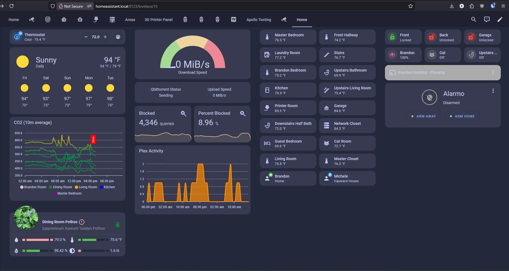
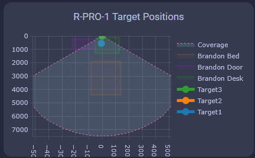
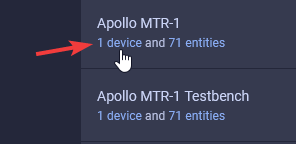
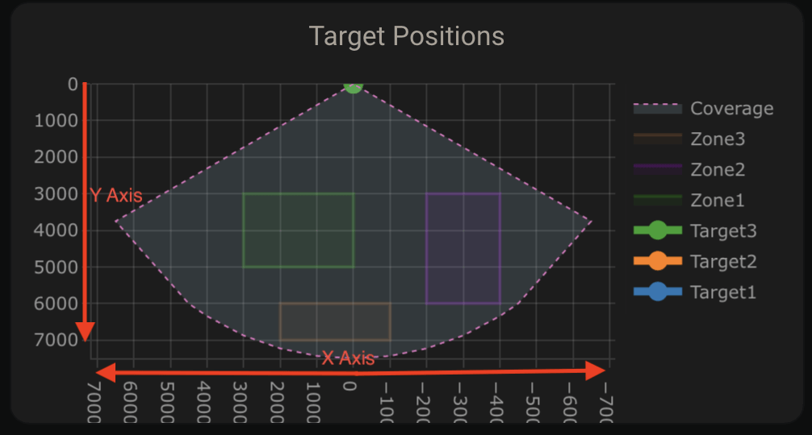
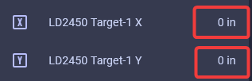
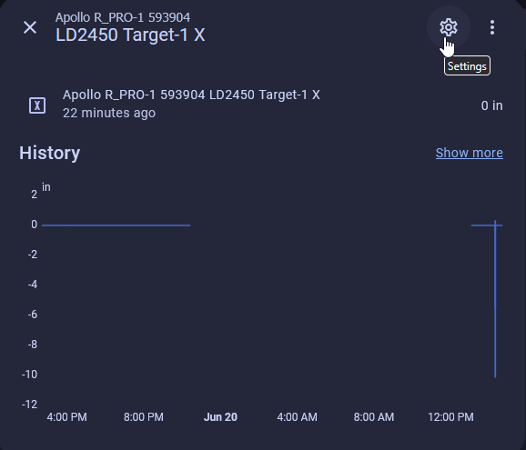
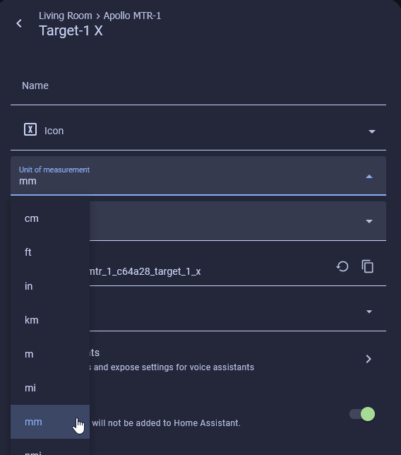
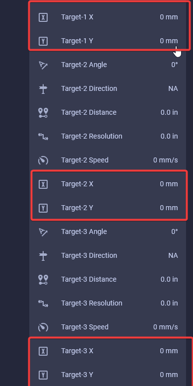
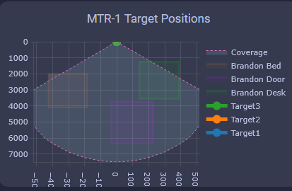

# How To Tune The MTR-1 Using Home Assistant

Below are steps to manually enter in the X and Y coordinates for each zone in Home Assistant or directly from the device's webserver by visiting the IP address or hostname.local. It's much easier to <a href="https://wiki.apolloautomation.com/products/rpro1/calibrating-and-updating/zones-hlk/" rel="noreferrer nofollow">tune using the HLK Radartool App</a> and we suggest using that to set up your MTR-1.

1\. Install [HACS](https://hacs.xyz/docs/use/).

2\. Install [Plotly](https://github.com/dbuezas/lovelace-plotly-graph-card "Click here to install Plotly!") inside HACS.

3\. Enter your device’s full name and optionally customize the names of the three zones using the tool below. Then click **Generate YAML** and **Copy YAML.** If you're unsure of your device name, go to the <a href="http://homeassistant.local:8123/config/integrations/integration/esphome" target="_blank" rel="noreferrer nofollow noopener">ESPHome Integrations page</a>, select your device, and look for the full name. Unless you’ve renamed it, it will likely be something like "apollo\_r\_mtr\_1\_c64a28", with six random characters at the end.

<iframe src="/snippets/mtr1-plotly-yaml-generator.html" width="100%" height="700" style="border: none;"></iframe>

4\. Head to a dashboard view and click the pencil icon to edit dashboard then click one of the large "+" signs, type in manual, and click on it.

5\. Delete any text in the custom card then paste the YAML you copied above and click save when finished. You should now have a custom card that looks just like the card below!

6\. Head to the [ESPHome Integrations page](http://homeassistant.local:8123/config/integrations/integration/esphome "Click me to go to the ESPHome integrations page")

7\. Click device as shown in the image below

8\. Scroll down until you get to the Configuration section and you see the empty boxes for zones 1-3 for both X and Y coordinates.

!!! tip "Suggested settings"

    * Multi Target Tracking toggled on helps it detect up to three targets better.
    * Zone Type allows you to select Disabled, Detection, or Filter.
    * Disabled: Disable zone area detection.
    * Detection: Only detects targets in the specified zone.
    * Filter: Excludes a zone from detection.

9\. Now we can input our Zone 1-3 X and Y values to make our zones. Using the visual card from above, we can walk, sit, or stand in the area where we want to create a detection or non-detection zone. Input values for X are -7000 mm to 7000 mm, and the Y values are 0 mm to 7000 mm.

!!! tip "Helpful Hints to understand zones better!"

    * X1 must always be less than X2, and Y1 must always be less than Y2.

    * The Y axis is easier since it's never negative.

      &nbsp;

    * The X axis is where you can get tripped up, especially when both values are negative: -3456 is less than -2345.
    * The Plotly chart will still render the rectangles even if the X1/X2 and Y1/Y2 values are reversed.
    * The zones cannot overlap.

10\. If you use the imperial system (Freedom Units) then you will need to do this step. Metric users can skip this. For the targets to show up correctly we first need to update the Target 1-3 X and Y measurements from inches (in) to millimeters (mm). Find Target 1-3 X and Y under the Sensors section and select them. You will want to update all 3 X and Y target values.

11\. Select the Settings cog in the top right.

12\. Change the unit of measurement to mm and select Update.

13\. Your X and Y Targets will now look like this.

14\. Now you should see targets on the card.

15\. Now we can make zones around the targets where you want to Detect presence or filter them out.

!!! tip tip "Tip for zone configuration resetting"

    If your zone configurations are not saved when restarting the device then try turning on the LD2450 Bluetooth for a few seconds and then turning it off again. You can also try to toggle on Multi Target Radar. This should wake up the mmWave module and retrieve your saved zones