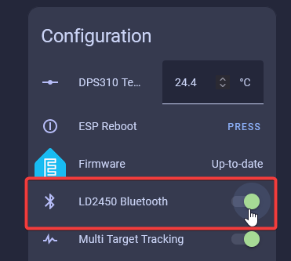
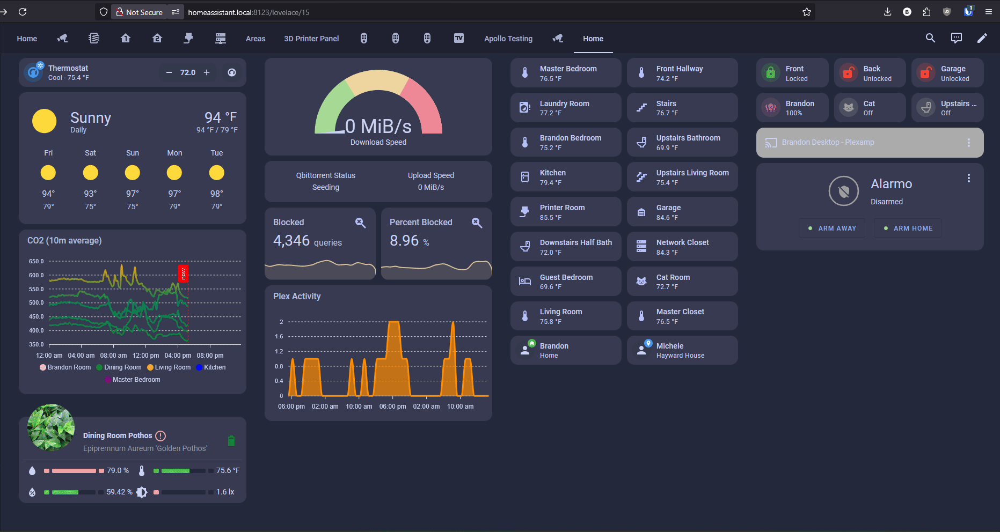

<iframe width="560" height="315" src="https://www.youtube.com/embed/-w_GFURyx-A?si=SSRovumabCvHeXwo" title="YouTube video player" frameborder="0" allow="accelerometer; autoplay; clipboard-write; encrypted-media; gyroscope; picture-in-picture; web-share" referrerpolicy="strict-origin-when-cross-origin" allowfullscreen=""></iframe>

###### Configure Zones

!!! note "Ensure that the LD2450 firmware version is V2.02.23090617 or later for proper integration functionality. "

    The newer version of the firmware includes an "auto calibrate" function so you might want to test it out!

The <a href="https://www.hlktech.net/index.php?id=1157" target="_blank" rel="noreferrer nofollow noopener">HLK-LD2450</a> mmWave sensor is used in the MTR-1. <a href="https://drive.google.com/drive/folders/1aItrdziwnEqI-ovDWf24Lj6ioALaljFA?usp=sharing" target="_blank" rel="noreferrer nofollow noopener">Click Here</a> for the datasheet.

=== "iPhone"

    <a href="https://apps.apple.com/us/app/hlkradartool/id1638651152" target="_blank" rel="noreferrer nofollow noopener">Click here to download</a>

=== "Android"

    <a href="https://play.google.com/store/apps/details?id=com.hlk.hlkradartool&amp;hl=en_US" target="_blank" rel="noreferrer nofollow noopener">Click here to download</a>

1\. Head to the <a href="http://homeassistant.local:8123/config/integrations/integration/esphome" title="Click me to go to the ESPHome integrations page" target="_blank" rel="noreferrer nofollow noopener">ESPHome Integrations page</a> then select your MTR-1 and scroll down until you see LD2450 Bluetooth.

2\. Open the HLKRadarTool App and select your device.

!!! success "You need to be close to your device!"

    The LD2450 mmWave sensor is a very tiny sensor with no external antenna, which means it cannot connect to bluetooth devices unless they are very close. Sometimes this means you need to be within a few feet of the sensor to connect directly to it!

3\. Select Set in the top right.

4\. Select Detection then toggle Area 1, 2, or 3 and you will see a box with the corresponding number pop up. Then you can press and hold the box to move it and resize it. When your zones are set then select Submit and you should see Setup successfully.

!!! tip "There are three ways to use your MTR-1!"

    You can use any of these three choices to control your MTR-1 differently. The most common option is "Detection" which lets you setup three areas and track three targets within them. **Disabled**: Disable zone area detection **Detection**: Only detects targets in the specified zone **Filter**: Excludes a zone from detection

    Disabled allows you to just use the sensor as a "basic" presence sensor and "Filter" lets you filter out an area and detect everything else, which is useful to avoid a fan!

5\. If set up correctly the zones should be saved as different colors. You can double-check that the settings are saved by looking at your HA entities (picture below). You should be all set!

!!! tip "Helpful Hints to understand zones better!"

    * X1 must always be less than X2, and Y1 must always be less than Y2.

    * The Y axis is easier since it's never negative.

      &nbsp;

    * The X axis is where you can get tripped up, especially when both values are negative: -3456 is less than -2345.
    * The Plotly chart will still render the rectangles even if the X1/X2 and Y1/Y2 values are reversed.
    * The zones cannot overlap.

###### Dashboard Card Setup

1\. Install [HACS](https://hacs.xyz/docs/use/).

2\. Install [Plotly](https://github.com/dbuezas/lovelace-plotly-graph-card "Click here to install Plotly!") inside HACS.

3\. Enter your device’s full name and optionally customize the names of the three zones using the tool below. Then click **Generate YAML** and **Copy YAML.** If you're unsure of your device name, go to the <a href="http://homeassistant.local:8123/config/integrations/integration/esphome" target="_blank" rel="noreferrer nofollow noopener">ESPHome Integrations page</a>, select your device, and look for the full name. Unless you’ve renamed it, it will likely be something like "apollo\_r\_mtr\_1\_c64a28", with six random characters at the end.

<iframe src="/snippets/mtr1-plotly-yaml-generator.html" width="100%" height="700" style="border: none;"></iframe>

4\. Head to a dashboard view and click the pencil icon to edit dashboard then click one of the large "+" signs, type in manual, and click on it.

5\. Delete any text in the custom card then paste the YAML you copied above and click save when finished. You should now have a custom card that looks just like the card below!

