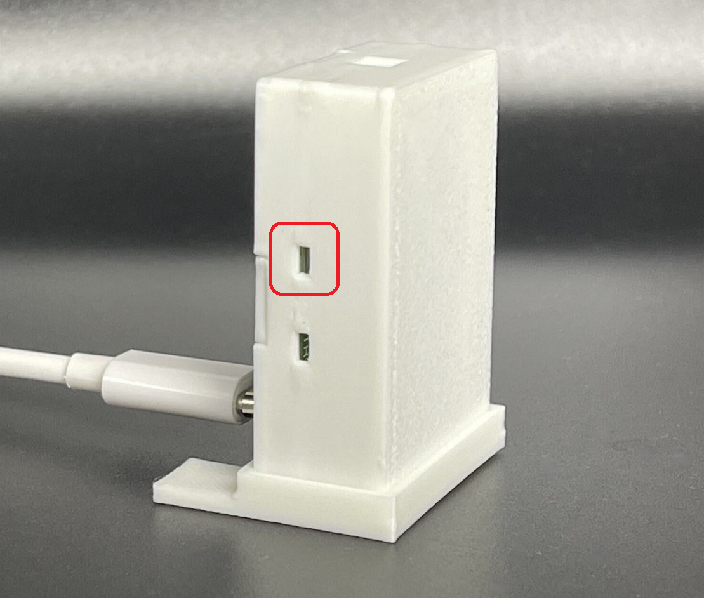
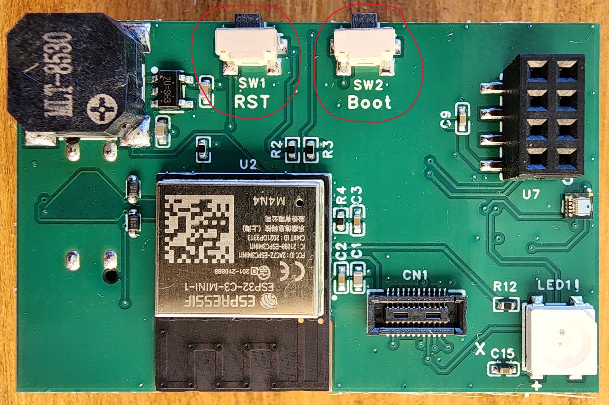

# Putting The MTR-1 In Boot Mode

This will cover how to put the MTR-1 into boot mode. Sometimes, this is needed to upload new firmware if the device is struggling.

**Boot Button Only**

1. See the photo below to help access the boot button through the top of the case
2. Use a pin to press and hold the boot button, while holding the boot button plug the MTR-1 back into your computer/power and then release the boot button

  4. Continue with [uploading the firmware document](https://wiki.apolloautomation.com/products/mtr1/troubleshooting/mtr1-code/)

**Boot and Reset Buttons**

1. Unplug the device
2. Slide the back of the case off
3. Remove the device from the case
4. Plug it back into your computer
5. Press and hold the boot button, while holding it press and release the reset button, then release the boot button

6\. Continue with [uploading the firmware document](https://wiki.apolloautomation.com/products/mtr1/troubleshooting/mtr1-code/)