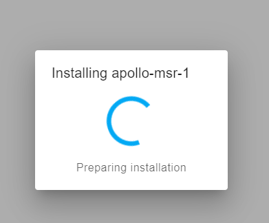

# Manually Uploading Code Through ESPHome

If your device becomes unresponsive and you've exhausted the other troubleshooting methods you can upload a fresh set of firmware by following the below guide. The utility does need to be run from Chrome or Edge.

If your device has already been connected to Home Assistant previously please refer to Removing Device From Home Assistant first before proceeding

1. Plug your MTR-1 into your computer with a quality USB-C cable that supports data transfer
2. Navigate to our installer page and click connect [\*\* Install Page \*\*](https://apolloautomation.github.io/MTR-1/)
3. Select your Apollo device, it will show with a similar name to the one below, and click connect. If you aren't sure which device it is, you can unplug the MTR-1 and see which disappears.

If no device shows, click cancel and then install the recommended driver that shows on the popup. If you have installed the driver, tried different cables, and it still won't work refer here for putting the MTR-1 in bootloader mode and then retry step 3. Putting MTR-1 In Boot Mode Document

4. Choose to install the new firmware

6. Wait for the installer to finish - if you see "ERROR Logger is not configured!" that is totally expected! The logger is disabled to make more room for other components on the microcontroller.

7\.VERY IMPORTANT - you need to unplug your device and plug it back in to leave boot mode!

8. After finishing, check for the Apollo hotspot and connect. This might not show if you previously had the MTR-1 connected to your wifi
9. Log into Home Assistant and go to the ESPHome addon check to see if you can adopt the device.

If you encounter the below error, please complete the Putting MTR-1 In Boot Mode Document and go back to step 3.

# Factory Re-Flash MSR-2

!!! info "If your device becomes unresponsive and you've exhausted the other troubleshooting methods you can reflash the factory firmware by following the steps below."

    This factory re-flash needs to be done in Chrome, Edge, or another Chromium based browser.

If your device has already been connected to Home Assistant please <a href="https://wiki.apolloautomation.com/products/general/troubleshooting/removing-device-from-home-assistant" target="_blank" rel="noreferrer nofollow noopener">remove it from the ESPHome integration</a> and the ESPHome Device Builder before continuing.

1\. Position the MSR-2 as shown in the image below and locate the small opening to press the boot button (the right button).

2\. Push and hold the boot button. While still holding the button down, plug in a USB-C cable into the USB-C port of your MSR-2 then let go of the button.

3\. Navigate to our installer page and click connect under Battery Firmware <a href="https://apolloautomation.github.io/MSR-2/" target="_blank" rel="noreferrer nofollow noopener">Apollo MSR-2 Installer</a>.

3\. Click the big "Connect" button.

3\. Select the open com port then click Connect.

4\. Click "Install ApolloAutomation.MSR-2".

5\. Click "INSTALL".

6\. Once you see "Installation complete!" you are finished. Click Next then close out of the browser window.

!!! warning "Power cycle your device before doing anything else!"

    Your device is still in boot mode and needs to be power cycled aka power removed to make it boot in a normal mode!

7\. Please <a href="https://wiki.apolloautomation.com/products/general/setup/getting-started-air1/" target="_blank" rel="noreferrer nofollow noopener">proceed to the getting started guide</a> and setup your sensor as a new device!