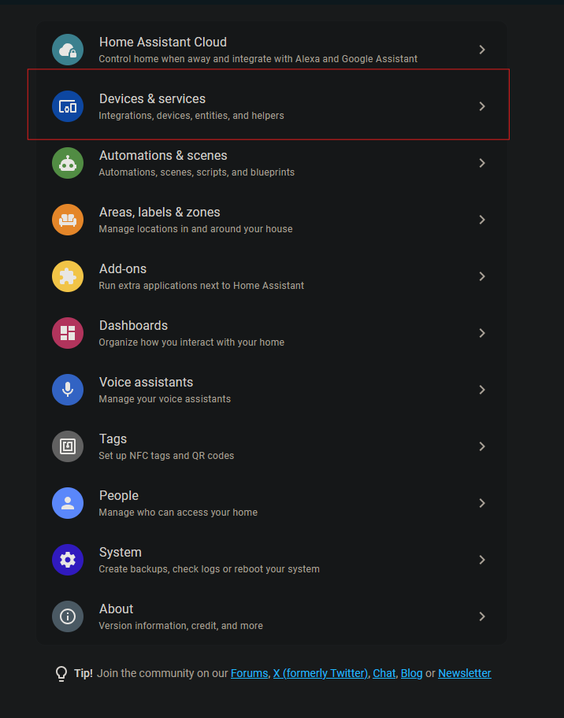
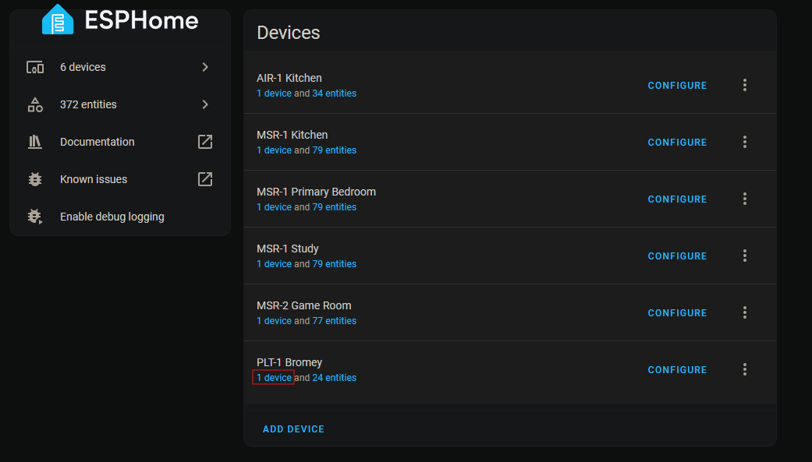
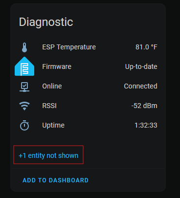
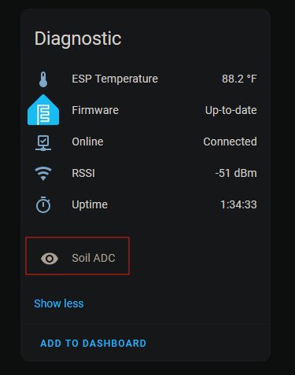
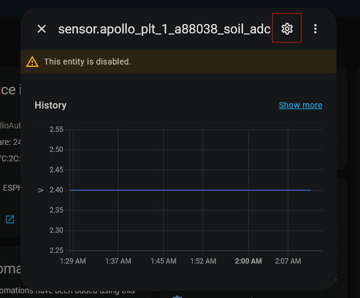
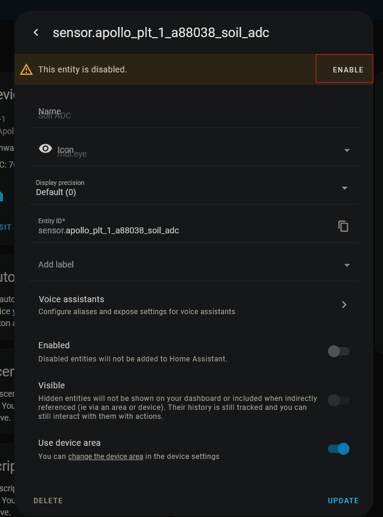
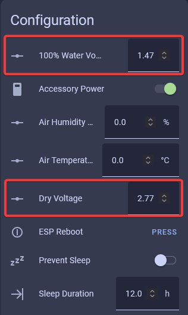
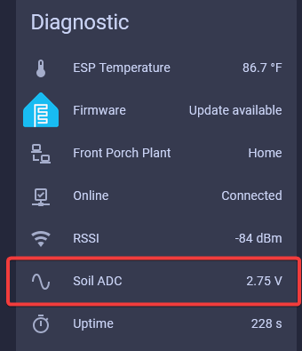

This guide will take you through calibrating your PLT-1’s moisture sensor. The sensors come with a default calibration, so this method is only necessary if you want to make your own adjustments.

1\. Take your PLT-1 out of the soil and clean off the probe. It’s important to remove all dirt for the most accurate calibration.

2\. Make sure the PLT-1 probe is sitting in the air or on a dry, non-conductive surface, and is plugged in.

3\. Select Settings and then Devices & Services

4\. Select the ESPHome Integration

5\. Select your PLT-1 device

6\. Scroll down to the diagnostics section and select entity not shown.

7\. Select the entity “Soil ADC.”

8\. Select the gear icon

9\. Select Enable

10\. Give the sensor a minute for this new entity to populate.

11\. Once the Soil ADC value is populated, enter it into the “Dry Voltage” entity.

12\. Now, place the stake/probe portion of the PLT-1 into a cup of water. Be careful not to submerge the entire sensor—only the exposed PCB below the “Apollo” label and the horizontal line can be exposed to water.

13\. Grab the “Soil ADC” value again and enter it into the “100% Water Voltage” entity.

14\. You can now return your PLT-1 to your plant. Congratulations, your sensor is calibrated!