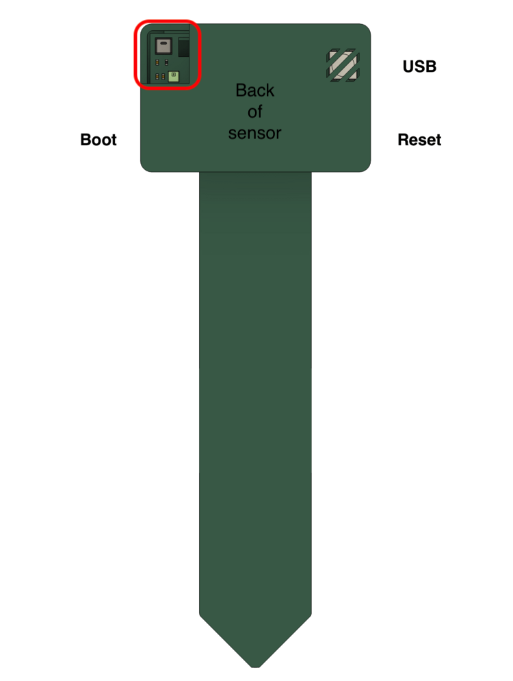

# Putting The PLT-1 In Boot Mode

This will cover how to put the PLT-1 into boot mode. Sometimes, this is needed to upload new firmware if the device is struggling.

## **Boot Button Only**

1\. See the photo below to help access the boot button through the side of the case on the non USB-C side.

2\. Use a pin to press and hold the boot button, while holding the boot button plug the PLT-1 back into your computer/power and then release the boot button

3\. Continue with uploading the firmware

## **Boot and Reset Buttons**

1\. Plug in the device

2\. Press and hold the boot button, while holding it press and release the reset button, then release the boot button

3\. Continue with uploading the firmware