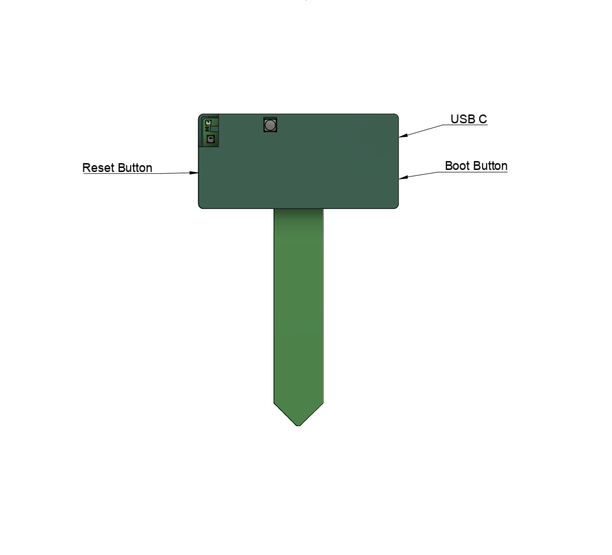
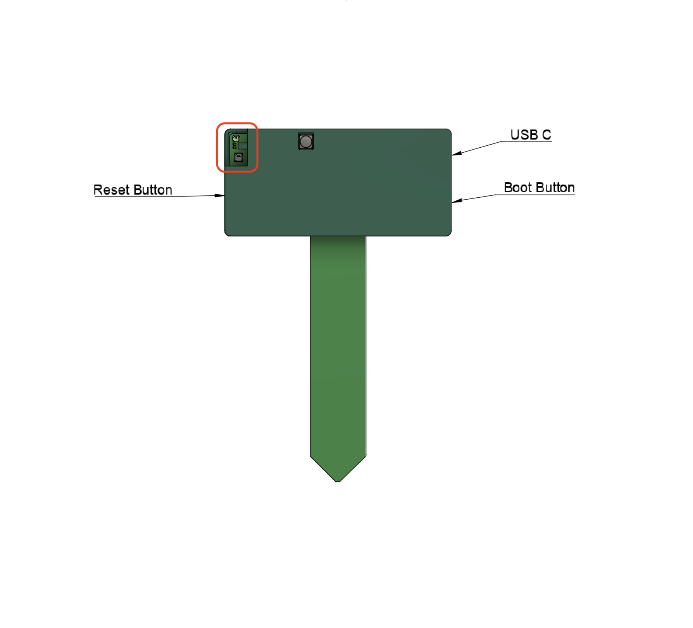

# General Tips

## Boot and Reset Buttons

When looking at the PLT-1B in the below orientation, the boot button is on the left and the reset is on the right by the USB-C port.

## LTR390 UV

For the most accurate UV and LUX readings, be sure to expose the sensor circled in the image below to light.

