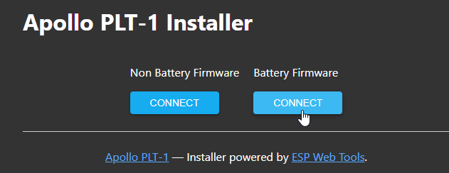

# Factory Re-Flash PLT-1B

!!! info "If your device becomes unresponsive and you've exhausted the other troubleshooting methods you can reflash the factory firmware by following the below guide."

    This needs to be done in Chrome, Edge, or another Chromium based browser.

If your device has already been connected to Home Assistant please <a href="https://wiki.apolloautomation.com/products/general/troubleshooting/removing-device-from-home-assistant" target="_blank" rel="noreferrer nofollow noopener">remove it from the ESPHome integration</a> and the ESPHome Device Builder before continuing.

1. Plug your sensor into your computer with a quality USB-C cable that supports data transfer
2. Navigate to our installer page and click connect [\*\* Install Page \*\*](https://apolloautomation.github.io/PLT-1/)
3. Select your Apollo device, it will show with a similar name to the one below, and click connect. If you aren't sure which device it is, you can unplug the sensor and see which disappears.

If no device shows, click cancel and then install the recommended driver that shows on the popup. If you have installed the driver, tried different cables, and it still won't work refer [here](https://wiki.apolloautomation.com/products/plt1b/plt1b-boot-mode/) for putting the sensor in bootloader mode and then retry step 3.

4\. Choose to install the new firmware

5\. Wait for the installer to finish - if you see "ERROR Logger is not configured!" that is totally expected! The logger is disabled to make more room for other components on the microcontroller.

!!! warning "Power cycle your device before doing anything else!"

    Your device is still in boot mode and needs to be power cycled aka power removed to make it boot in a normal mode!

6\. Please <a href="https://wiki.apolloautomation.com/products/general/setup/getting-started/" target="_blank" rel="noopener">proceed to the getting started guide</a> and setup your sensor as a new device!

# Factory Re-Flash PLT-1B

!!! info "If your device becomes unresponsive and you've exhausted the other troubleshooting methods you can reflash the factory firmware by following the below guide."

    This needs to be done in Chrome, Edge, or another Chromium based browser.

If your device has already been connected to Home Assistant please <a href="https://wiki.apolloautomation.com/products/general/troubleshooting/removing-device-from-home-assistant" target="_blank" rel="noreferrer nofollow noopener">remove it from the ESPHome integration</a> and the ESPHome Device Builder before continuing.

1\. <a href="https://wiki.apolloautomation.com/products/plt1/troubleshooting/plt1-boot-mode/" target="_blank" rel="noopener">Put your device in boot mode</a> by holding down the boot button and then plugging in the USB cable.

2\. Navigate to our installer page and click connect under Battery Firmware <a href="https://apolloautomation.github.io/PLT-1/" target="_blank" rel="noreferrer nofollow noopener">Apollo PLT-1B Installer</a>

!!! failure "Remove the battery!"

    This will not work properly if the battery is still supplying power to the TEMP-1B. Please remove the battery if you are having issues!

3\. Click the big "Connect" button.

4\. Select the open com port then click Connect.

5\. Click "Install ApolloAutomation.PLT-1B".

6\. Click "INSTALL".

7\. Once you see "Installation complete!" you are finished. Click Next then close out of the browser window.

!!! warning "Power cycle your device before doing anything else!"

    Your device is still in boot mode and needs to be power cycled aka power removed to make it boot in a normal mode!

8\. Please <a href="https://wiki.apolloautomation.com/products/general/setup/getting-started-plt1/" target="_blank" rel="noopener">proceed to the getting started guide</a> and setup your sensor as a new device!