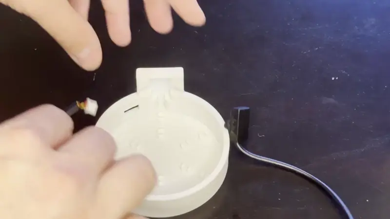

# Attaching the bottle to the PUMP-1

1\. Begin by placing the small white connector through the hole in the base of the water bottle and gently press the input fluid level sensor into place.

!!! tip "Make sure to orient your fluid level sensor correctly as shown in the gif below"

    The fluid sensor needs to be placed with the flat side with no writing facing outwards and the side with the ears flush with the back towards the plastic enclosure.

2\. **(Optional)** Gently press the cable into the **built-in cable slots** located on the underside of the 3D-printed base. This helps keep the wiring neat and secure.

3\. Slide the bottle into the base until it is securely seated.

[Click here to learn how to attach the inlet and outlet tubes!](https://wiki.apolloautomation.com/products/pump1/addons/attaching-tubes-to-pump-1){  .md-button .md-button--primary }