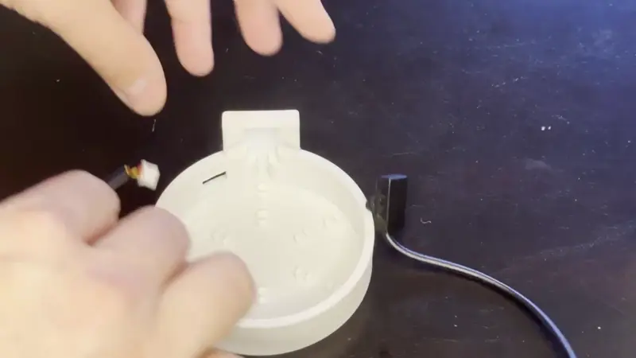

# Attaching Fluid Level Sensors to the PUMP-1

##### Installing Fluid Input Sensor

1\. Begin by placing the small white connector through the hole in the base of the water bottle and gently press the input fluid level sensor into place.

!!! tip "Make sure to orient your fluid level sensor correctly as shown in the gif below"

    The fluid sensor needs to be placed with the flat side with no writing facing outwards and the side with the ears flush with the back towards the plastic enclosure.

##### Attaching Fluid Input Sensor

1\. Insert the small white connector into the **right-side port** on your PUMP-1 device. Ensure it is fully seated for proper operation. The small bump on top of the white connector must be facing **upwards** when inserting it. This ensures proper alignment and a secure connection.

##### Attaching Fluid Output Sensor

1\. Insert the small white connector into the **left-side port** on your PUMP-1 device. Ensure it is fully seated for proper operation. The small bump on top of the white connector must be facing **upwards** when inserting it. This ensures proper alignment and a secure connection.

2\. Attach the fluid output sensor to the **outside** of the water reservoir of your choice. Common examples include Keurig water tanks, fish tanks, or similar containers. This sensor detects whether the water level is **above or below** a specific threshold, providing a reliable indication of fluid presence at that height. You can secure the sensor using **double-sided tape**, a **Command™ strip**, or even a **small dab of hot glue** - \*\* \*\* whichever method works best for your setup. Just ensure the sensor remains firmly in place and maintains good contact with the surface.

!!! warning "Do not submerge the fluid sensor."

    It is intended for external placement only.