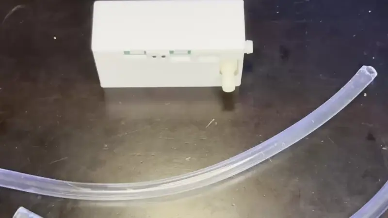

# Attaching Inlet and Outlet tubes to the PUMP-1

1\. Attach the two tubes to the pump as shown below. The fluid input tube is the left tube on the same side as the USB-C port and the fluid output tube is the tube on the right on the side of the PUMP-1.

[Click here to learn how to attach the Fluid Sensor addons!](https://wiki.apolloautomation.com/products/pump1/addons/attaching-fluid-level-sensors-pump-1/){  .md-button .md-button--primary }