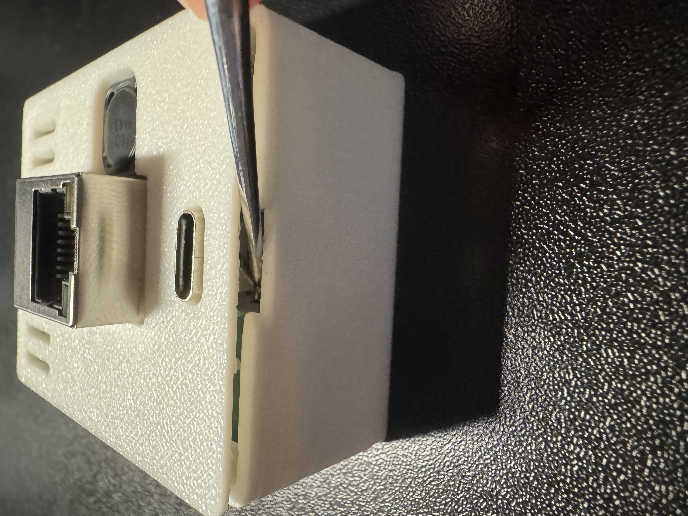
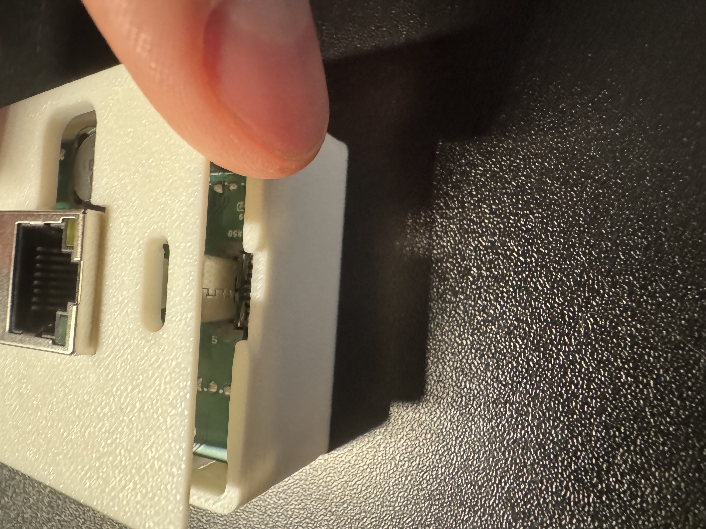
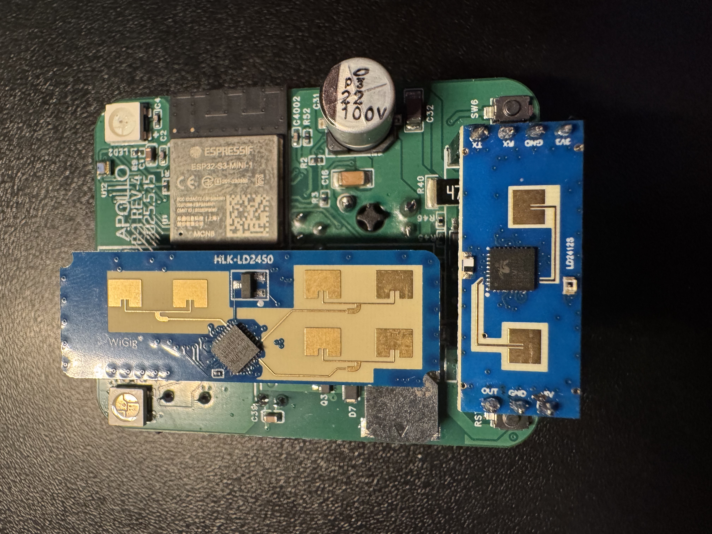
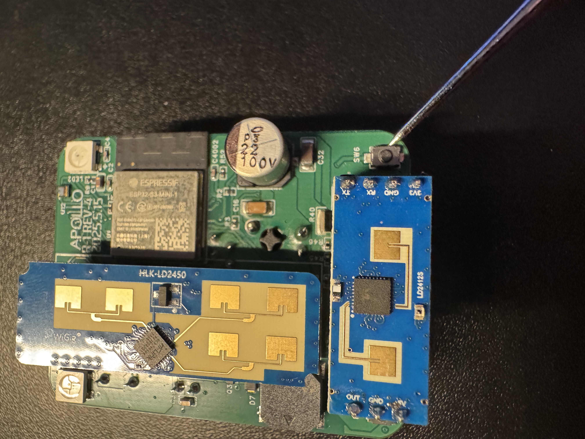
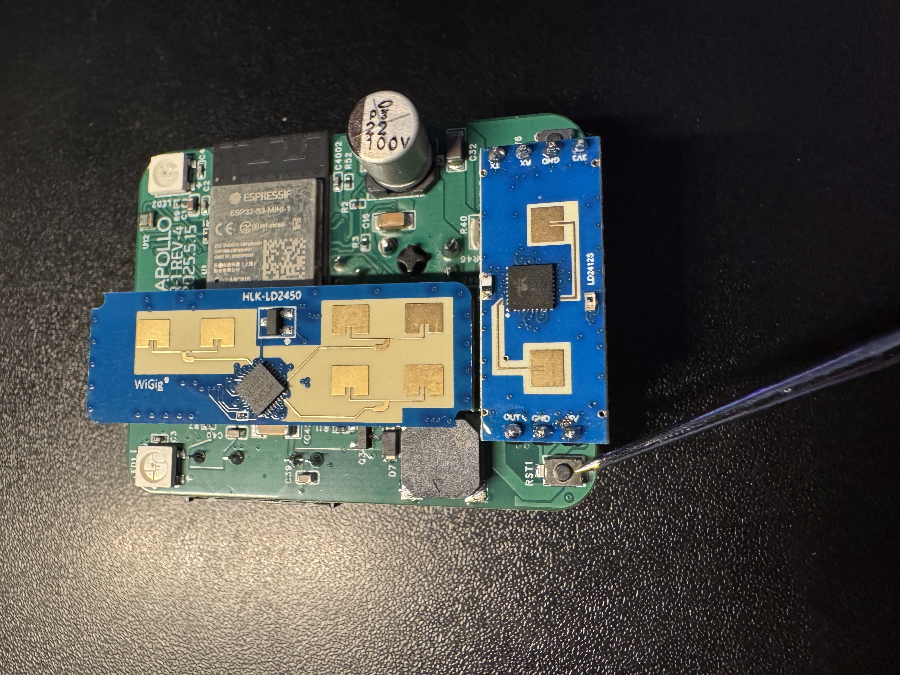

# Putting The PUMP-1 In Boot Mode

!!! info "This will cover how to put the PUMP-1 into boot mode."

    This is needed to force the device into boot mode to reflash the firmware.

##### Method 1: Boot Button Only

1\. Unplug your R-PRO-1 from power and remove the back.

2\. Gently remove the PCB from the case and flip it over.

3\. Locate the boot button on the bottom right side of the PCB.

4\. Push and hold the boot button. While still holding the button down, plug in a USB-C cable into the USB-C port of your R-PRO-1 then let go of the button.

5\. Continue with <a href="https://wiki.apolloautomation.com/products/rpro1/troubleshooting/rpro1-code/" rel="noreferrer nofollow">uploading the firmware document</a>.

##### Method 2: Boot and Reset Buttons

1\. Unplug your R-PRO-1 from power and remove the back.

2\. Gently remove the PCB from the case and flip it over.

3\. Locate the boot button on the bottom right side of the PCB.

4\. Locate the reset button on the bottom left side of the PCB.

5\. Hold down the boot button (the right button), then press and release the reset button (the left button) while keeping the boot button pressed. Finally, release the boot button.

6\. Continue with <a href="https://wiki.apolloautomation.com/products/rpro1/troubleshooting/rpro1-code/" rel="noreferrer nofollow">uploading the firmware document</a>.