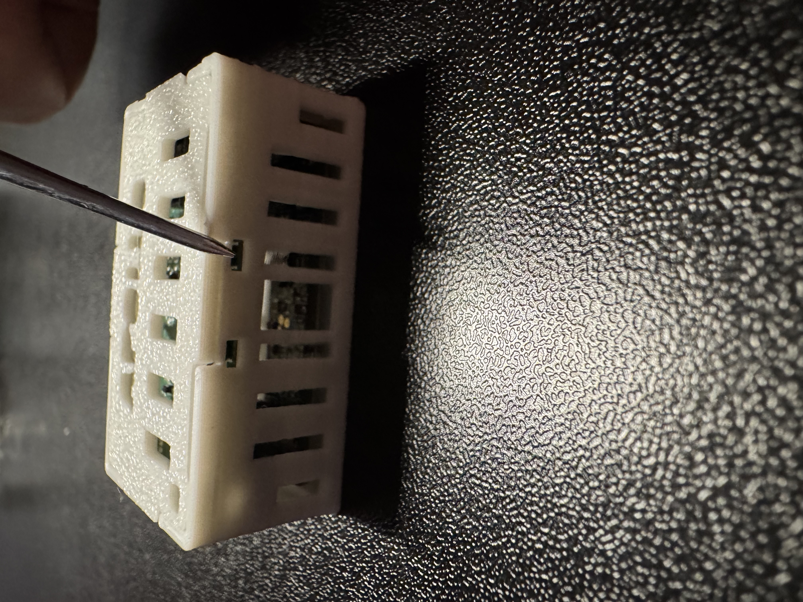
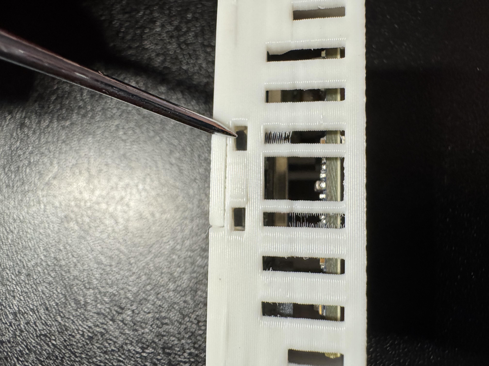

# Reset Wi-Fi Credentials on your MSR-2

1\. Plug the device into power.

2\. Long press the Boot button (the button on the right) for 10 seconds

3\. The Wi-Fi credentials should be reset and it will broadcast its hotspot again.

4\. Connect to the hotspot titled "Apollo MSR2 Hotspot" and enter your new Wi-Fi details!