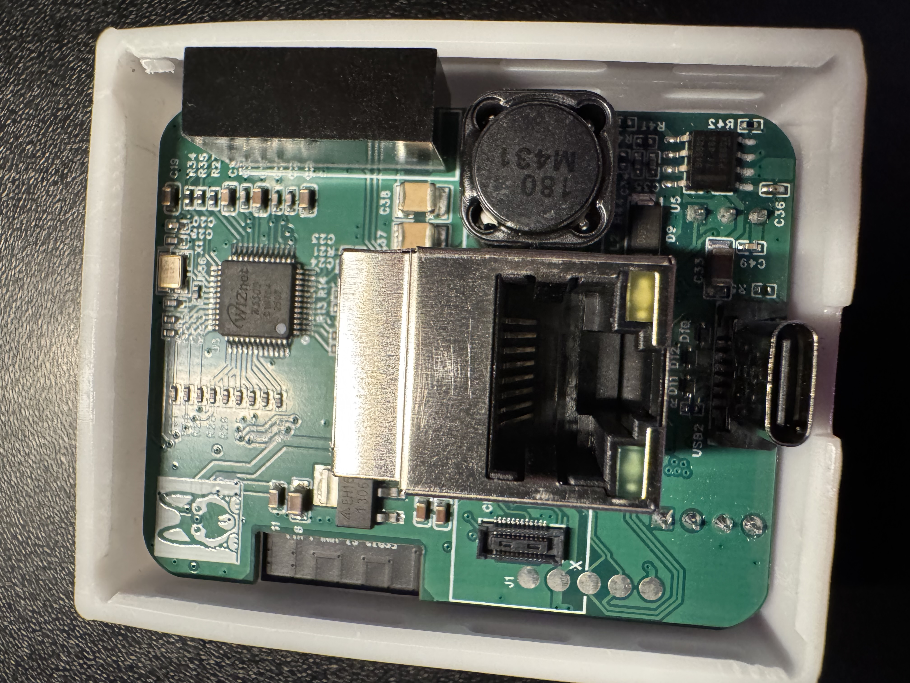

# Install the LD2412 in R-PRO-1

!!! tip "Check out the gif above or step by step directions below!"

    The gif above shows all the steps needed to take apart and add your ld2412 to the R-PRO-1 or you can follow the step by step tutorial with images below!

1\. Unplug your R-PRO-1 from power and remove the back.

2\. Gently remove the PCB from the case and flip it over.

3\. Place the LD2412 on the 4 and 3 pin headers (only fits one way).

4\. Place back into the case with the ethernet module facing up and the usb-c port facing you.

5\. Snap the lid back into place!

