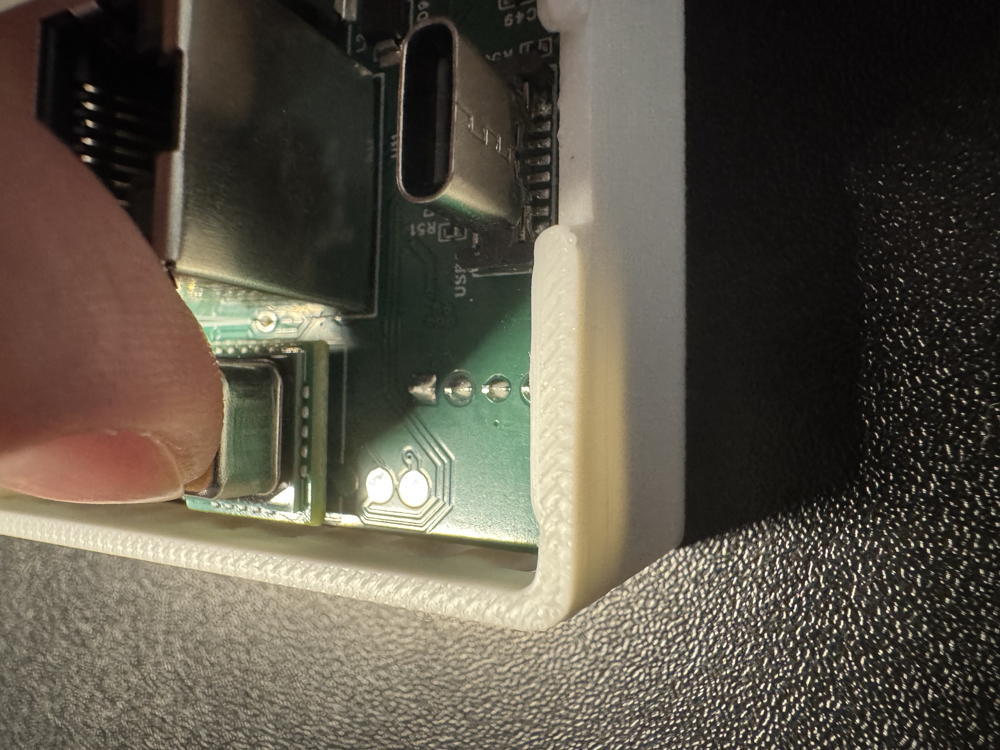
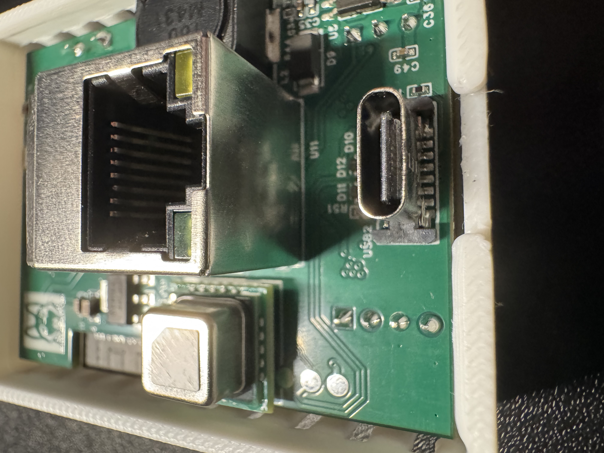
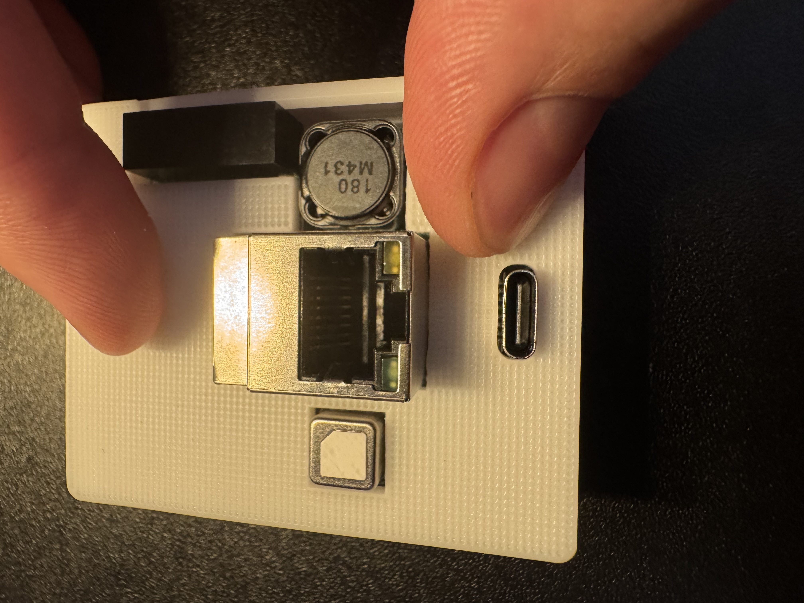

# Adding CO2 To R-PRO-1

1\. Unplug your R-PRO-1 from power and remove the back.

2\. With the back removed, identify the bottom left corner where the small black mezzanine connector lives. You will see an "X" indicating which corner needs to be lined up with the SCD40 CO2 sensor. There is an X on the SCD40 sensor's PCB as well, you can see it in the image below but it is slightly cut off on the PCB itself.

!!! tip "Other ways to identify the correct orientation"

    * There is also a "gold dot" in the top left of the SCD40 when oriented properly.
    * There is a torn corner on top of the SCD40 on the top right.

3\. Gently push the SCD40 CO2 module onto the black mezzanine connector.

4\. Slide the case back over the R-PRO-1, making sure that the case has the hole for the USB-C port and the SCD40 facing toward you.

5\. Gently press the backplate of the R-PRO-1 case onto the R-PRO-1 until it lightly snaps into place. Please do not force it, if necessary please repeat steps above until it seats in the case without any force required.

[Click here to head to the CO2 calibration guide!](https://wiki.apolloautomation.com/products/general/calibrating-and-updating/co2-calibration/){ .md-button .md-button--primary }