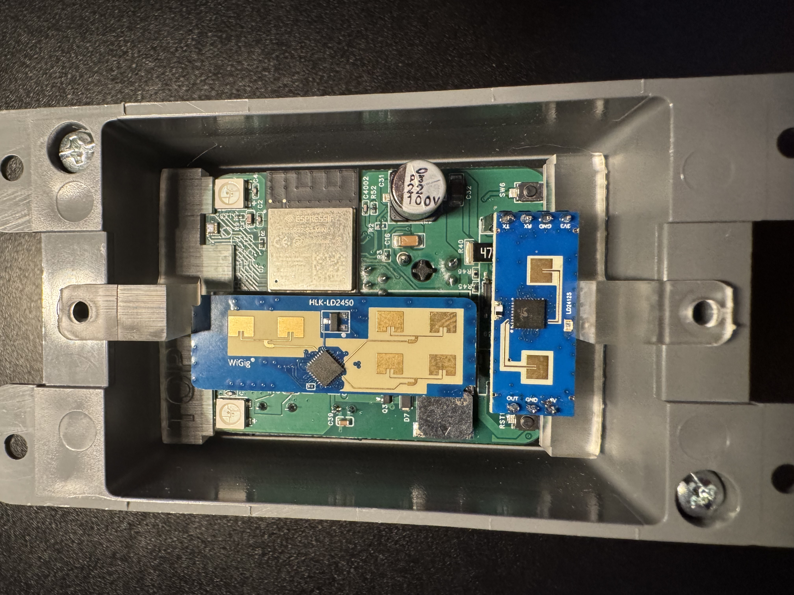
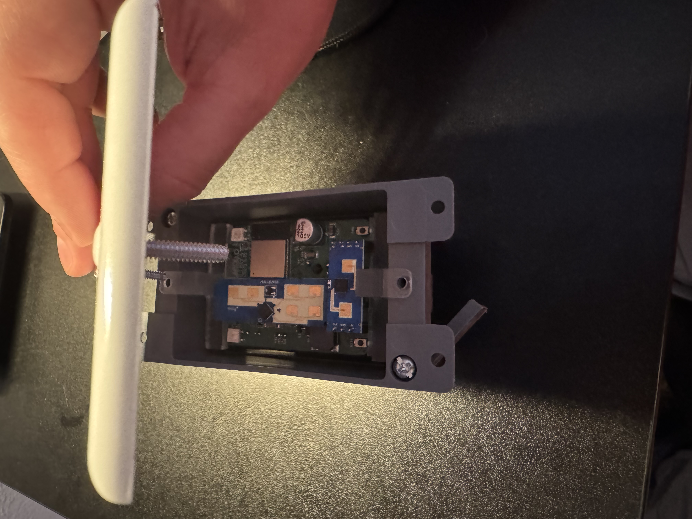
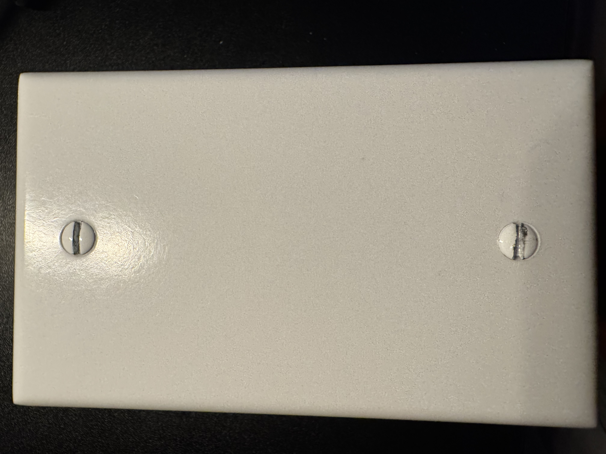

# Adding Gang Box Mounts To R-PRO-1

###### Attaching Mounts

1\. Unplug your R-PRO-1 from power and remove the back.

2\. Gently lift the PCB out of the case and set it face up with the USB-C port facing down.

3\. Take the two gang box mount pieces and identify the one labeled "TOP" and the other piece which is the bottom mount.

!!! danger "Before continuing and sliding the mounts on, please verify you have the pieces oriented as shown in the images below."

    If the mounts are not put on properly the R-PRO-1 could be damaged!

3\. Gently push the top mount labeled "TOP" into the pcb as shown below. Make sure the orientation is identical to the image below!

4\. Gently push the top mount into the pcb as shown below. Make sure the orientation is identical to the image below!

5\. The end result should look identical to the image below. You are now ready to install it inside of a 1 gang box.

###### Install in 1-Gang Box

1\. Line up the holes in your 1-gang box (yours will be attached to the wall already).

2\. Place screws through the blank faceplate and gently place over the r-pro-1 mounting holes.

3\. Screw in the screws slowly to make sure not to break the mounts or the blank faceplate. At the end yours will look just like the image below!

