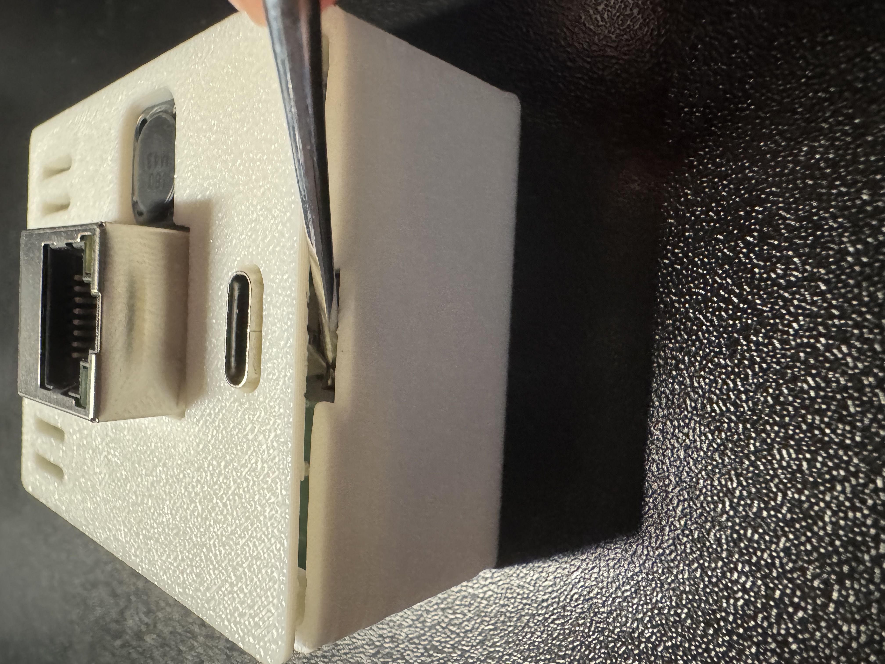

# Install Ceiling Mount for R-PRO-1

###### Attaching Mounts

1\. Unplug your R-PRO-1 from power and remove the back.

2\. Gently lift the PCB out of the case and set it face up with the USB-C port facing down.

3\. Take the two ceiling mount pieces and identify the one labeled "TOP" and the other piece which is the bottom mount.

!!! danger "Before continuing and sliding the mounts on, please verify you have the pieces oriented as shown in the images below."

    If the mounts are not put on properly the R-PRO-1 could be damaged!

3\. Gently push the top mount labeled "TOP" into the pcb as shown below. Make sure the orientation is identical to the image below!

4\. Gently push the bottom mount into the pcb as shown below. Make sure the orientation is identical to the image below!

5\. The end result should look identical to the image below. You are now ready to install it inside of the ceiling mount.

###### Install in Ceiling Mount

1\. Remove the cover to expose the inside of the installed Ceiling Mount.

2\. Plug in Ethernet cable or USB-C cable.

3\. Gently slide R-PRO-1 into the Ceiling Mount.

4\. Push the R-PRO-1 back 1inch (around 2.5cm) to make sure the lip of the cover fits over the Ceiling Mount.

5\. Gently press the ceiling mount cover until it is securely attached to the Ceiling Mount.

&nbsp;