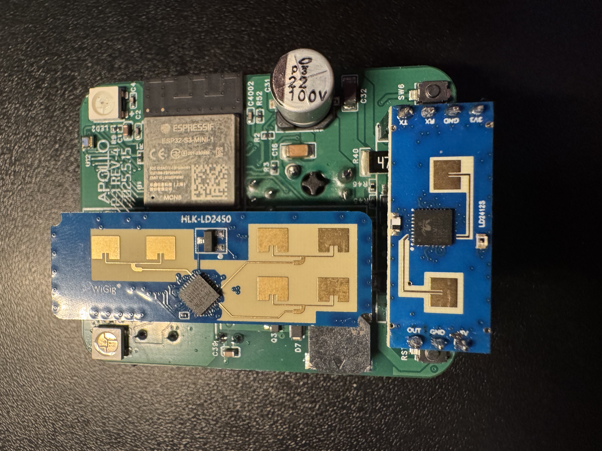

# Install Ceiling Mount for R-PRO-1

1\. Unplug your R-PRO-1 from power and remove the back.

2\. Gently lift the PCB out of the case and set it face up with the USB-C port facing down.

3\. Take the two ceiling mount pieces and identify the one labeled "TOP" and the other piece which is the bottom mount.

!!! danger "Before continuing and sliding the mounts on, please verify you have the pieces oriented as shown in the images below."

    If the mounts are not put on properly the R-PRO-1 could be damaged!

3\. Gently push the top mount labeled "TOP" into the pcb as shown below. Make sure the orientation is identical to the image below!

4\. Gently push the bottom mount into the pcb as shown below. Make sure the orientation is identical to the image below!

5\. The end result should look identical to the image below. You are now ready to turn it over and install it inside of the ceiling mount.

