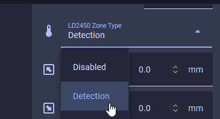
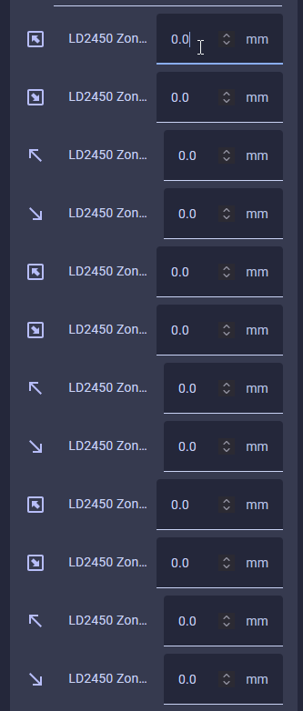

# How To Tune The R-PRO-1 Using Home Assistant

!!! info "Your R-PRO-1 has two unique mmWave sensors that both need to be tuned!"

    The R-PRO-1 comes with an LD2450 mmwave sensor and an optional secondary LD2412 mmWave sensor.

    The LD2450 allows for up to three targets tracked in up to three zones but can have issues with "still detection".

    The optional LD2412 mmWave sensor allows you to have perfect still detection for one target at up to 9 meters so it's a great addition to the sensor.

###### LD2450 Configuration

Manually enter in the X and Y coordinates for each zone in Home Assistant or directly from the device's webserver by visiting the IP address or hostname.local. It's much easier to tune using the HLK Radartool App and we suggest using that to set up your LD2450 instead.

1\. Navigate to the ESPHome integration by going to settings -&gt; <a href="http://homeassistant.local:8123/config/integrations/integration/esphome" target="_blank" rel="noopener">esphome integration</a> -&gt; click on the name of your new device!

2\. Scroll down until you see "LD2450 Zone Type" and choose "Detection" from the drop-down menu.

3\. Begin entering in the X and Y coordinates for each zone.

!!! null "Helpful Hints to understand LD2450 zones better!"

    * X1 must always be less than X2, and Y1 must always be less than Y2.
    * The Y axis is easier since it's never negative.
    * The X axis is where you can get tripped up, especially when both values are negative: -3456 is less than -2345.
    * The Plotly chart will still render the rectangles even if the X1/X2 and Y1/Y2 values are reversed.
    * The zones cannot overlap.

&nbsp;

&nbsp;

&nbsp;

###### LD2412 Configuration

&nbsp;