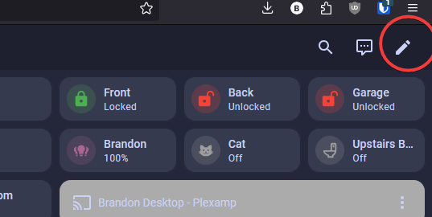
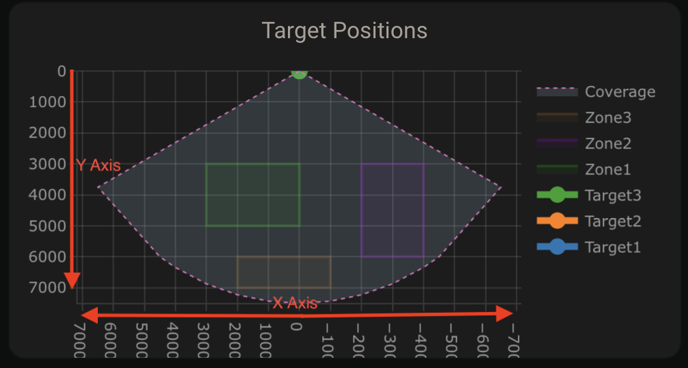
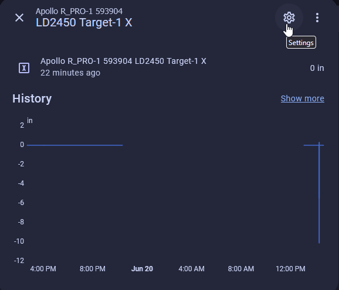
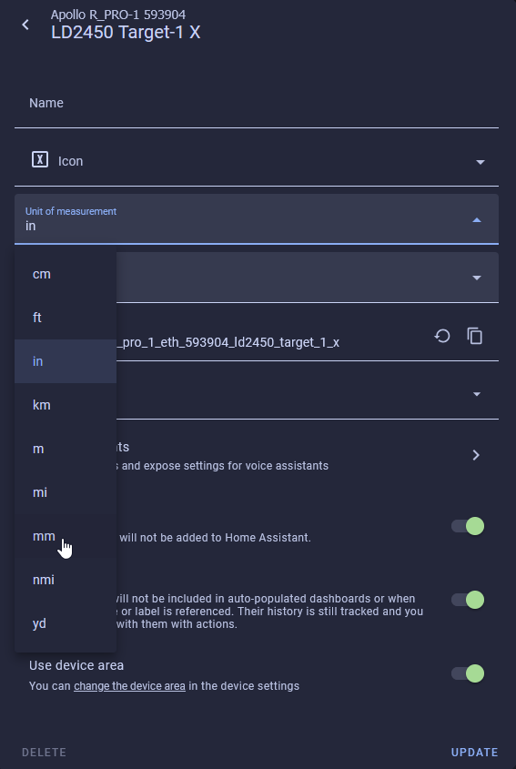
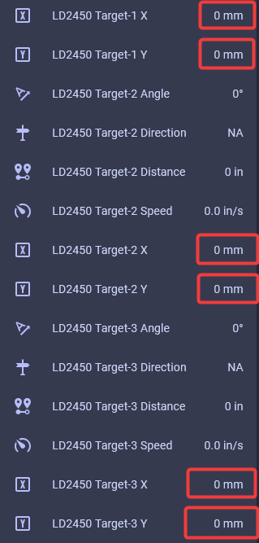
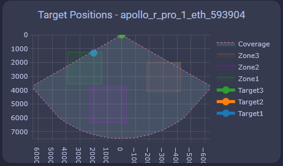

# How To Tune The R-PRO-1 Using Home Assistant

!!! info "Your R-PRO-1 has two unique mmWave sensors that both need to be tuned!"

    The R-PRO-1 comes with an LD2450 mmwave sensor and an optional secondary LD2412 mmWave sensor.

    The LD2450 allows for up to three targets tracked in up to three zones but can have issues with "still detection".

    The optional LD2412 mmWave sensor allows you to have perfect still detection for one target at up to 9 meters so it's a great addition to the sensor.

Manually enter in the X and Y coordinates for each zone in Home Assistant or directly from the device's webserver by visiting the IP address or hostname.local. It's much easier to <a href="https://wiki.apolloautomation.com/products/rpro1/calibrating-and-updating/zones-hlk/" rel="noreferrer nofollow">tune using the HLK Radartool App</a> and we suggest using that to set up your LD2450 instead.

###### LD2450 Configuration

1\.Install [HACS](https://hacs.xyz/docs/use/).

2\. Install [Plotly](https://github.com/dbuezas/lovelace-plotly-graph-card "Click here to install Plotly!") and [Decluttering Card](https://github.com/custom-cards/decluttering-card "Click here to install Decluttering Card!") inside HACS.

!!! danger "You can break things at this point!"

    Now you are able to break things if you do not follow along exactly as shown in the tutorial.

3\. Click edit dashboard in the top right then click the 3 dots menu then choose "Raw configuration editor".



4\. Make sure to scroll to the very bottom and start a new line all the way to the left as shown in the image below. Make sure to save and exit in the top right when finished.


5\. Copy the code below and paste it on the new line from step 4.

```yaml
decluttering_templates:
  apollo_r_pro_1:
    card:
      type: custom:plotly-graph
      title: Target Positions - [[name]]
      refresh_interval: 1
      hours_to_show: current_day
      layout:
        height: 230
        margin:
          l: 50
          r: 20
          t: 20
          b: 40
        showlegend: true
        xaxis:
          dtick: 1000
          gridcolor: RGBA(200,200,200,0.15)
          zerolinecolor: RGBA(200,200,200,0.15)
          type: number
          fixedrange: true
          range:
            - 4000
            - -4000
        yaxis:
          dtick: 1000
          gridcolor: RGBA(200,200,200,0.15)
          zerolinecolor: RGBA(200,200,200,0.15)
          scaleanchor: x
          scaleratio: 1
          fixedrange: true
          range:
            - 7500
            - 0
      entities:
        - entity: ''
          name: Target1
          marker:
            size: 12
          line:
            shape: spline
            width: 5
          x:
            - $ex hass.states["sensor.[[name]]_ld2450_target_1_x"].state
          'y':
            - $ex hass.states["sensor.[[name]]_ld2450_target_1_y"].state
        - entity: ''
          name: Target2
          marker:
            size: 12
          line:
            shape: spline
            width: 5
          x:
            - $ex hass.states["sensor.[[name]]_ld2450_target_2_x"].state
          'y':
            - $ex hass.states["sensor.[[name]]_ld2450_target_2_y"].state
        - entity: ''
          name: Target3
          marker:
            size: 12
          line:
            shape: spline
            width: 5
          x:
            - $ex hass.states["sensor.[[name]]_ld2450_target_3_x"].state
          'y':
            - $ex hass.states["sensor.[[name]]_ld2450_target_3_y"].state
        - entity: ''
          name: Zone1
          mode: lines
          fill: toself
          fillcolor: RGBA(20,200,0,0.06)
          line:
            color: RGBA(20,200,0,0.2)
            shape: line
            width: 2
          x:
            - $ex hass.states["number.[[name]]_ld2450_zone_1_x1"].state
            - $ex hass.states["number.[[name]]_ld2450_zone_1_x1"].state
            - $ex hass.states["number.[[name]]_ld2450_zone_1_x2"].state
            - $ex hass.states["number.[[name]]_ld2450_zone_1_x2"].state
            - $ex hass.states["number.[[name]]_ld2450_zone_1_x1"].state
          'y':
            - $ex hass.states["number.[[name]]_ld2450_zone_1_y1"].state
            - $ex hass.states["number.[[name]]_ld2450_zone_1_y2"].state
            - $ex hass.states["number.[[name]]_ld2450_zone_1_y2"].state
            - $ex hass.states["number.[[name]]_ld2450_zone_1_y1"].state
            - $ex hass.states["number.[[name]]_ld2450_zone_1_y1"].state
        - entity: ''
          name: Zone2
          mode: lines
          fill: toself
          fillcolor: RGBA(200,0,255,0.06)
          line:
            color: RGBA(200,0,255,0.2)
            shape: line
            width: 2
          x:
            - $ex hass.states["number.[[name]]_ld2450_zone_2_x1"].state
            - $ex hass.states["number.[[name]]_ld2450_zone_2_x1"].state
            - $ex hass.states["number.[[name]]_ld2450_zone_2_x2"].state
            - $ex hass.states["number.[[name]]_ld2450_zone_2_x2"].state
            - $ex hass.states["number.[[name]]_ld2450_zone_2_x1"].state
          'y':
            - $ex hass.states["number.[[name]]_ld2450_zone_2_y1"].state
            - $ex hass.states["number.[[name]]_ld2450_zone_2_y2"].state
            - $ex hass.states["number.[[name]]_ld2450_zone_2_y2"].state
            - $ex hass.states["number.[[name]]_ld2450_zone_2_y1"].state
            - $ex hass.states["number.[[name]]_ld2450_zone_2_y1"].state
        - entity: ''
          name: Zone3
          mode: lines
          fill: toself
          fillcolor: RGBA(200,120,55,0.06)
          line:
            color: RGBA(200,120,55,0.2)
            shape: line
            width: 2
          x:
            - $ex hass.states["number.[[name]]_ld2450_zone_3_x1"].state
            - $ex hass.states["number.[[name]]_ld2450_zone_3_x1"].state
            - $ex hass.states["number.[[name]]_ld2450_zone_3_x2"].state
            - $ex hass.states["number.[[name]]_ld2450_zone_3_x2"].state
            - $ex hass.states["number.[[name]]_ld2450_zone_3_x1"].state
          'y':
            - $ex hass.states["number.[[name]]_ld2450_zone_3_y1"].state
            - $ex hass.states["number.[[name]]_ld2450_zone_3_y2"].state
            - $ex hass.states["number.[[name]]_ld2450_zone_3_y2"].state
            - $ex hass.states["number.[[name]]_ld2450_zone_3_y1"].state
            - $ex hass.states["number.[[name]]_ld2450_zone_3_y1"].state
        - entity: ''
          name: Coverage
          mode: lines
          fill: tonexty
          fillcolor: rgba(168, 216, 234, 0.15)
          line:
            shape: line
            width: 1
            dash: dot
          x:
            - 0
            - $ex 7500 * Math.sin((2 * Math.PI)/360 * 60)
            - 4500
            - 4000
            - 3000
            - 2000
            - 1000
            - 0
            - -1000
            - -2000
            - -3000
            - -4000
            - -4500
            - $ex -7500 * Math.sin((2 * Math.PI)/360 * 60)
            - 0
          'y':
            - 0
            - $ex 7500 * Math.cos((2 * Math.PI)/360 * 60)
            - $ex Math.sqrt( 7500**2 - 4500**2 )
            - $ex Math.sqrt( 7500**2 - 4000**2 )
            - $ex Math.sqrt( 7500**2 - 3000**2 )
            - $ex Math.sqrt( 7500**2 - 2000**2 )
            - $ex Math.sqrt( 7500**2 - 1000**2 )
            - 7500
            - $ex Math.sqrt( 7500**2 - 1000**2 )
            - $ex Math.sqrt( 7500**2 - 2000**2 )
            - $ex Math.sqrt( 7500**2 - 3000**2 )
            - $ex Math.sqrt( 7500**2 - 4000**2 )
            - $ex Math.sqrt( 7500**2 - 4500**2 )
            - $ex 7500 * Math.cos((2 * Math.PI)/360 * 60)
            - 0
      raw_plotly_config: true
```

6\. Copy the code below to use in the next step. Please change the "name" in the code below to the name of your R-PRO-1 sensor. If you are unsure what name to use here, please head to the [ESPHome Integrations page](http://homeassistant.local:8123/config/integrations/integration/esphome "Click me to go to the ESPHome integrations page") and navigate to your device then find the full device name. Unless you renamed it, your device will likely be called "apollo\_r\_pro\_1\_eth\_" with 6 random numbers/letters after the final underscore as shown in the example image below.

```yaml
template: apollo_r_pro_1
type: custom:decluttering-card
variables:
  - name: apollo_r_pro_1_eth_593904
```


7\. Click edit dashboard in the top right then choose ADD CARD in the bottom right. Type in "Manual" then select Manual.


8\. Paste in the code you copied from step 6 and you should now see this:


9\. Head to the [ESPHome Integrations page](http://homeassistant.local:8123/config/integrations/integration/esphome "Click me to go to the ESPHome integrations page")

10\. Click device as shown in the image below


11\. Scroll down until you get to the Configuration section and you see the empty boxes for zones 1-3 for both X and Y coordinates.

!!! tip "Suggested settings"

    * Multi Target Tracking toggled on helps it detect up to three targets better.
    * Zone Type allows you to select Disabled, Detection, or Filter.
    * Disabled: Disable zone area detection.
    * Detection: Only detects targets in the specified zone.
    * Filter: Excludes a zone from detection.

12\. Now we can input our Zone 1-3 X and Y values to make our zones. Using the visual card from above, we can walk, sit, or stand in the area where we want to create a detection or non-detection zone. Input values for X are -7000 mm to 7000 mm, and the Y values are 0 mm to 7000 mm.



13\. If you use the imperial system (Freedom Units) then you will need to do this step. Metric users can skip this. For the targets to show up correctly we first need to update the Target 1-3 X and Y measurements from inches (in) to millimeters (mm). Find Target 1-3 X and Y under the Sensors section and select them. You will want to update all 3 targets X and Y values.


14\. Select the Settings cog in the top right.



15\. Change the unit of measurement to mm and select Update.



16\. Your X and Y Targets will now look like this.



17\. Now you should see targets on the card.



18\. Now we can make zones around the targets where you want to Detect presence or filter them out

!!! tip tip "Tip for zone configuration resetting"

    If your zone configurations are not saved when restarting the device then try turning on the LD2450 Bluetooth for a few seconds and then turning it off again. You can also try to toggle on Multi Target Radar. This should wake up the mmWave module and retrieve your saved zones

###### LD2412 Configuration

1\. Navigate to the ESPHome integration by going to settings -&gt; <a href="http://homeassistant.local:8123/config/integrations/integration/esphome" target="_blank" rel="noopener">esphome integration</a> -&gt; click on "1 device" below the Apollo R-PRO-1.


2\. Scroll down until you see "LD2412 Mode" and change it from "Normal" to "Engineering".

!!! tip "The LD2412 can be tuned using the steps below to work perfectly in your environment!"

    The LD2412 has "gates" at 0.75meter increments starting at g0 and ending at g13. These gates allow you to raise the threshold needed to trigger occupancy in each 0.75meter increment.

    This is very useful in scenarios where you want to tune out a fan, a cat sitting on the stairs, etc.

3\. Scroll down to the Diagnostic section and you will see "LD2412 g00 move energy" through "LD2412 g13 still energy" are showing percentages from 0-100%.


4\. Scroll up to the Configuration section and identify the threshold sliders for g0-g13 for both moving and still energy.

Moving the gate still and move threshold slider to the right increases the amount of energy needed to trigger the sensor. Do this if you want the gate to be less sensitive.


Moving the gate still and move threshold slider to the left decreases the amount of energy needed to trigger the sensor. Do this if you want the gate to be more sensitive.

