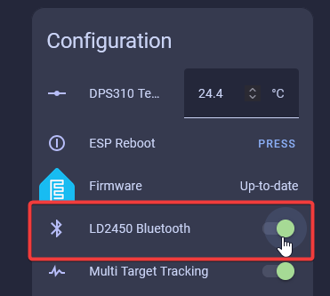
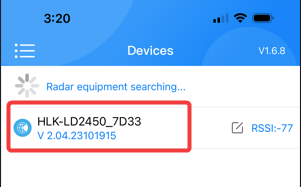
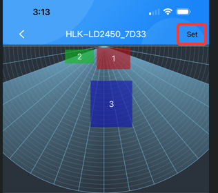
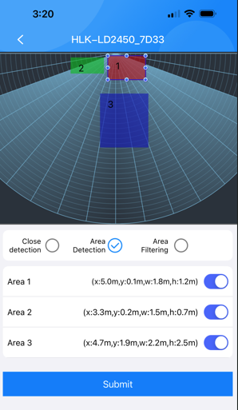
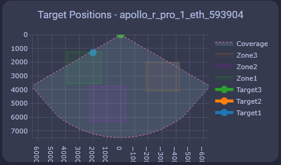

# How To Tune mmWave Using HLKRadarTool

<div class="cms-embed"><iframe width="560" height="315" src="https://www.youtube.com/embed/-w_GFURyx-A?si=SSRovumabCvHeXwo" title="YouTube video player" frameborder="0" allow="accelerometer; autoplay; clipboard-write; encrypted-media; gyroscope; picture-in-picture; web-share" referrerpolicy="strict-origin-when-cross-origin" allowfullscreen=""></iframe></div>

###### LD2450 Configuration

!!! note "Ensure that the LD2450 firmware version is V2.02.23090617 or later for proper integration functionality. "

    The newer version of the firmware includes an "auto calibrate" function so you might want to test it out!

The <a href="https://www.hlktech.net/index.php?id=1157" target="_blank" rel="noreferrer nofollow noopener">HLK-LD2450</a> mmWave sensor is used in the R-PRO-1. <a href="https://drive.google.com/drive/folders/1aItrdziwnEqI-ovDWf24Lj6ioALaljFA?usp=sharing" target="_blank" rel="noreferrer nofollow noopener">Click Here</a> for the datasheet.

=== "iPhone"

    <a href="https://apps.apple.com/us/app/hlkradartool/id1638651152" target="_blank" rel="noreferrer nofollow noopener">Click here to download</a>

=== "Android"

    <a href="https://play.google.com/store/apps/details?id=com.hlk.hlkradartool&amp;hl=en_US" target="_blank" rel="noreferrer nofollow noopener">Click here to download</a>

1\. Head to the <a href="http://homeassistant.local:8123/config/integrations/integration/esphome" title="Click me to go to the ESPHome integrations page" target="_blank" rel="noreferrer nofollow noopener">ESPHome Integrations page</a> then select your R-PRO-1 and scroll down until you see LD2450 Bluetooth.



2\. Open the HLKRadarTool App and select your device.

!!! success "You need to be close to your device!"

    The LD2450 mmWave sensor is a very tiny sensor with no external antenna, which means it cannot connect to bluetooth devices unless they are very close. Sometimes this means you need to be within a few feet of the sensor to connect directly to it!



3\. Select Set in the top right.



4\. Enable Area Detection, then toggle Area 1, 2, and 3 to display a colored box with the matching number. You can press and hold the box to move or resize it as needed. Once your zones are configured, click **Submit** — you should see a confirmation message: **"Setup successfully."**

!!! tip "There are three ways to use your R-PRO-1!"

    You can use any of these three choices to control your R-PRO-1 differently. The most common option is "Detection" which lets you setup three areas and track three targets within them.<br>**Disabled**: Disable multi-zone area detection and just tracks one big area.<br>**Detection**: Only detects targets within each of the three zones.<br>**Filter**: Excludes a zone from detection and detects presence everywhere else.

    Disabled allows you to just use the sensor as a "basic" presence sensor and "Filter" lets you filter out an area and detect everything else, which is useful to avoid a fan!



!!! tip "Helpful Hints to understand zones better!"

    * X1 must always be less than X2, and Y1 must always be less than Y2.

    * The Y axis is easier since it's never negative.

      &nbsp;

    * The X axis is where you can get tripped up, especially when both values are negative: -3456 is less than -2345.
    * The Plotly chart will still render the rectangles even if the X1/X2 and Y1/Y2 values are reversed.
    * The zones cannot overlap.

###### Dashboard Card Setup

1\. Install [HACS](https://hacs.xyz/docs/use/).

2\. Install [Plotly](https://github.com/dbuezas/lovelace-plotly-graph-card "Click here to install Plotly!") inside HACS.

3\. Copy the code below and add a Home Assistant card to visualize your zones. You will need to replace "apollo\_r\_pro\_1\_eth\_593904" to match your R-PRO-1 device. This can be done quickly by using a code editor or ChatGPT.

&nbsp;



```
type: custom:plotly-graph
title: R-PRO-1 Target Positions
refresh_interval: 1
hours_to_show: current_day
layout:
  height: 230
  margin:
    l: 50
    r: 20
    t: 20
    b: 40
  showlegend: true
  xaxis:
    dtick: 1000
    gridcolor: RGBA(200,200,200,0.15)
    zerolinecolor: RGBA(200,200,200,0.15)
    type: number
    fixedrange: true
    range:
      - -4000
      - 4000
  yaxis:
    dtick: 1000
    gridcolor: RGBA(200,200,200,0.15)
    zerolinecolor: RGBA(200,200,200,0.15)
    scaleanchor: x
    scaleratio: 1
    fixedrange: true
    range:
      - 7500
      - 0
entities:
  - entity: ''
    name: Target1
    marker:
      size: 12
    line:
      shape: spline
      width: 5
    x:
      - $ex hass.states["sensor.apollo_r_pro_1_eth_593904_ld2450_target_1_x"].state
    'y':
      - $ex hass.states["sensor.apollo_r_pro_1_eth_593904_ld2450_target_1_y"].state
  - entity: ''
    name: Target2
    marker:
      size: 12
    line:
      shape: spline
      width: 5
    x:
      - $ex hass.states["sensor.apollo_r_pro_1_eth_593904_ld2450_target_2_x"].state
    'y':
      - $ex hass.states["sensor.apollo_r_pro_1_eth_593904_ld2450_target_2_y"].state
  - entity: ''
    name: Target3
    marker:
      size: 12
    line:
      shape: spline
      width: 5
    x:
      - $ex hass.states["sensor.apollo_r_pro_1_eth_593904_ld2450_target_3_x"].state
    'y':
      - $ex hass.states["sensor.apollo_r_pro_1_eth_593904_ld2450_target_3_y"].state
  - entity: ''
    name: Zone1
    mode: lines
    fill: toself
    fillcolor: RGBA(20,200,0,0.06)
    line:
      color: RGBA(20,200,0,0.2)
      shape: line
      width: 2
    x:
      - $ex hass.states["number.apollo_r_pro_1_eth_593904_ld2450_zone_1_x1"].state
      - $ex hass.states["number.apollo_r_pro_1_eth_593904_ld2450_zone_1_x1"].state
      - $ex hass.states["number.apollo_r_pro_1_eth_593904_ld2450_zone_1_x2"].state
      - $ex hass.states["number.apollo_r_pro_1_eth_593904_ld2450_zone_1_x2"].state
      - $ex hass.states["number.apollo_r_pro_1_eth_593904_ld2450_zone_1_x1"].state
    'y':
      - $ex hass.states["number.apollo_r_pro_1_eth_593904_ld2450_zone_1_y1"].state
      - $ex hass.states["number.apollo_r_pro_1_eth_593904_ld2450_zone_1_y2"].state
      - $ex hass.states["number.apollo_r_pro_1_eth_593904_ld2450_zone_1_y2"].state
      - $ex hass.states["number.apollo_r_pro_1_eth_593904_ld2450_zone_1_y1"].state
      - $ex hass.states["number.apollo_r_pro_1_eth_593904_ld2450_zone_1_y1"].state
  - entity: ''
    name: Zone2
    mode: lines
    fill: toself
    fillcolor: RGBA(200,0,255,0.06)
    line:
      color: RGBA(200,0,255,0.2)
      shape: line
      width: 2
    x:
      - $ex hass.states["number.apollo_r_pro_1_eth_593904_ld2450_zone_2_x1"].state
      - $ex hass.states["number.apollo_r_pro_1_eth_593904_ld2450_zone_2_x1"].state
      - $ex hass.states["number.apollo_r_pro_1_eth_593904_ld2450_zone_2_x2"].state
      - $ex hass.states["number.apollo_r_pro_1_eth_593904_ld2450_zone_2_x2"].state
      - $ex hass.states["number.apollo_r_pro_1_eth_593904_ld2450_zone_2_x1"].state
    'y':
      - $ex hass.states["number.apollo_r_pro_1_eth_593904_ld2450_zone_2_y1"].state
      - $ex hass.states["number.apollo_r_pro_1_eth_593904_ld2450_zone_2_y2"].state
      - $ex hass.states["number.apollo_r_pro_1_eth_593904_ld2450_zone_2_y2"].state
      - $ex hass.states["number.apollo_r_pro_1_eth_593904_ld2450_zone_2_y1"].state
      - $ex hass.states["number.apollo_r_pro_1_eth_593904_ld2450_zone_2_y1"].state
  - entity: ''
    name: Zone3
    mode: lines
    fill: toself
    fillcolor: RGBA(200,120,55,0.06)
    line:
      color: RGBA(200,120,55,0.2)
      shape: line
      width: 2
    x:
      - $ex hass.states["number.apollo_r_pro_1_eth_593904_ld2450_zone_3_x1"].state
      - $ex hass.states["number.apollo_r_pro_1_eth_593904_ld2450_zone_3_x1"].state
      - $ex hass.states["number.apollo_r_pro_1_eth_593904_ld2450_zone_3_x2"].state
      - $ex hass.states["number.apollo_r_pro_1_eth_593904_ld2450_zone_3_x2"].state
      - $ex hass.states["number.apollo_r_pro_1_eth_593904_ld2450_zone_3_x1"].state
    'y':
      - $ex hass.states["number.apollo_r_pro_1_eth_593904_ld2450_zone_3_y1"].state
      - $ex hass.states["number.apollo_r_pro_1_eth_593904_ld2450_zone_3_y2"].state
      - $ex hass.states["number.apollo_r_pro_1_eth_593904_ld2450_zone_3_y2"].state
      - $ex hass.states["number.apollo_r_pro_1_eth_593904_ld2450_zone_3_y1"].state
      - $ex hass.states["number.apollo_r_pro_1_eth_593904_ld2450_zone_3_y1"].state
  - entity: ''
    name: Coverage
    mode: lines
    fill: tonexty
    fillcolor: rgba(168, 216, 234, 0.15)
    line:
      shape: line
      width: 1
      dash: dot
    x:
      - 0
      - $ex 7500 * Math.sin((2 * Math.PI)/360 * 60)
      - 4500
      - 4000
      - 3000
      - 2000
      - 1000
      - 0
      - -1000
      - -2000
      - -3000
      - -4000
      - -4500
      - $ex -7500 * Math.sin((2 * Math.PI)/360 * 60)
      - 0
    'y':
      - 0
      - $ex 7500 * Math.cos((2 * Math.PI)/360 * 60)
      - $ex Math.sqrt( 7500**2 - 4500**2 )
      - $ex Math.sqrt( 7500**2 - 4000**2 )
      - $ex Math.sqrt( 7500**2 - 3000**2 )
      - $ex Math.sqrt( 7500**2 - 2000**2 )
      - $ex Math.sqrt( 7500**2 - 1000**2 )
      - 7500
      - $ex Math.sqrt( 7500**2 - 1000**2 )
      - $ex Math.sqrt( 7500**2 - 2000**2 )
      - $ex Math.sqrt( 7500**2 - 3000**2 )
      - $ex Math.sqrt( 7500**2 - 4000**2 )
      - $ex Math.sqrt( 7500**2 - 4500**2 )
      - $ex 7500 * Math.cos((2 * Math.PI)/360 * 60)
      - 0
raw_plotly_config: true
```

## Live YAML Generator

<iframe src="/snippets/rpro1-plotly-yaml-generator.html" width="100%" height="700" style="border: none;"></iframe>

&nbsp;

&nbsp;

&nbsp;

&nbsp;

&nbsp;

###### LD2412 Configuration

&nbsp;

&nbsp;

&nbsp;

&nbsp;