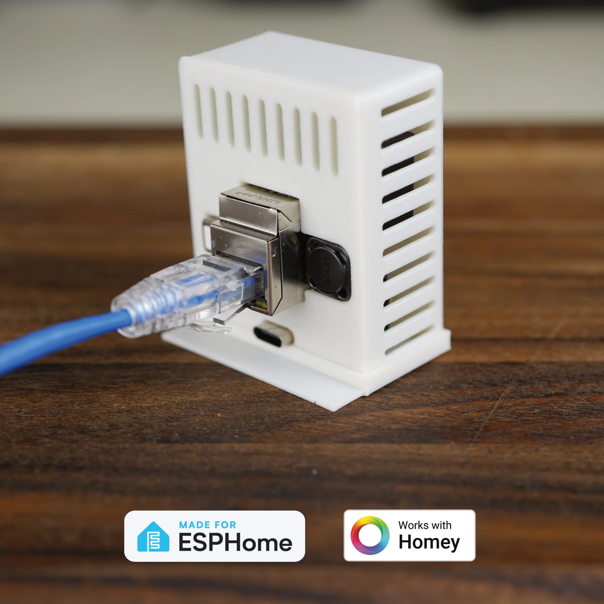

# Introduction

The Apollo Automation R PRO-1 PoE mmWave Multisensor (LD2450 and additional LD2412 add-on option) is our most advanced presence sensor. Designed for power, precision, and reliability, the R PRO-1 is a compact PoE mmWave sensor built for high-accuracy motion detection and environmental monitoring in smart homes and commercial buildings.

This versatile sensor supports PoE (802.3 compliant) and USB-C power, and includes built-in Wi-Fi and Bluetooth connectivity, enabling flexible installation and seamless smart home integration. Its small form factor combined with PoE or USB-C power options makes the R PRO-1 ideal for quick deployments in a wall or ceiling.