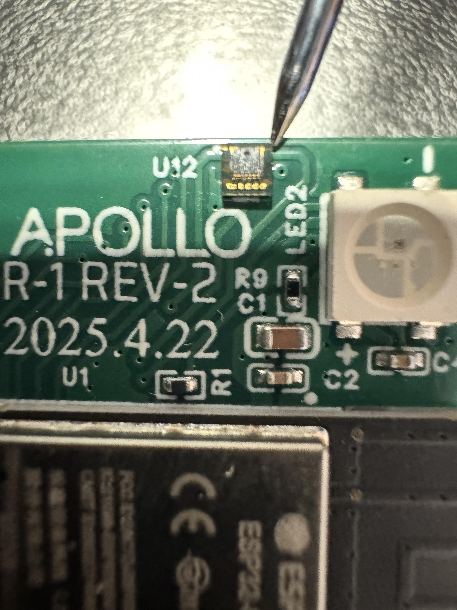
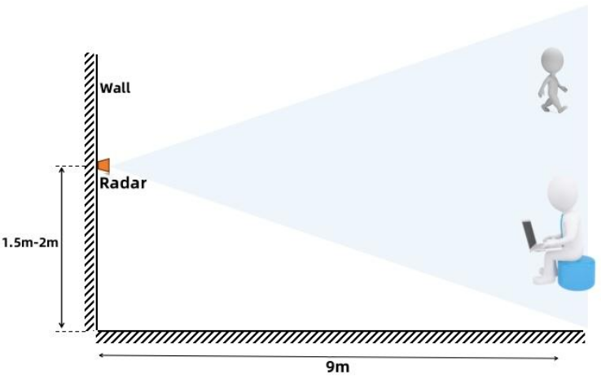
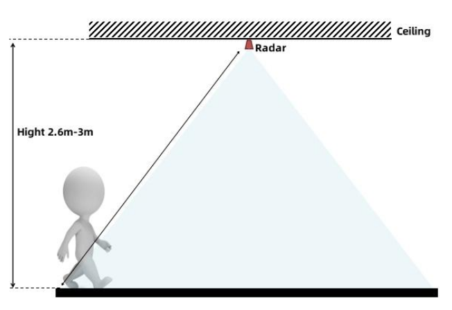
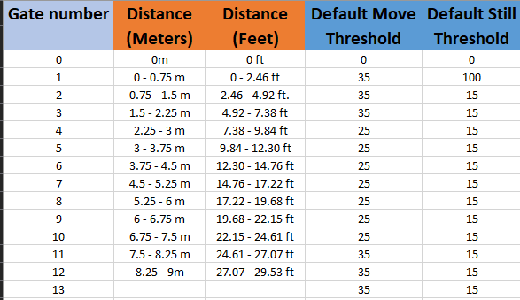

# General Tips

##### **Light Sensor (LTR-390UV)**

The R-PRO-1 doesn't have any slits on the front of the case, so UV rays can't directly reach the sensor for UV detection. However, light can still enter from around the edges or behind the front panel, allowing the lux readings to spike when ambient light is present.

!!! warning "The RGB LED will trigger the Light sensor!"

    Make sure that your automations do not interfere with each other. This includes being aware that your onboard LED can trigger the lux reading but not the uv reading of the LTR390 in your device.

##### **Wall Mounting**

The R-PRO-1 should be mounted 1.5-2 meters off the ground which will then provide a nice even 120 degree FOV for the LD2450 and 150 degree FOV for the LD2412.

##### **Ceiling Mounting**

The R-PRO-1 should be mounted 2.6-3 meters (8-10 feet) high when mounted on the ceiling using our ceiling mount kit.

!!! tip "There are actually two sensors in your r-pro-1 if you bought the optional LD2412 addon!"

    **The multi-target LD2450:**

    * The horizontal FOV angle is -60 to 60 degrees - 120 degrees total.
    * The vertical FOV angle is -35 to 35 degrees - 70 degrees total.
    * Zones are X and Y coordinate zones and are user-configurable.

    **Helpful hints for LD2450 Zones:**

    * The X axis is where you can get tripped up, especially when both values are negative: -3456 is less than -2345.
    * X1 must always be less than X2, and Y1 must always be less than Y2.
    * The Y axis is easier since it's never negative.
    * The Plotly chart will still render the rectangles even if the X1/X2 and Y1/Y2 values are reversed.
    * The zones cannot overlap.

    **The single-target LD2412:**

    * The horizontal FOV angle is -75 to 75 degrees - 150 degrees total.
    * The vertical FOV angle is -35 to 35 degrees - 70 degrees total.
    * Gates are pre-defined by the radar module and are in 0.75 meter increments.

##### **Gate Visualization**

