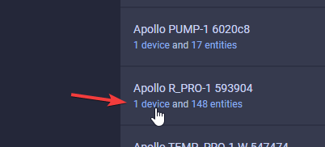
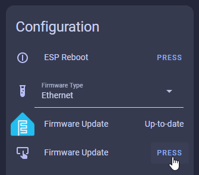
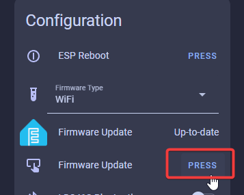
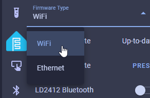

# Firmware Switching Guide

!!! tip "R-PRO-1 ships with Wi-Fi firmware because some people might not have ethernet or PoE."

    Your device needs to be able to connect to the internet to switch between firmware files. If you are connecting to an IoT network on a subnet/vlan unable to access github.com then this will not work. You can also manually reflash your device serially (usb) by<a href="https://wiki.apolloautomation.com/products/rpro1/troubleshooting/rpro1-code/" target="_blank" rel="noreferrer nofollow noopener"> following our flashing guide</a>!

###### Switch to Ethernet

1\. Navigate to the ESPHome integration by going to settings -&gt; <a href="http://homeassistant.local:8123/config/integrations/integration/esphome" target="_blank" rel="noopener">esphome integration</a> -&gt; click on "1 device" below your Apollo R-PRO-1.

2\. Scroll down until you see the "Firmware Type" dropdown and select "Ethernet".

3\. Locate the Firmware Update entity and click on "PRESS".

4\. Wait a few minutes - this will download the new firmware file from our github repo and then install the image.

5\. Your device is now on the Ethernet firmware and is ready to configure!

###### Switch to Wi-Fi

1\. Navigate to the ESPHome integration by going to settings -&gt; <a href="http://homeassistant.local:8123/config/integrations/integration/esphome" target="_blank" rel="noopener">esphome integration</a> -&gt; click on "1 device" below your Apollo R-PRO-1.

2\. Scroll down until you see the "Firmware Type" dropdown and select "WiFi".

3\. Locate the Firmware Update entity and click on "PRESS".

4\. Wait a few minutes - this will download the new firmware file from our github repo and then install the image.

[Head to the getting started docs to get your sensor integrated with Home Assistant!](https://wiki.apolloautomation.com/products/general/setup/getting-started-rpro1/#connecting-through-hotspot){  .md-button .md-button--primary }