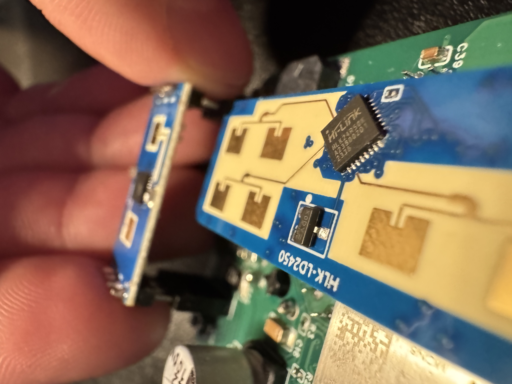
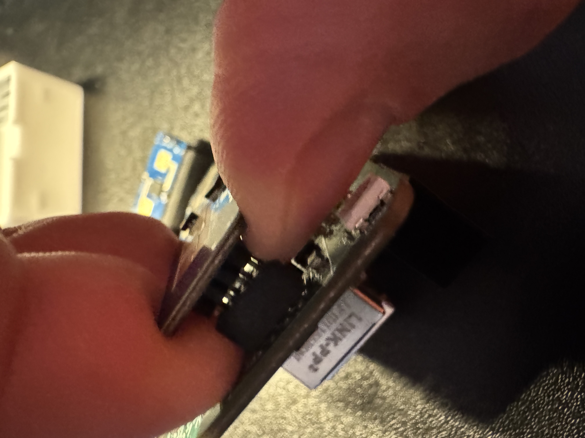
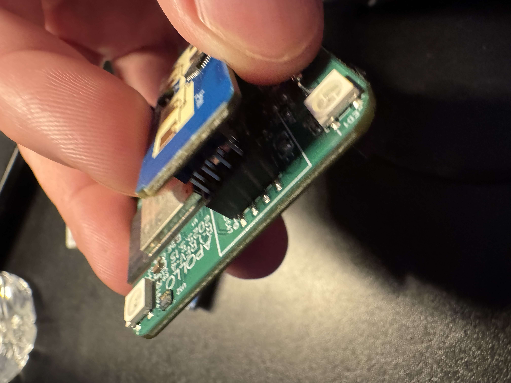
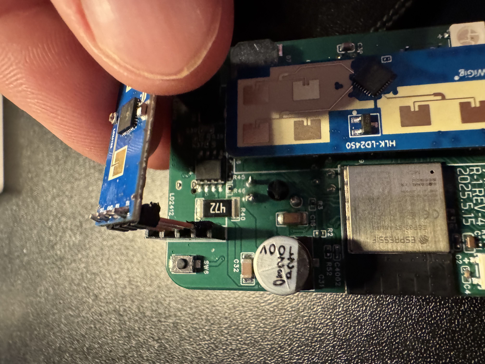
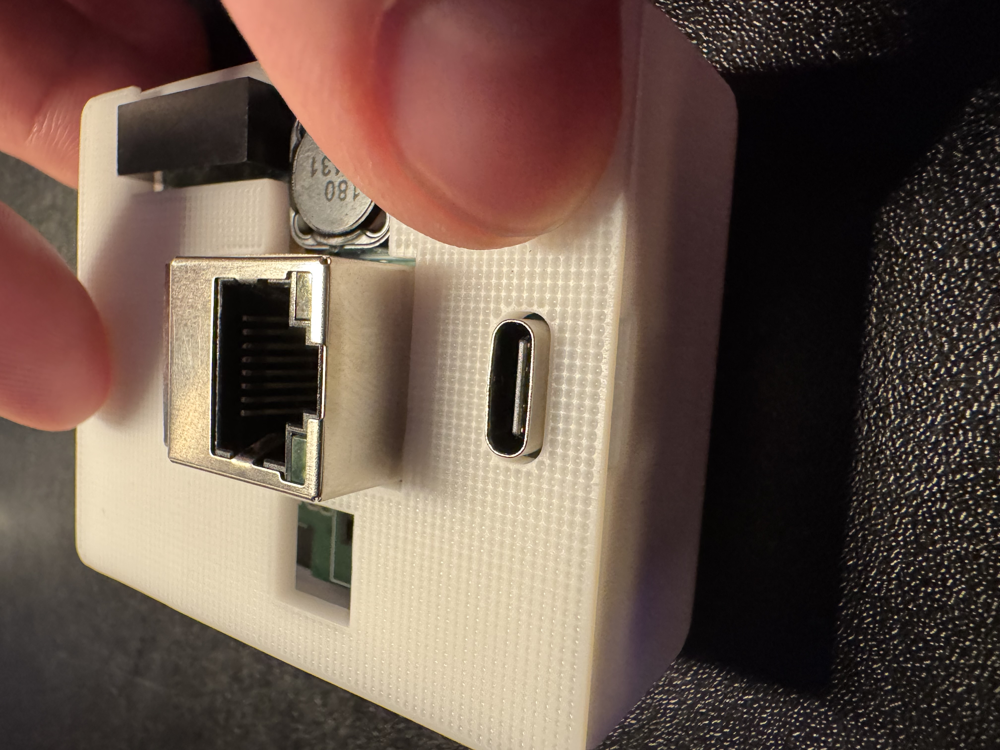

# Teardown and Reassembly Of R-PRO-1

###### Disassembly:

1\. Unplug your R-PRO-1 from power and remove the back.

2\. Gently remove the PCB from the case and flip it over.

3\. Gently remove the LD2412 as shown below.

4\. Gently remove the LD2450 as shown below.

###### Reassembly

1\. Place the LD2450 on the 8 pin header.

2\. Place the LD2412 on the 4 and 3 pin headers (only fits one way).

3\. Place back into the case with the ethernet module facing up and the usb-c port facing you.

4\. Snap the lid back into place!

