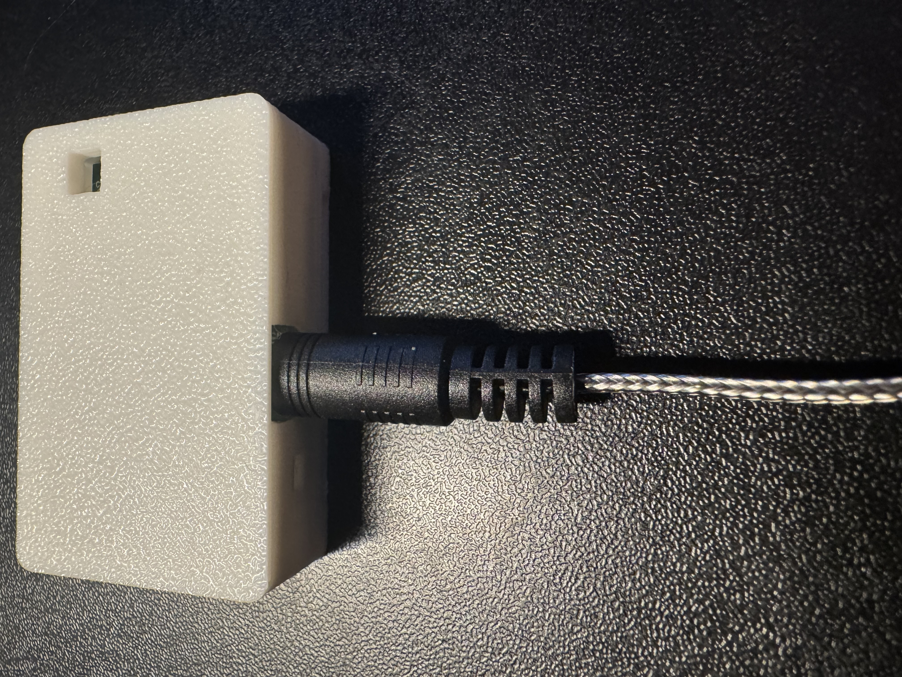
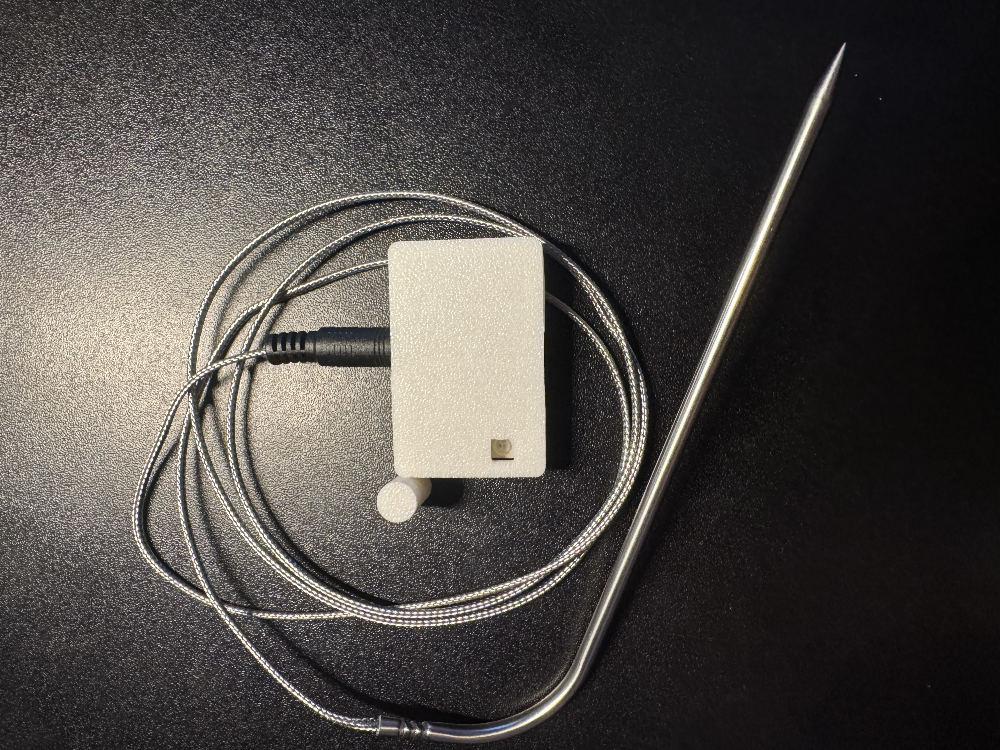
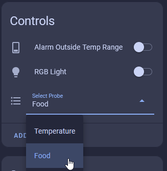

# TEMP-1 Food Probe

The TEMP-1 comes with an optional food probe which can be used to monitor food temperatures when baking, grilling, etc. It includes a heat-resistant cable but the TEMP-1 itself needs to stay in a cool environment.

1\. To use your food probe simply take it out of the package and insert it into the 3.5mm port on your TEMP-1.

2\. Once inserted, proceed to step 3 unless you have a battery in it

!!! tip "If you have it plugged into power you need to push the reset button."

    The TEMP-1 looks for the food probe when it boots and if it is not there then the sensor is marked as failed and will not work properly in Home Assistant. You need to click the reset button if you have it plugged in or power cycle your TEMP-1 to make it reliably use the new food temperature probe.

&nbsp;

3\. Go to the device page of your TEMP-1 in Home Assistant and choose probe "Food".

!!! danger "Do not leave your sensor outside or let it get wet!"

    The TEMP-1 should not be left outside for long periods of time or allowed to get wet. You will need to use another case around your TEMP-1 if there will be high moisture content in the air or if it is expected to rain.