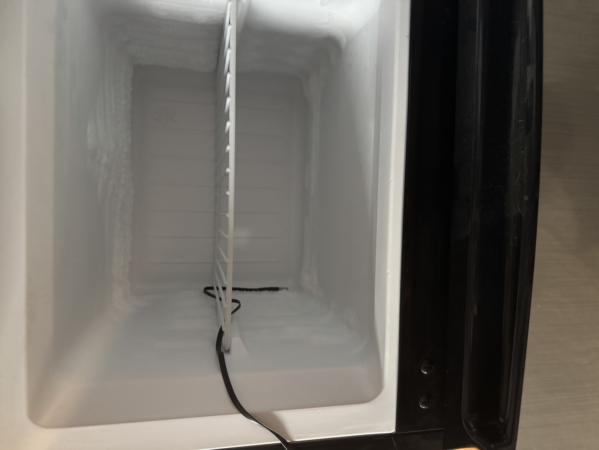

# TEMP Pro-1 Temp Probe

The TEMP Pro-1 comes with an optional temp probe which can be used to monitor a fridge, freezer, fish tank, pool, hot tub, etc. It includes a protected cable but the TEMP Pro-1 itself needs to stay in a cool environment.

1\. To use your temp probe simply take it out of the package and insert it into the left 3.5mm port on your TEMP Pro-1.

2\. Your probe is now fully inserted and ready to use. Make sure to reboot your device if it is already powered on so that it recognizes the probe!

!!! danger "Do not leave your sensor outside or let it get wet!"

    The TEMP Pro-1 should not be left outside for long periods of time or allowed to get wet. You will need to use another case around your TEMP Pro-1 if there will be high moisture content in the air or if it is expected to rain.

**Example images of the long temperature probe in a mini freezer:**

