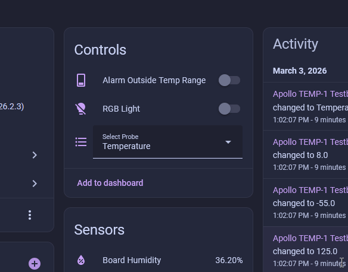
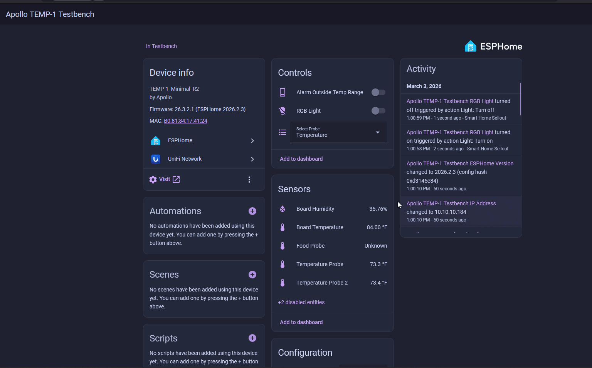
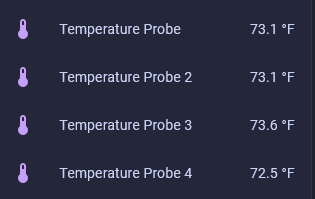
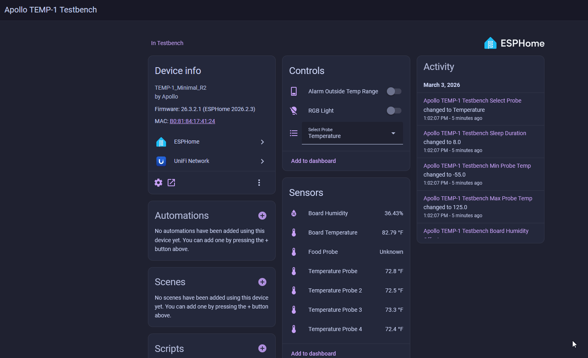

# TEMP-1 Multiple Probe Guide

The TEMP-1 comes with an optional 3.5mm splitter which can be used to monitor a fridge, freezer, fish tank, pool, hot tub, etc with up to 4 probes.

!!! success "Firmware version 25.11.20.1 or newer required for TEMP-1 and TEMP-1B"

    The multi probe support was added in November of 2025. If you are using an old TEMP-1 or TEMP-1B that hasn't been updated then please visit our reflashing guide for the <a href="https://wiki.apolloautomation.com/products/temp1/troubleshooting/temp1-code/" target="_blank" rel="noreferrer nofollow noopener">TEMP-1</a> and <a href="https://wiki.apolloautomation.com/products/temp1b/troubleshooting/temp1b-code/" target="_blank" rel="noreferrer nofollow noopener">TEMP-1B</a>. Alternatively you can <a href="https://wiki.apolloautomation.com/products/general/calibrating-and-updating/updating-firmware/" target="_blank" rel="noreferrer nofollow noopener">update your devices following this guide</a>!

1\. To use your TEMP-1 multi-probe setup gently plug in your TEMP-1 multi probe splitter into the 3.5mm port on your device.

2\. Plug in your long or short temp probes into the multi probe splitter.

!!! success "Power on your TEMP-1 after plugging in all of your probes!"

    The TEMP-1 will look for the probes at boot and mark them failed if you power on and plug in the probes after. Simply power cycle your device and they should show up!

3\. Go to the device page of your TEMP-1 in Home Assistant and confirm the Temperature Probe is selected from the dropdown.

4\. Enable the disabled 3rd and 4th temp probe entities if you have more than 2 probes!

5\. Once completed you will see all four probes updating the temperature!

6\. To rename the probes you can edit each probe and choose a unique name such as "Fridge Brobe" and "Freezer Probe" as shown below!

!!! danger "Do not leave your sensor outside or let it get wet!"

    The TEMP-1 should not be left outside for long periods of time or allowed to get wet. You will need to use another case around your TEMP-1 if there will be high moisture content in the air or if it is expected to rain.