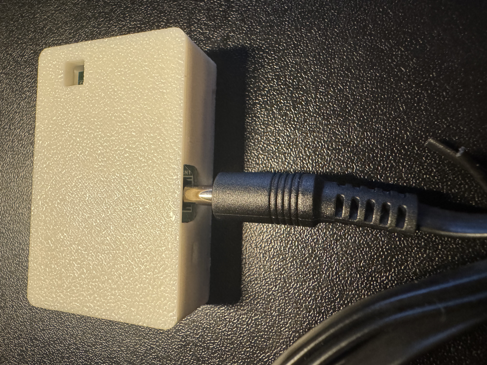
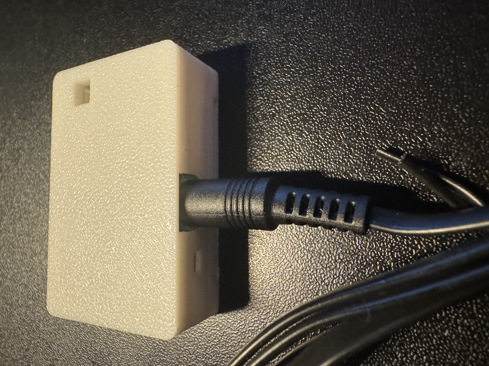
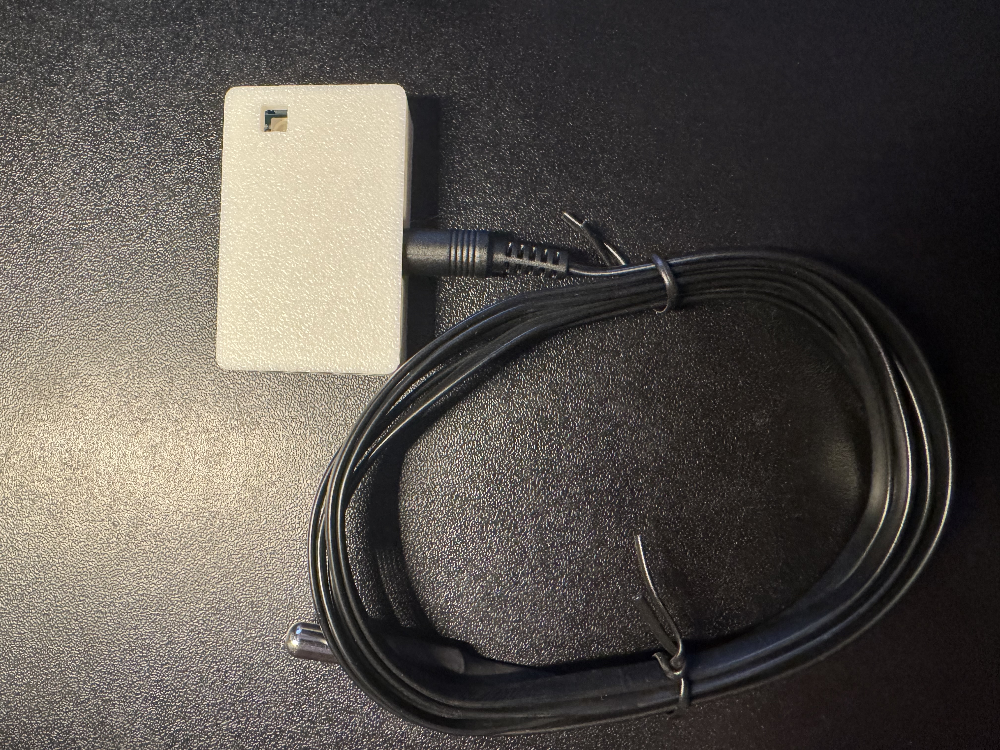
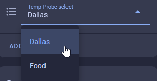
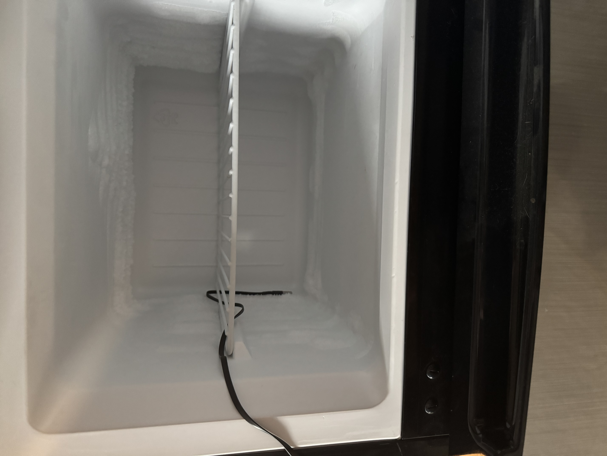

# TEMP-1 Temp Probe

The TEMP-1 comes with an optional temp probe which can be used to monitor a fridge, freezer, fish tank, pool, hot tub, etc. It includes a protected cable but the TEMP-1 itself needs to stay in a cool environment.

1\. To use your temp probe simply take it out of the package and insert it into the 3.5mm port on your TEMP-1.

2\. Once inserted, proceed to step 3.

3\. Go to the device page of your TEMP-1 in Home Assistant and choose probe "Dallas" aka Temperature.

!!! danger "Do not leave your sensor outside or let it get wet!"

    The TEMP-1 should not be left outside for long periods of time or allowed to get wet. You will need to use another case around your TEMP-1 if there will be high moisture content in the air or if it is expected to rain.

**Example images of the long temperature probe in a mini freezer:**

