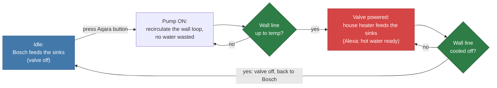

# Hot Water Recirculation with TEMP-1

!!! info "Contributed by Donovan"

    This is a real setup shared by Donovan, an Apollo community member. We will flesh out the Home Assistant side once he shares his automations.

There are two normal ways to get hot water at a sink, and each has a catch. A small under-sink tank gives you instant hot water with very little energy, but it runs out after a gallon or two. The main house water heater never runs out, but you either wait while cold water runs down the drain, or you get a cold-water sandwich when the tank water hands off to the line water.

Donovan's setup uses an Apollo TEMP-1 to get both. Small draws come from a 2.5 gallon Bosch mini tank. When he knows he needs more, a button starts a recirculation loop that pulls hot water up from the house heater without running the tap, and the TEMP-1 tells Home Assistant the moment that line is hot enough to switch over. No water goes down the drain, and there is no cold-water sandwich.

## How it works

The TEMP-1 probe is zip-tied to the hot-water angle stop, so it reads the temperature of the hot line coming from the house heater. Everything else, the Bosch tank, the circulator pump, the motorized valve, and the TEMP-1 itself, plugs into a Kasa smart power strip that Home Assistant controls.

1. **Idle.** The 3-way valve is unpowered, so the sinks are fed by the Bosch mini tank. Instant hot water, low energy.
2. **Request hot water.** Donovan presses an Aqara Zigbee button when he knows he'll use more than a gallon or two.
3. **Recirculate.** Home Assistant switches the circulator pump on. It pumps the cooled water from the hot line back into the cold line, pulling fresh hot water up from the house heater. Nothing runs down the drain.
4. **Watch the line.** The TEMP-1 reports the angle-stop temperature every few seconds. The pump also has its own temperature sensor, and the smart strip watches its energy use, so the system knows when the pump finishes.
5. **Switch over.** Once the line is hot, Home Assistant powers the valve so the sinks draw from the house heater, and shuts the pump outlet off so it won't run again when the water cools. Alexa announces "The hot water is ready."
6. **Revert.** When the TEMP-1 sees the line drop below a set temperature, Home Assistant cuts power to the valve. A capacitor inside the valve stores just enough energy to rotate it back, so the sinks return to the Bosch tank.

### Physical layout


### Control logic



## Parts

| Part | Role in the loop |
| --- | --- |
| Apollo TEMP-1 + short temperature probe | Reads the hot line at the angle stop and reports it to Home Assistant |
| Bosch ES2.5 mini tank (2.5 gal, 120 V) | Instant hot water for small draws |
| AquaMotion AMH3K-7N circulator pump | Recirculates the loop to pull hot water up from the house heater |
| US Solid 1/2" 3-way L-type motorized ball valve | Selects the hot source: unpowered feeds the Bosch, powered feeds the house heater |
| TP-Link Kasa smart power strip | Switches the pump, valve, Bosch, and TEMP-1 outlets, and monitors energy use |
| Aqara wireless mini switch (Zigbee) | The "I want hot water" button |
| Alexa speaker | Announces when the line is ready |

## TEMP-1 configuration

For this to react quickly, the probe needs to report faster than its 60 second default. Donovan reports it every 3 seconds and keeps a 60 second heartbeat, so Home Assistant reacts fast while you can still tell at a glance that the probe is alive. Two guards keep the data clean: the `85.0` reading a DS18B20 sends at power-on is dropped, and readings are ignored when the **Select Probe** option is set to `Food`.

For the full walkthrough of overriding probe YAML in the ESPHome Builder, including the simpler delta-plus-heartbeat pattern, see [How To Change The Temperature Probe Update Interval](/products/temp1/setup/temp1-change-temp-probe-update-interval.md).

```yaml
sensor:
  - platform: dallas_temp
    id: !extend temp_probe
    update_interval: 3s
    filters:
      - lambda: |-
          if (isnan(x)) {
            return NAN;
          }
          if (x == 85.0) {
              return NAN;
          }
          auto selected_probe = id(temp_probe_select).current_option();
          if (selected_probe == "Food") {
            return NAN;
          }
          return x - id(dallas_temperature_offset).state;
      - or:
          - delta: 1.1    # ~2°F; change to 2.0 for 2°C (~3.6°F) instead
          - heartbeat: 60s
```

## Home Assistant automations

!!! note "Work in progress"

    The whole cycle is driven by Home Assistant automations. The button press starts the pump, a TEMP-1 threshold flips the valve and triggers the Alexa announcement, and a lower threshold reverts the valve. We'll add Donovan's actual automation YAML here once he shares it.
