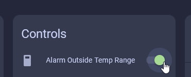

# TEMP-1 Alert Outside Temp Range Example

######

This will guide you through how to setup the built in alarm using the temperature probe in your freezer!

1\. Place the temperature probe into your freezer (not the entire TEMP-1, just the probe!) and then wait for it to normalize around 0 degrees F aka -18C.

2\. Once normalized, look at the graph and determine a good value to set for both the maximum and minimum temperatures. My mini freezer seems to max out at 30F so I would want to go slightly above that range. However, <a href="https://www.energy.gov/energysaver/refrigerator-freezer-use-and-temperature-tips" target="_blank" rel="noreferrer nofollow noopener">in most freezers they should NOT reach above 0F</a> so you will likely need to input a lower value than me. my minimums are around -20F.

3\. We now need to convert F to C since the max and min temps are measured in Celsius. My new values I will input are max probe temp 2C and a min probe temp of -30C. Reminder, yours will likely be different values, especially your max probe temp.

4\. Enable the "Alarm Outside Temp Range" toggle and now your TEMP-1 will play an audible alert with it's buzzer when the temp thresholds are reached. If the temp goes under the min or over the max the alarm will go off

