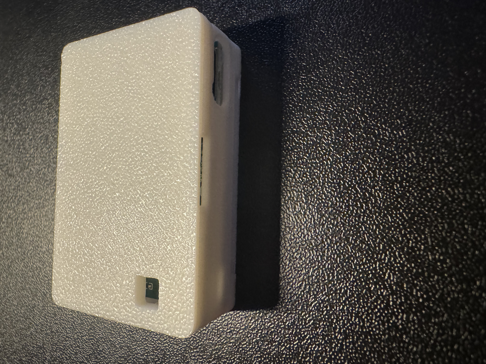

The TEMP-1 can be used with an optional temperature probe which come in two lengths or a food safe grill probe. The TEMP-1 itself can be used with an optional magnetic mount to mount it to a fridge, grill, or other surface while taking measurements. It also features an AHT20-F air temperature and humidity sensor, which includes dust protection, an RGB LED, a piezo buzzer, and an optional DS18b20 waterproof soil temperature probe (20 cm / 7.8 inches).

!!! danger "Do not leave your sensor outside or let it get wet!"

    The TEMP-1 should not be left outside for long periods of time or allowed to get wet. You will need to use another case around your TEMP-1 if there will be high moisture content in the air or if it is expected to rain.