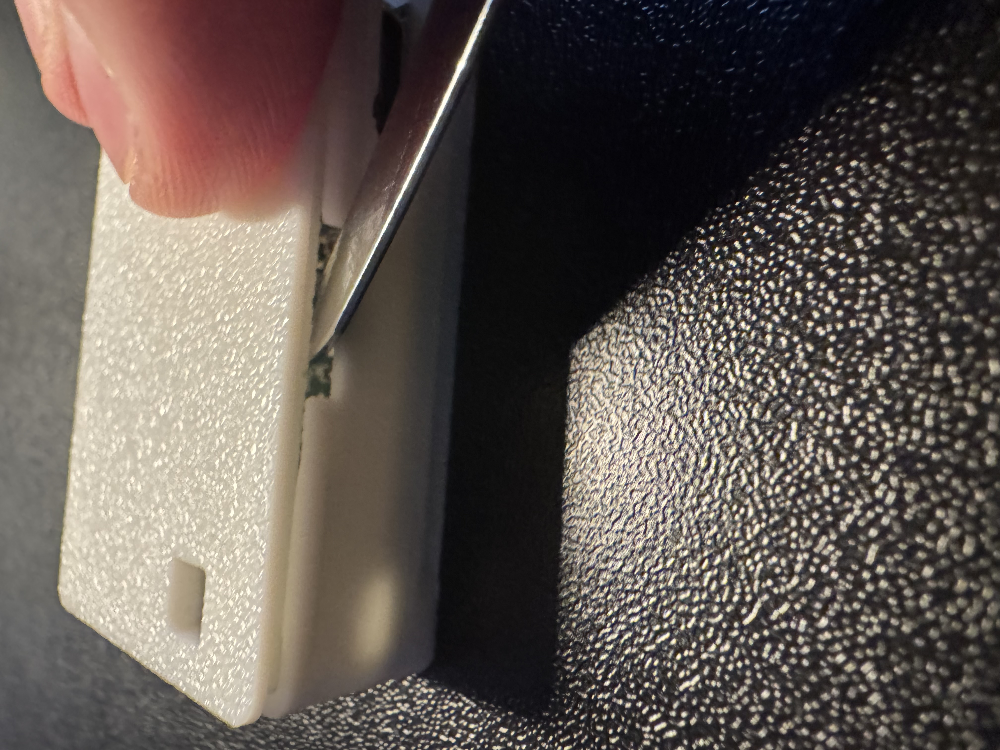
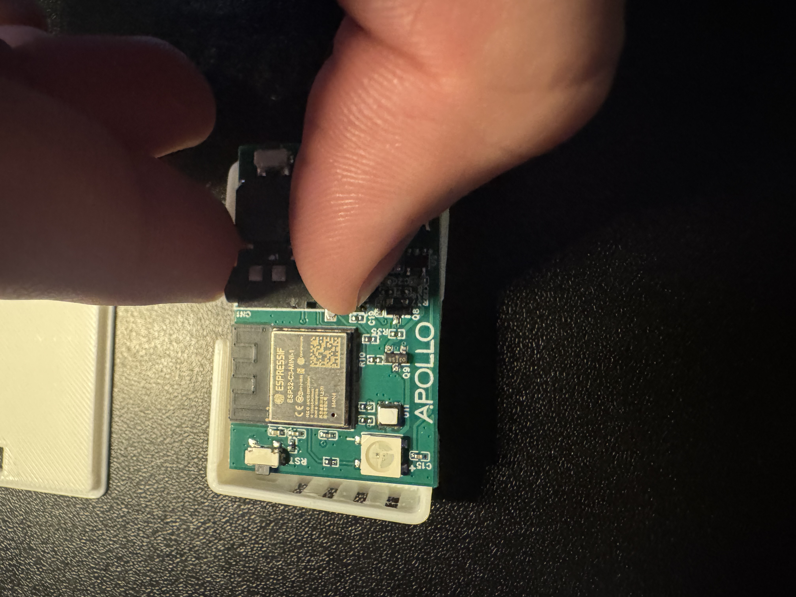
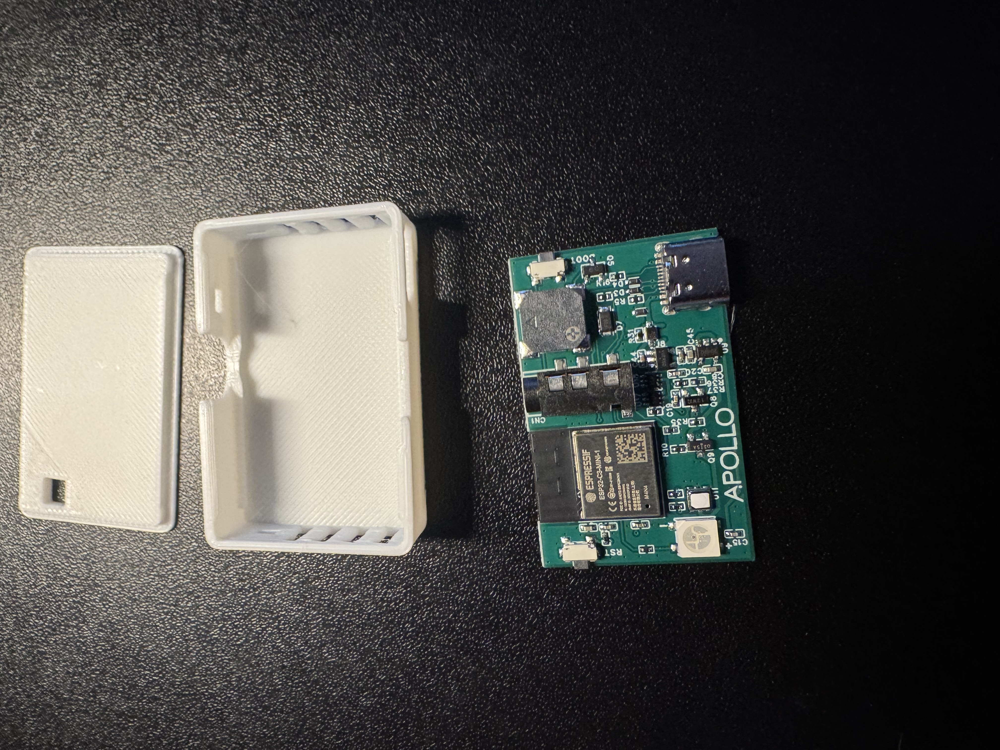
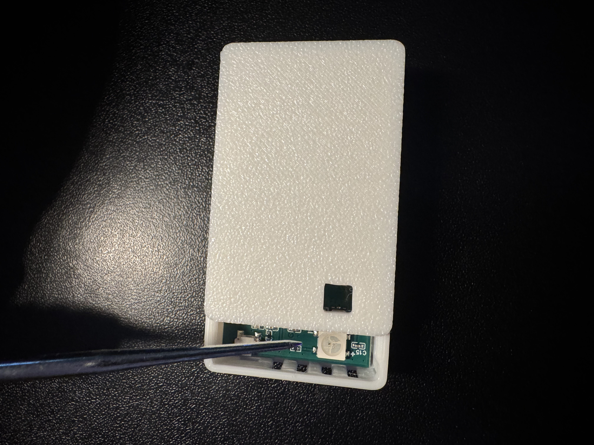
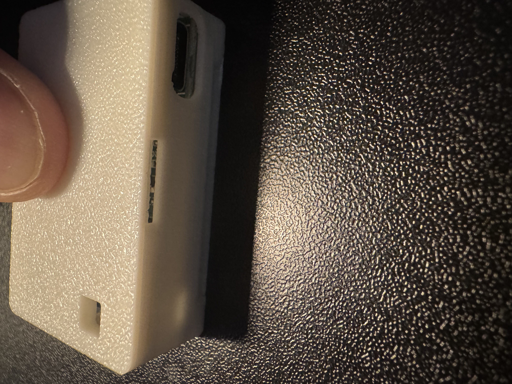

# Teardown Of TEMP-1

1\. Gently pry open the case lid as shown in the image below.

2\. Once the lid is removed either lift the PCB out or gently dump the pcb out by turning it upside down.

3\. The teardown is complete!

4\. Make sure during reassembly that the RGB LED is in the bottom left as shown in image below then press on the lid as shown below until it snaps into place!

&nbsp;