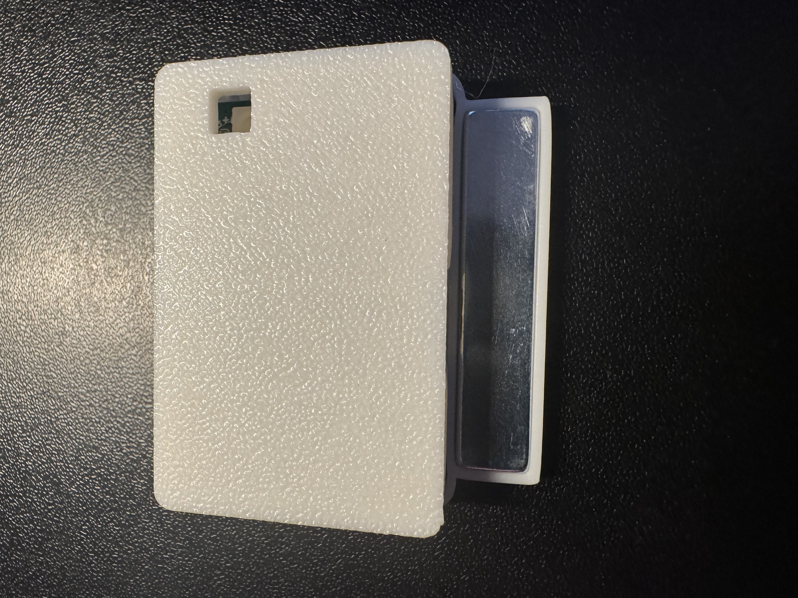
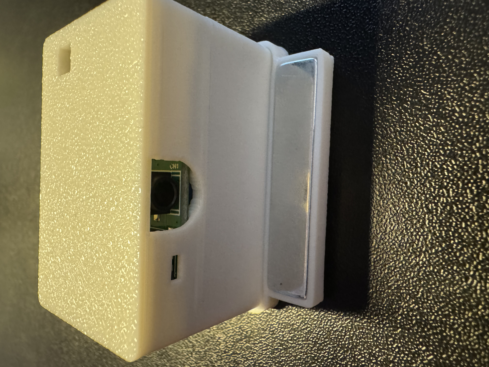
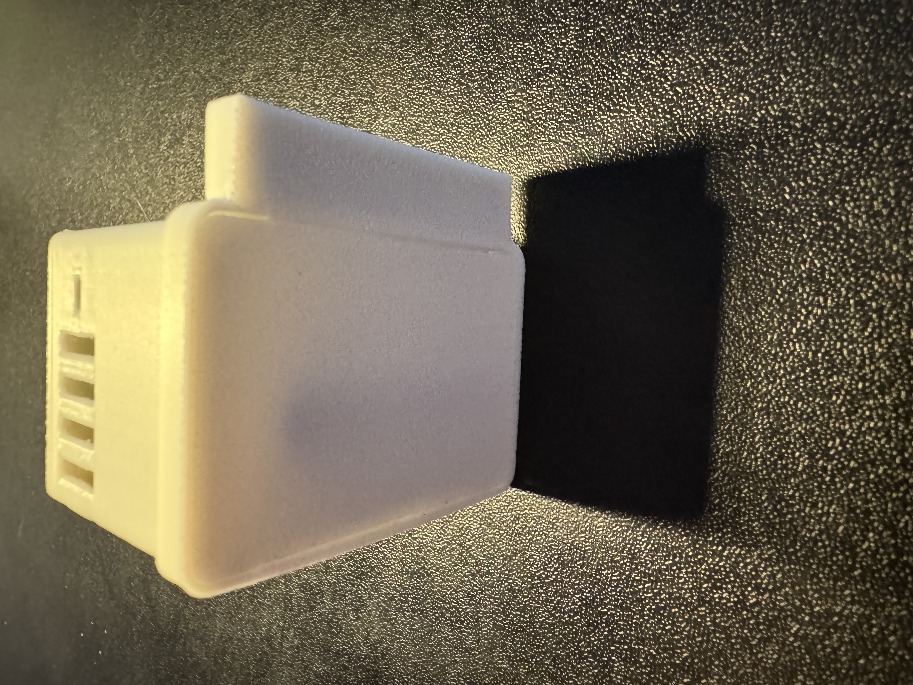
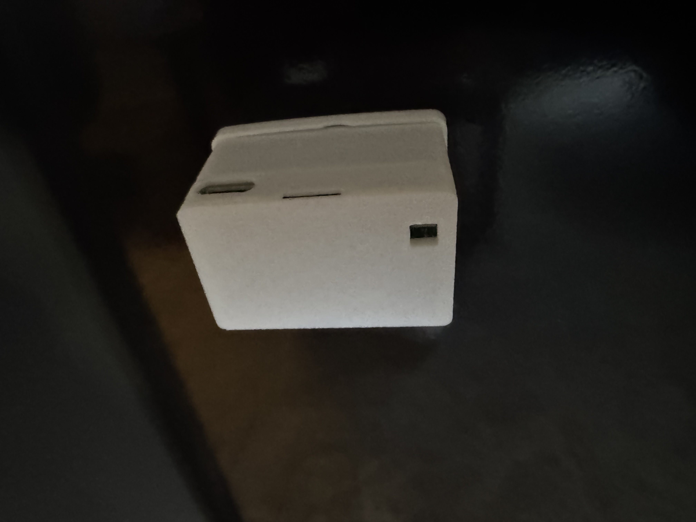

# TEMP-1B Magnetic Mount

The TEMP-1B comes with an optional magnetic mount which can be used to secure the TEMP-1B to your fridge or grill as shown below.

1\. To use your magnetic mount place it with the magnet facing upwards as shown:

2\. Align the lid with the hole in the top right and place your TEMP-1B inside the magnetic mount and gently press down.

3\. It will sit flush as shown in the image below.

4\. Affix your TEMP-1B to a fridge or a safe cool place on the grill.

!!! danger "Do not leave your sensor outside or let it get wet!"

    The TEMP-1B should not be left outside for long periods of time or allowed to get wet. You will need to use another case around your TEMP-1B if there will be high moisture content in the air or if it is expected to rain.

&nbsp;