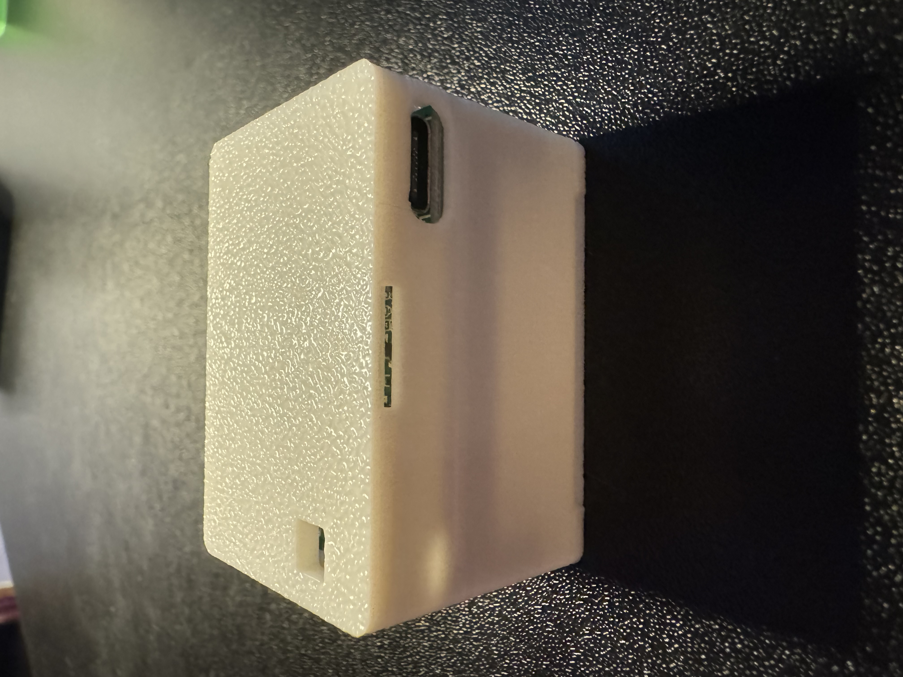

The TEMP-1B (16340 battery) can be used with an optional temperature probe which come in two lengths or a food safe grill probe. The TEMP-1B itself can be used with an optional magnetic mount to mount it to a fridge, grill, or other surface while taking measurements, however, it should not be left outside for long periods of time or allowed to get wet. It also features an AHT20-F air temperature and humidity sensor, which includes dust protection, an RGB LED, a piezo buzzer, and an optional DS18b20 waterproof soil temperature probe (20 cm / 7.8 inches).