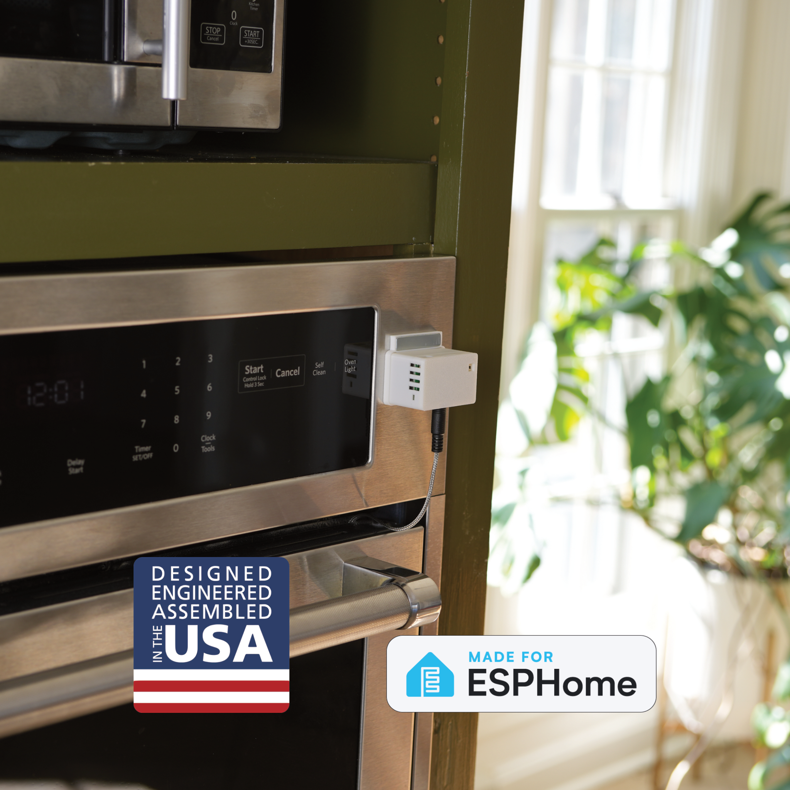

The TEMP-1B (16340 battery) can be used with an optional temperature probe which come in two lengths or a food safe grill probe. The TEMP-1B itself can be used with an optional magnetic mount to mount it to a fridge, grill, or other surface while taking measurements. It also features an AHT20-F air temperature and humidity sensor, which includes dust protection, an RGB LED, a piezo buzzer, and an optional DS18b20 waterproof soil temperature probe (20 cm / 7.8 inches).

**Optional Probe Addons:**

* 1\.5m (~5ft) Waterproof Flat Cable (DS18B20) – -55°C to 85°C (-67°F to 185°F), ±0.5°C accuracy. Ideal for fridges, freezers, fish tanks etc.
* 20cm (~8in) Waterproof Flat Cable (DS18B20) – -55°C to 85°C (-67°F to 185°F), ±0.5°C accuracy.
* 1m (~3ft) Stainless Steel Food-Safe Probe (NTC) – Max 350°C (662°F). Perfect for grilling, baking, and food prep (not dishwasher safe).

!!! danger "Do not leave your sensor outside or let it get wet!"

    The TEMP-1B should not be left outside for long periods of time or allowed to get wet. You will need to use another case around your TEMP-1B if there will be high moisture content in the air or if it is expected to rain.