# How to Insert the Battery

!!! info "16340 AKA RC-CR123A and charger required!"

    The TEMP-1B is a very neat sensor but it does *NOT* include a battery nor a charging circuit. You will have to buy your own <a href="https://apolloautomation.com/products/16340-rechargeable-battery" target="_blank" rel="noreferrer nofollow noopener">rechargable RC-CR123A aka 16340 battery </a>and also a separate 16340 charger such as a Nitecore 2 or 4bay model.

1\. Gently pry open the case lid as shown in the image below.

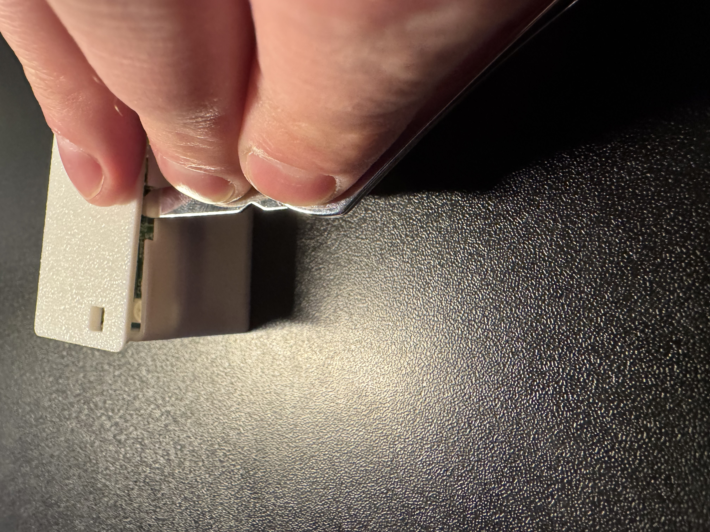

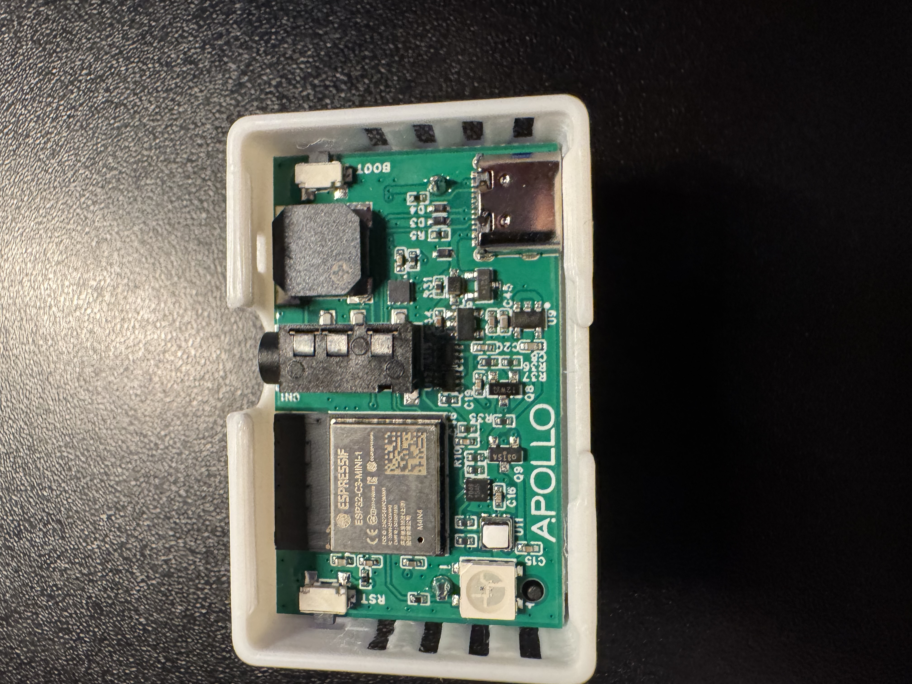

2\. Once the lid is removed either lift the PCB out or gently dump the pcb out by turning it upside down.

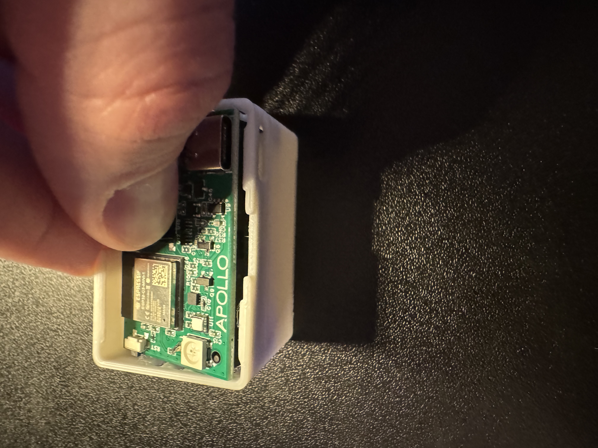

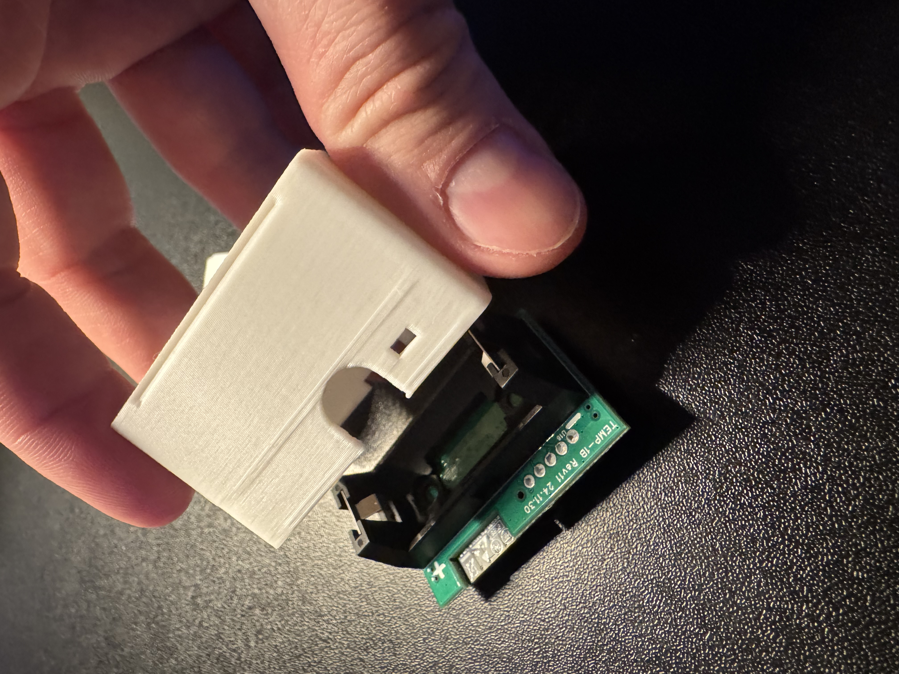

3\. Align the battery as shown in the image below.

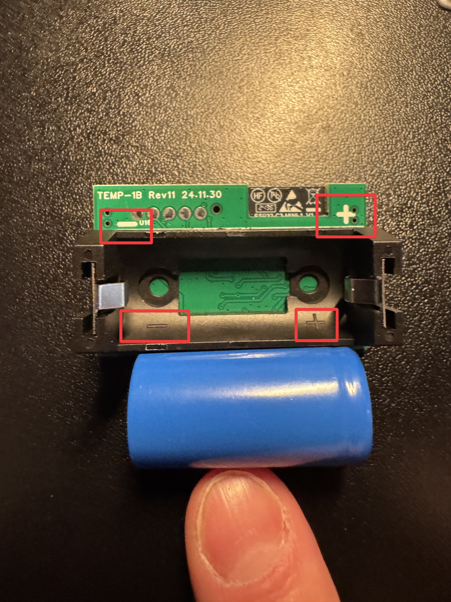

4\. Insert the battery with the positive terminal facing the + sign.

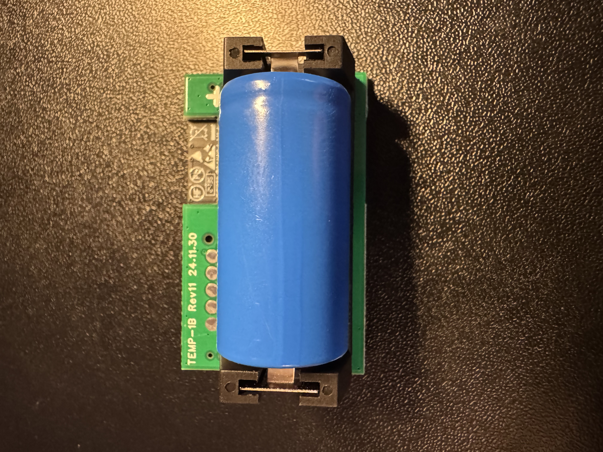

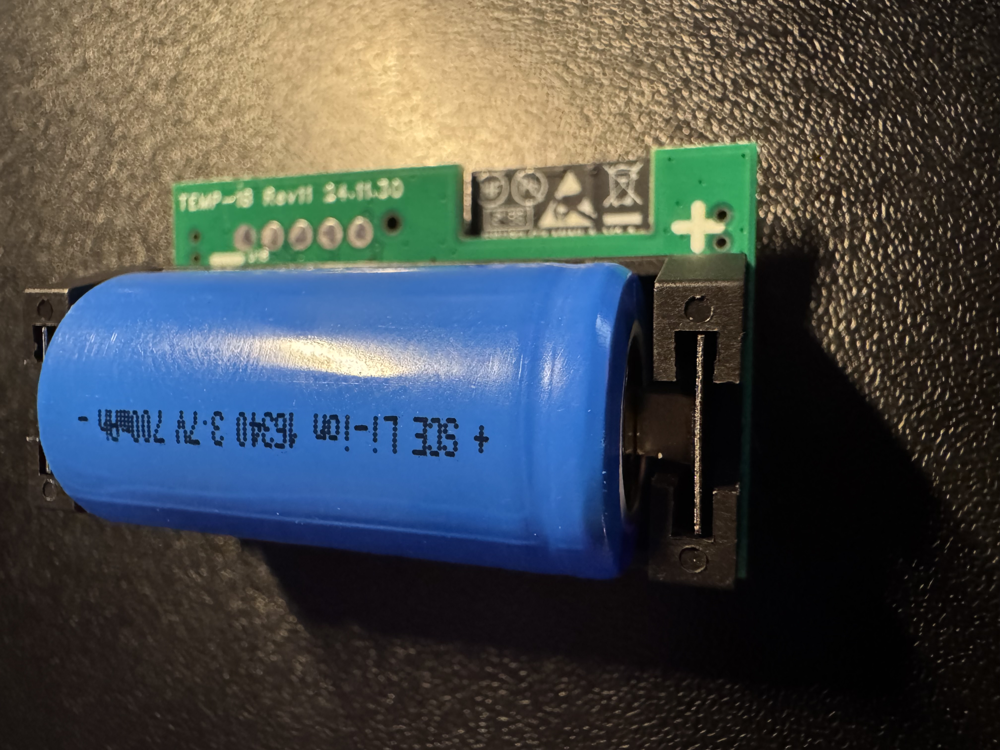

5\. Begin reassembly by placing the battery side down with the RGB led in the top right corner.

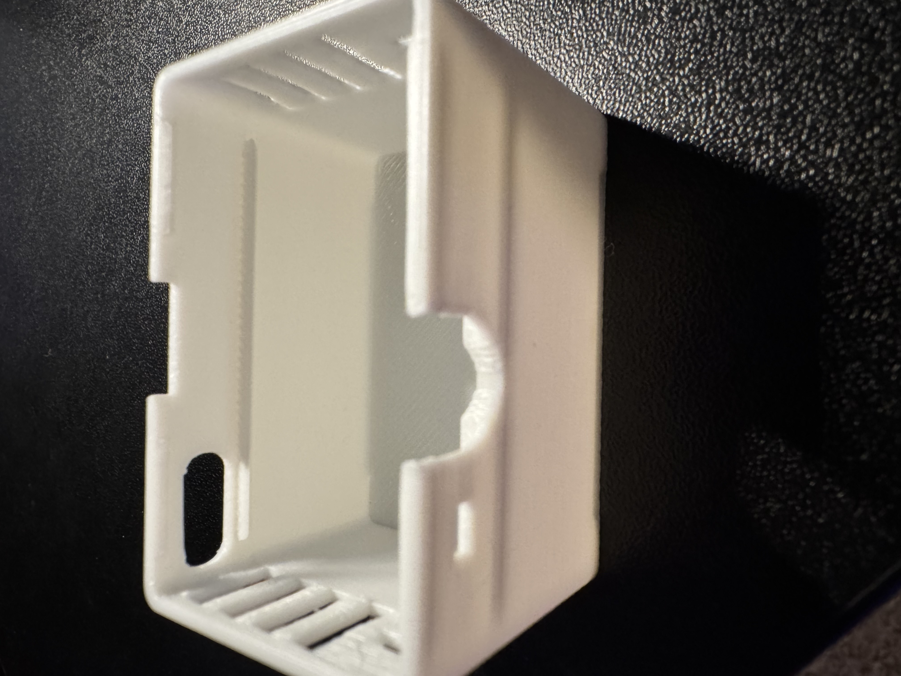

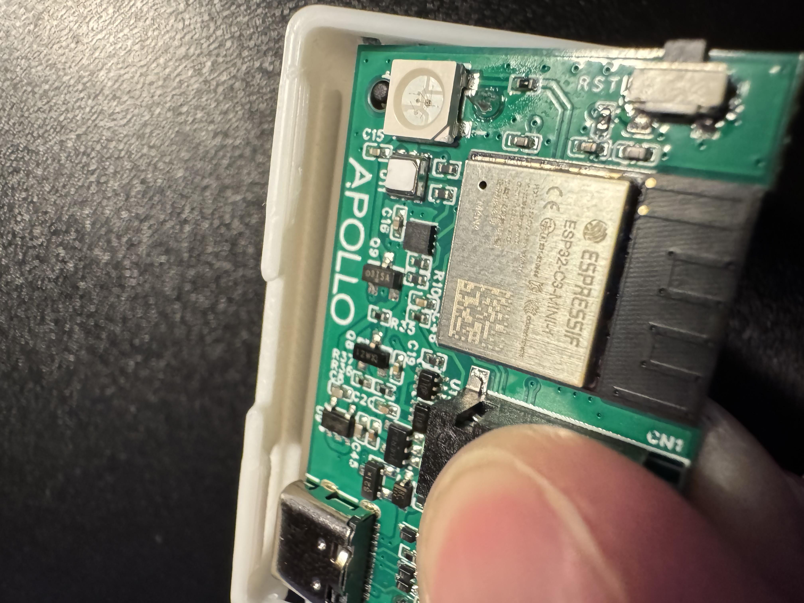

6\. You will use the "ledge" of the case to set the PCB down and then it will lay down and rest on the ledge of the other side as well.

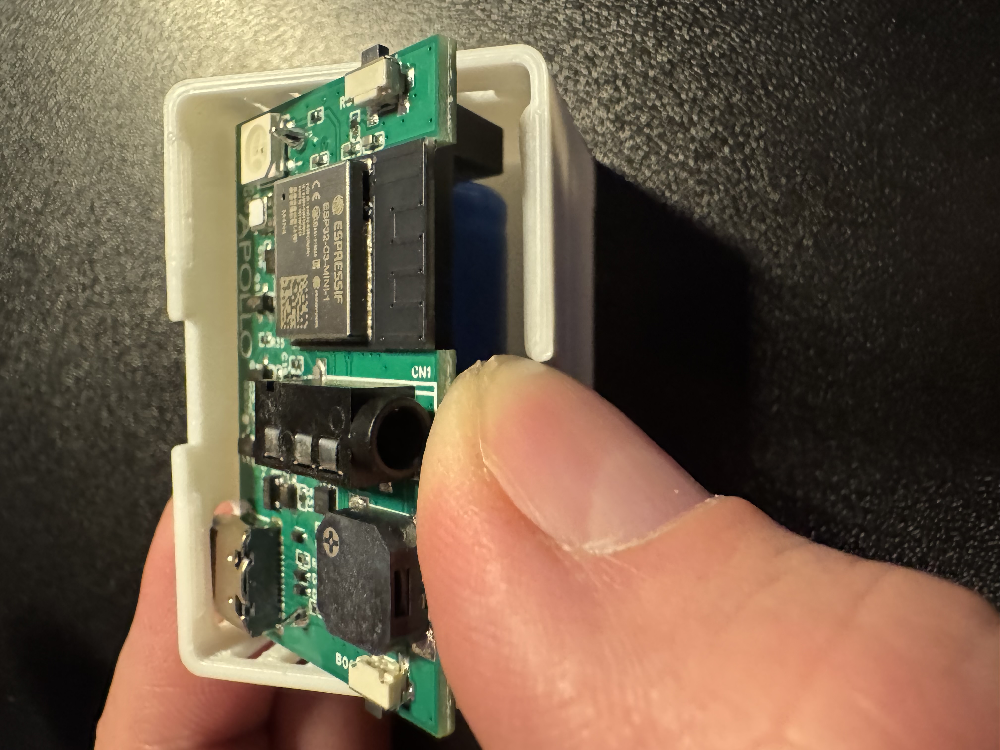

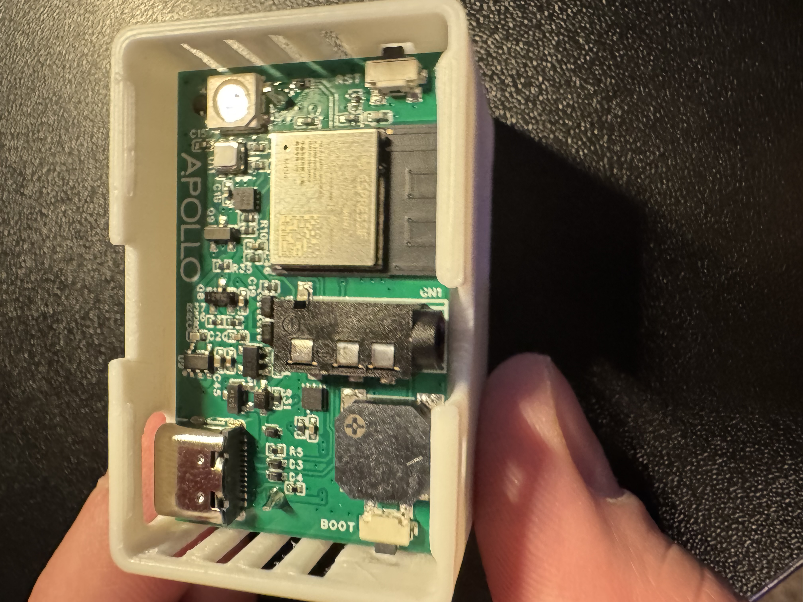

7\. Align the RGB led in the top right with the small hole in the lid.

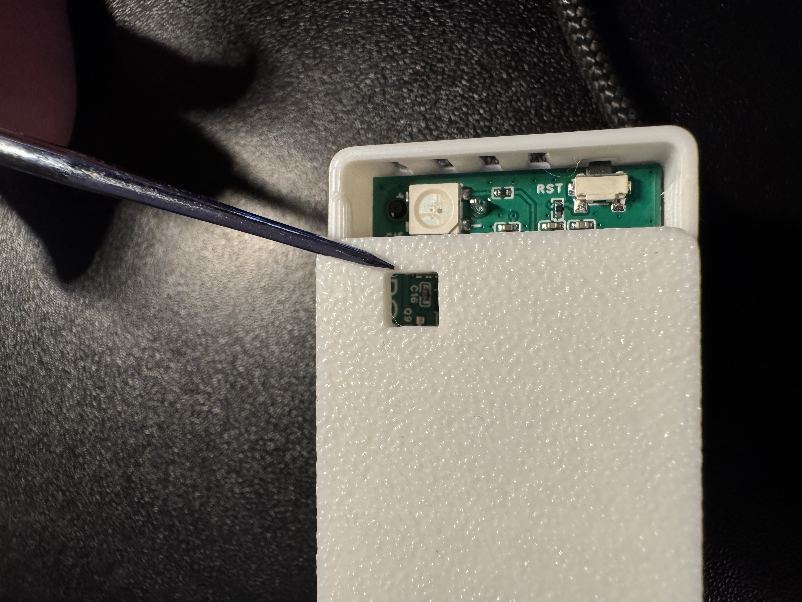

8\. Gently press down until it the lid seats.

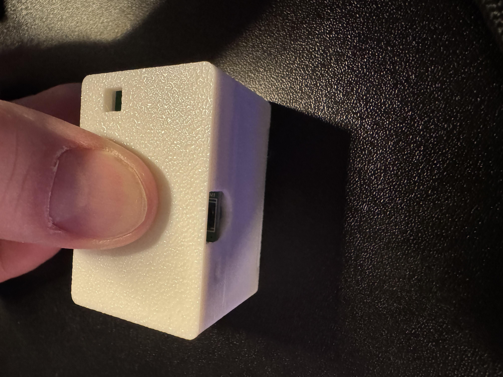

9 You have now installed or reinstalled the battery!