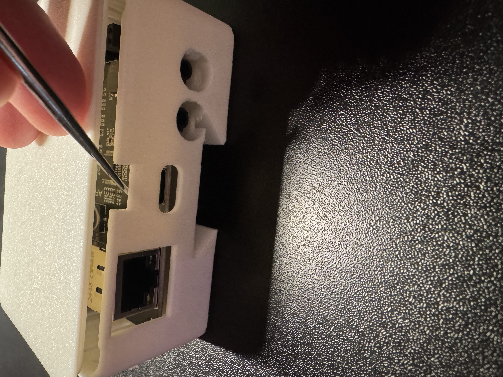
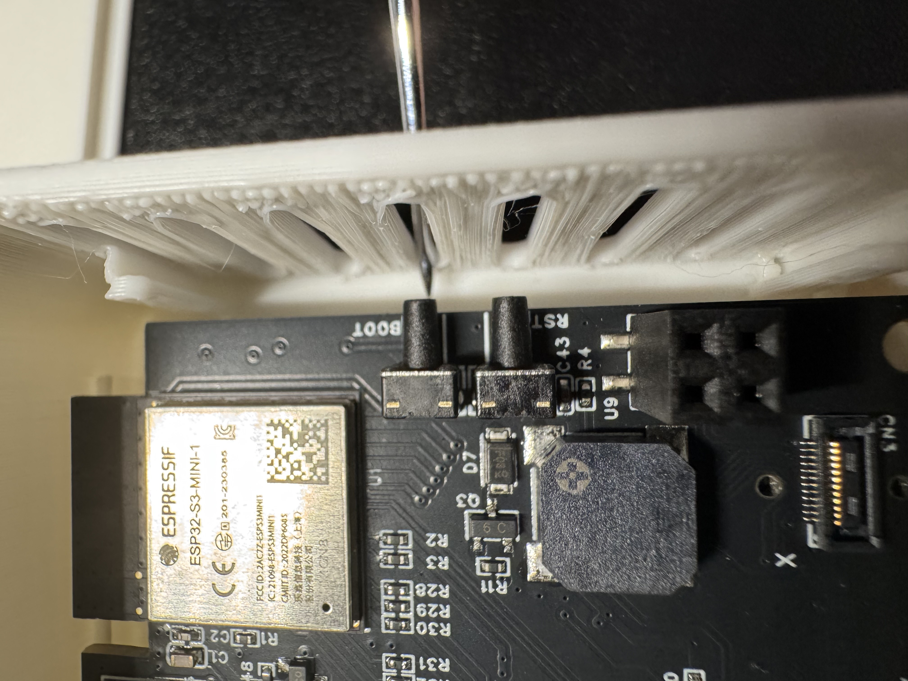

# Putting The TEMP Pro-1 In Boot Mode

!!! info "This will cover how to put the TEMP Pro-1 into boot mode."

    This is needed to force the device into boot mode to reflash the firmware.

##### Method 1: Boot Button Only

1\. Position the TEMP Pro-1 so that the USB-C port is facing you. Remove the lid by gently prying up on the small slit by the top of the case.

2\. Locate the boot button as show in the image below.

3\. Push and hold the boot button. While still holding the button down, plug in a USB-C cable into the USB-C port of your TEMP Pro-1 then let go of the button.

3\. Continue with [uploading the firmware document](https://apolloautomation.github.io/docs/products/temp1/troubleshooting/temp1-code/). (needs new link)

##### Method 2: Boot and Reset Buttons

1\. Unplug the device and remove the case as shown in the images above

2\. Plug it into your computer.

3\. Hold down the boot button (shown above), then press and release the reset button (shown below) while keeping the boot button pressed. Finally, release the boot button.

4\. Continue with [uploading the firmware document](https://apolloautomation.github.io/docs/products/temp1/troubleshooting/temp1-code/). (needs new link)